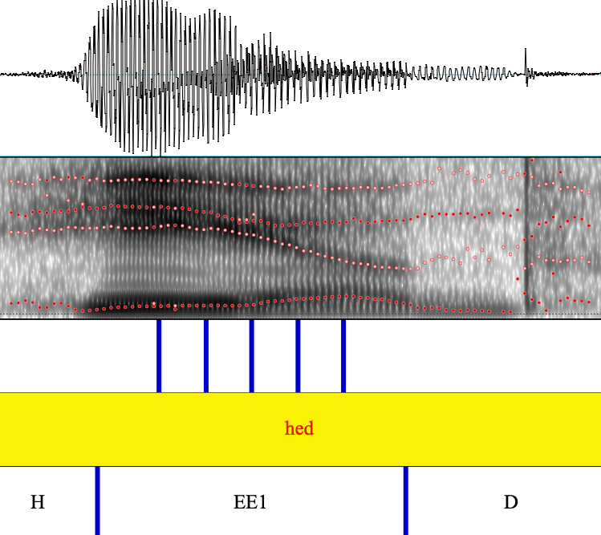

\setcounter{secnumdepth}{5}

```{r libraries, include=FALSE, message=FALSE}
library(curl)             # Check availability of internet for install of remote libraries

# Install remotes package if necessary
if(!requireNamespace("remotes", quietly = TRUE)) if (has_internet()) install.packages("remotes")
# Install the stable development version from GitHub
if (has_internet()) remotes::install_github("crsh/papaja")
library(papaja)           # APA formatted ms

library(tidyverse)        # data wrangling and plotting
library(magrittr)         # pipes, my friend, we need pipes
library(assertthat)       # for error checking
library(rlang)            # quosures and unquoting
library(ggforce)          # correlation matrices
library(plotly)           # for interactive HTML plots
library(mvtnorm)          # multivariate Gaussian distributions

if (has_internet()) remotes::install_github("hlplab/MVBeliefUpdatr")
library(MVBeliefUpdatr)   # for generating Ideal Observers

library(linguisticsdown)  # for inserting IPA symbols
library(kableExtra)       # for styling html format
library(modelr)
library(phonR)            # for vowel normalization functions
library(phonTools)        # for WattFabricius normalization function
```

```{r setup, include=FALSE}
library(knitr)

# Set knit defaults for code chunks
opts_chunk$set(
  dev='jpeg', # default format of figures
  fig.ext="jpeg",
  comment="",
  echo=FALSE, warning=FALSE, message=FALSE,
  cache=TRUE)

# some useful formatting functions for output of knitting
def.chunk.hook  <- knitr::knit_hooks$get("chunk")
knitr::knit_hooks$set(chunk = function(x, options) {
  x <- def.chunk.hook(x, options)
  ifelse(options$size != "normalsize", paste0("\n \\", options$size,"\n\n", x, "\n\n \\normalsize"), x)
})

color_block = function(color) {
  function(x, options) sprintf('\\color{%s}\\begin{verbatim}%s\\end{verbatim}\\color{black}', color, x)
}
knitr::knit_hooks$set(error = color_block('red'))
knitr::knit_hooks$set(warning = color_block('orange'))
```

```{r functions-and-pipes, include=FALSE}
source("../../scripts/constants.R")

myGplot.defaults("paper")

options(knitr.table.format = "latex")
color.transform <- "#C9C0BB"
color.centering <- "#ABCDEF"
color.scaling <- "#DDADAF"

base.width = 2.5
base.height = 2.5
```

# To Do

  * Update TO DO regularly
  * FIGs
    * fig 9: decrease bottom margins in first 4 plots
    * adjust fig sizes by chunk arguments in the following plots: 13, 14.
    * why isn't the confusion matrices adjusted in supplementary materials?
  * Have all tables be the same size
  * REFs
    * add REF on coarticulation with /d/ in coda (Sussman et al., 1997; Parker, 1974)
    * add REF on easier recognition of peripheral vowels and vowels without close competitors
    * add REFs on talker-specific learning
  * Apply normalization to the data at all three time points
  * convert noise to apply to all IOs (incl in hz, erb, bark etc.)?
  * Supplementary information
    * In what format should the normalizing constants be presented? If at all?
    * Generate IOs without distributional outliers.

```{r}

```

\newpage
\setcounter{page}{1}

# Introduction {#sec:intro}
Talkers differ in their pronunciation of individual speech sounds due to both physiological differences and socio-cultural factors, including style, regional dialect, and second language accents. For listeners, this means that the mapping from acoustic cues to linguistic categories---phonemes, syllables, words, and ultimately word meanings---varies depending on the talker. How listeners manage to typically understand talkers despite this "lack of invariance" [@liberman1967] has remained one of the central questions for research on speech perception. Hypotheses about the mechanisms underlying this ability can be grouped into three, mutually compatible, accounts: (1) low-level, pre-linguistic auditory transformation of the acoustic signal, (2) learning of changes in the linguistic representations, and (3) post-linguistic changes in decision-making biases [see e.g., @johnson2006; @pardo2006; @xie2022]. The present study focuses on the first type of account, that the acoustic signal is transformed and normalized early on during auditory processing [for recent reviews, @johnson-sjerps2021; @stilp2020]. Some studies suggest, for example, that talker-normalized representations of the speech signal are present as early as in the brain stem [e.g., @sjerps2019; @sussman1986], and thus prior to even the earliest cortical areas associated with speech perception. We compare different types of normalization accounts against data from the production of short and long vowels of Stockholm Swedish.

Normalization accounts were originally proposed as a theory of how the brain removes *physiologically*-conditioned variation from the speech signal, reducing variability in, for example, category means between talkers, and thus reducing the overlap of phonological categories in the acoustic-phonetic space [e.g., @Bladon1984; @gerstman1968; @lobanov1971; @miller1989c; @nearey1978; @nordstrom1975; @peterson1961; @Syrdal1986; @sussman1986]. Most of this early work focused specifically on differences in formants, which cross-linguistically are the primary cues to distinctions in vowel quality, and known to be affected by the vocal tract size of the talker [e.g., @fox1995; @Peterson1952; @verbrugge1976; @yang2014]. Figure \@ref(fig:illustrate-normalization) illustrates the effect of one of the most commonly applied normalization accounts [@lobanov1971] for the vowel spaces of three L1 speakers of US English [from the database reported in @xie2020asa]. By normalizing cues prior to categorization, physiological differences between talkers can be reduced, resulting in reduced between-talker variability (compare Figure \@ref(fig:illustrate-normalization)B to \@ref(fig:illustrate-normalization)A). If listeners' category representations pool experiences across talkers into a single talker-independent model, this reduced inter-talker variability results in reduced category overlap (compare Figure \@ref(fig:illustrate-normalization)D to \@ref(fig:illustrate-normalization)C).^[Talker-independent category representations are assumed in many influential models of spoken word recognition [e.g., @luce-pisoni1998; @mcclelland-elman1986; @norris-mcqueen2008]. While talker-independent representations might be a simplifying assumption for some of these theories, this assumption has persisted for decades [e.g. @magnuson2020; @tenbosch2022]. Exceptions include exemplar accounts [e.g., @johnson1997; @pierrehumbert2001] and the Bayesian ideal adaptor account [@kleinschmidt-jaeger2015]. Importantly, it is an unresolved question whether---or for which cues and phonetic contrasts---listeners maintain talker-specific *category* representations [for findings and discussion, see @kraljic-samuel2007; @kleinschmidt-jaeger2015; @kleinschmidt2019; @xie2021cognition]. In the present paper, we follow previous work and compare the effectiveness of normalization under the assumption of talker-independent category representations.]

(ref:illustrate-normalization) Illustrating how normalization reduces category overlap for the 8 monophthongs of L1 US English. Three talkers from @xie2020asa database are shown before (**Panel A**) and after Lobanov normalization (**Panel B**). Lobanov normalization reduces inter-talker variability in the category means and, to some extent, in the category variances. The panels in the rightmost column aggregate the data from all 17 talkers in the database (5 female, 12 male), showing the means and 95% probability mass bivariate Gaussian densities for each vowel before (**Panels C**) and after Lobanov normalization (**Panel D**).

```{r}
# Load native vowel data from Li & Xie database
d.Eng.LiXie <-
  read_csv('../../data/phonetic vowel statistics/English/Li_Xie_2020_L1_vowels_statistics_general.csv') %>%
    #remove variables related to Miller's height backness space to avoid confusion
    select(-F0_gm) %>%
    mutate(Language = "L1 English",
           Vowel = factor(
             plyr::mapvalues(
               Vowel,
               levels.vowel.Arpabet,
               levels.vowel.IPA),
             levels = levels.vowel.IPA)) %>%
  rename(category = Vowel, F0 = F0.mean, F1 = F1_gm, F2 = F2_gm, F3 = F3_gm) %>%
  relocate(F0, .before = F1) %>%
  group_by(Talker, category) %>%
  #Since the normalization and transformation functions does not take NAs, we replace NAs with the average F0 value for that Talker and category
  mutate(
    F0 = replace_na(F0, geometric.mean(F0)))
```

```{r}
set.seed(333421866)

d.Eng.LiXie.long <-
  d.Eng.LiXie %>%
  # Split data into five equally sized bins  
  split_data() %>%
  # Make cross-validation folds
  crossing(crossvalidation_group = 1:5) %>%
  mutate(fold_type = ifelse(crossvalidation_group != (fold + 3) %% 5 + 1, "training", "test")) %>%
  arrange(crossvalidation_group)

apply_all_transformations_and_normalization <-
  function(data) {
    data %>%
      get_transformation() %>%
      get_normalization_functions(
        data = .,
        normalize_based_on_fold_types = "training")() %>%
      rename(F0_Hz = F0, F1_Hz = F1, F2_Hz = F2, F3_Hz = F3) %>%
      add_C_CuRE(
        data = .,
        cues = c("F0_Hz", "F1_Hz", "F2_Hz", "F3_Hz", "F0_Mel", "F1_Mel", "F2_Mel", "F3_Mel", "F0_ERB", "F1_ERB", "F2_ERB", "F3_ERB", "F0_Bark", "F1_Bark", "F2_Bark", "F3_Bark", "F0_semitones", "F1_semitones", "F2_semitones", "F3_semitones", "Duration"),
        normalize_based_on_fold_types = "training")() %>%
      # Add '_r' for 'raw' to columns with scale-transformed data in order for pivoting to work in next chunk
      rename_with(.fn = ~ paste(.x, "r", sep = "_"), .cols = ends_with(c("Hz", "Mel", "Bark", "ERB", "semitones")))
  }

# Normalize all data based on the respective training of each cross-validation group
d.Eng.LiXie.long %<>%
  group_by(crossvalidation_group) %>%
  # Get transformations, apply normalizations (both classic formants one and C-CuRE)
  group_map(
    .f = ~ apply_all_transformations_and_normalization(data = .x),
    .keep = T
  ) %>%
  reduce(bind_rows) %>%
  ungroup() %>%
  pivot_longer(
    cols = starts_with("F", ignore.case = FALSE),
    names_to = c("Cue", "Normalization.Scale", "Normalization.Type"),
    names_sep = "_",
    values_to = "Cue.Value") %>%
  pivot_wider(
    names_from = "Cue",
    values_from = "Cue.Value") %>%
    # Mutate both
  mutate(Normalization.Type = paste(Normalization.Type, Normalization.Scale, sep = "_")) %>%
  select(-Normalization.Scale) %>%
  relocate(Talker, Normalization.Type, crossvalidation_group, fold_type, fold, category, Token)

p.Eng.LiXie.raw <-
  d.Eng.LiXie.long %>%
  filter(fold_type == "test", Normalization.Type == "r_Hz", Talker %in% c("E1", "E4", "E9")) %>%
  ggplot(
    aes(
      x = F2,
      y = F1)) +
  geom_point(
    aes(
      colour = category),
    alpha = .3) +
  # Add category means
  geom_point(
    data =
      ~ .x %>%
      group_by(category, Talker) %>%
      summarise(across(c(F1, F2), ~ mean(.x))),
    mapping = aes(
      colour = category),
    alpha = .8) +
  scale_color_brewer("Vowel", palette = "Paired") +
  scale_x_reverse("F2 (Hertz)", position = "top", breaks = scales::pretty_breaks(n = 3), limits = c(3100, 740)) +
  scale_y_reverse("F1 (Hertz)", breaks = scales::pretty_breaks(n = 3), limits = c(1100, 200)) +
  guides(color = "none") +
  facet_wrap(~ factor(Talker, levels = c("E1", "E4", "E9"), labels = c("Talker E1", "Talker E4", "Talker E9")), ncol = 1) +
  theme(axis.text = element_text(size = 7),
        axis.title.y = element_text(vjust = 0))

p.Eng.LiXie.Lobanov <-
  p.Eng.LiXie.raw %+%
  (d.Eng.LiXie.long %>%
  filter(fold_type == "test", Normalization.Type == "Lobanov_Hz", Talker %in% c("E1", "E4", "E9"))) +
  scale_x_reverse("F2 (Lobanov)", position = "top", breaks = scales::pretty_breaks(n = 3), limits = c(2.55, -1.8)) +
  scale_y_reverse("F1 (Lobanov)", breaks = scales::pretty_breaks(n = 3), limits = c(2, -2))

p.Eng.LiXie.all.raw <-
  d.Eng.LiXie.long %>%
  filter(fold_type == "test", Normalization.Type == "r_Hz") %>%
  ggplot(
    aes(
      x = F2,
      y = F1,
      color = category)) +
  stat_ellipse() +
  geom_point(
    data =
      ~ .x %>%
      group_by(category) %>%
      summarise(across(c(F1, F2), ~ mean(.x))),
    mapping = aes(
      colour = category),
    alpha = .8) +
  scale_color_brewer("Vowel", palette = "Paired") +
  scale_x_reverse("F2 (Hertz)", position = "top", breaks = scales::pretty_breaks(n = 3), limits = c(3100, 740)) +
  scale_y_reverse("F1 (Hertz)", breaks = scales::pretty_breaks(n = 3), limits = c(1100, 200)) +
  facet_wrap(~ factor(Normalization.Type, levels = c("r_Hz", "Lobanov_Hz"), labels = c("unnormalized (Hz)", "Lobanov (Hz)")), scales = "free") +
  theme(axis.text = element_text(size = 7))

p.Eng.LiXie.all.Lob <-
  p.Eng.LiXie.all.raw %+%
  (d.Eng.LiXie.long %>%
     filter(fold_type == "test", Normalization.Type == "Lobanov_Hz"))  +
  scale_x_reverse("F2 (Lobanov)", position = "top", breaks = scales::pretty_breaks(n = 3), limits = c(2.55, -1.8)) +
  scale_y_reverse("F1 (Lobanov)", breaks = scales::pretty_breaks(n = 3), limits = c(2, -2)) +
  guides(color = "none")

#Get legend from final plot
legend <-
  cowplot::get_legend(
    # create some space to the left of the legend
    p.Eng.LiXie.all.raw +
      guides(color = guide_legend(nrow = 1, byrow = TRUE)) +
      theme(legend.direction = "horizontal",
            legend.justification="center",
            legend.box.just = "top"))
```

```{r illustrate-normalization, fig.width=base.width*2.5+.5, fig.height=base.height*2.5, out.width='60%', fig.align='center', fig.cap="(ref:illustrate-normalization)"}
cowplot::plot_grid(
  legend,
  cowplot::plot_grid(
    cowplot::plot_grid(p.Eng.LiXie.raw, p.Eng.LiXie.Lobanov, labels = c("A", "B"), label_x = 0, vjust = 2, ncol = 2, align = "h", rel_widths = c(1,.95)),
    cowplot::plot_grid(
      p.Eng.LiXie.all.raw + theme(legend.position = "none"),
      p.Eng.LiXie.all.Lob,
      NULL,
      align = "hv", labels = c("C", "D", ""), label_x = 0, vjust = 2, ncol = 1, rel_heights = c(1, 1, .9)),
    align = "hv", axis = "bt", rel_widths = c(2/3, 1/3)),
  nrow = 2, rel_heights = c(.05, .95))
```

Dozens of different accounts of vowel normalization have been proposed over the years [e.g., @joos1948; @gerstman1968; @lobanov1971; @fant1975; @nordstrom1975; @nearey1978; @traunmuller1981; @Bladon1984; @Syrdal1986; @miller1989c; @zahorian1991; @watt2002; for reviews, see @adank2004; @weatherholtz-jaeger2016]. @carpenter1993 summarize over 100 different vowel-specific normalization accounts, many of them closely related to each other. More recently, additional *general* normalization accounts have emerged that can be applied to *any* type of cue and phonological contrast [e.g., @cole2010; @mcmurray-jongman2011]. The most widely used of these proposals, C-CuRE, has since been successfully applied to the categorization of US English fricatives [@apfelbaum2014; @crinnion2020; @mcmurray-jongman2011], stop voicing [@kulikov2022; @toscano2015; @xie2022], vowels [@kleinschmidt2019; @mcmurray-jongman2016], and sentence-final rising question vs. statement intonation [@xie2021cognition]. In each of these studies, C-CuRE reduced inter-talker variability and improved categorization. C-CuRE stands for "**c**omputing **cu**es **r**elative to **e**xpectations", capturing the motivation behind many of the earlier normalization accounts that cue values should be interpreted relative to the distribution they are expected to have in the present context. In addition to being more general than earlier accounts, C-CuRE also addresses one of the main arguments against normalization as an account of human speech perception: by focusing on listeners' expectations rather than talkers' physiology, accounts like C-CuRE capture that inter-talker variability is not limited to physiology [e.g., @johnson2006].

Table \@ref(tab:norm-accounts) lists the normalization accounts investigated in the present study. This includes both the most influential vowel-specific normalization accounts that have been found to perform well in previous works (e.g., Lobanov and Nearey2 normalization) and several variants of the general purpose normalization C-CuRE. As indicated through shading in the table, the accounts can be grouped into four types based on the computational assumptions they make. *Transformations* are meant to transform the formant data from acoustic (Hz) into a perceptual space that approximates the perceptual organization of auditory information in the human brain. All other accounts instead or additionally adjust each formant value based on either the values of other formants on the same segment (*vowel-intrinsic* approaches) or summary statistics of the formant across segments (*vowel-extrinsic* approaches).^[Miller's formant-ratio account [@miller1989c] can technically be considered a hybrid approach, since the first step in its scaffolding normalization is normalizing F1 using a constant (the sensory reference, SR), derived from talker-specific F0s. F2 is then normalized by F1, F3 by F2.] We further distinguish two types of vowel-extrinsic approaches: approaches that *center* each cue relative to its mean across all vowel segments, and approaches that instead/additionally *scale* cues relative to the overall variability or range of the cue across all vowel segments [for reviews, see also e.g., @Johnson2005c; @kohn2012a; @weatherholtz-jaeger2016]. The former type includes C-CuRE, and we consider different variants of this approach, one for each transformation approach in Table \@ref(tab:norm-accounts).^[Another somewhat frequently used standardizing account is Watt & Fabricius [@watt2002; @fabricius2009]. We do not include this account in our evaluation, as it requires making specific assumptions of vowel inventories of the language, and it is limited to normalization of the first two formants.]

\begin{landscape}\begin{table}
\caption{\label{tab:norm-accounts}Normalization accounts considered in the present study. Unless otherwise marked, formant variables ($F$s) in the right-handside of normalization formulas are in Hz.}
\centering
\fontsize{8}{10}\selectfont
\begin{tabular}[t]{>{\arraybackslash}p{0.1cm}>{\arraybackslash}p{0.2cm}>{\arraybackslash}p{0.5cm}|>{\raggedright\arraybackslash}p{3cm}|>{\raggedright\arraybackslash}p{3cm}|>{\raggedright\arraybackslash}p{4cm}|>{\raggedright\arraybackslash}p{6.2cm}}
\hline
& & & Normalization procedure & Perceptual scale & Source & Formula\\
\hline
\hline
& & & n/a & Hz & n/a & n/a \\

\hline

& & \cellcolor[HTML]{C9C0BB}{} & \cellcolor[HTML]{C9C0BB}{n/a} & \cellcolor[HTML]{C9C0BB}{Bark} & \cellcolor[HTML]{C9C0BB}{Traunmüller (1990)} & \cellcolor[HTML]{C9C0BB}{$F_n^{Bark} = \frac{26.81 \times F_n}{1960 + F_n} - 0.53$} \\
& & \cellcolor[HTML]{C9C0BB}{} & \cellcolor[HTML]{C9C0BB}{---} & \cellcolor[HTML]{C9C0BB}{ERB}  & \cellcolor[HTML]{C9C0BB}{Glasberg \& Moore (1990)} & \cellcolor[HTML]{C9C0BB}{$F_n^{ERB} = 21.4 \times \log_{10}(1 + F_n \times 0.00437)$} \\
\multirow[c]{-2}{*}{\rotatebox{90}{trans-}} & & \cellcolor[HTML]{C9C0BB}{} & \cellcolor[HTML]{C9C0BB}{---} & \cellcolor[HTML]{C9C0BB}{Mel}  & \cellcolor[HTML]{C9C0BB}{Stevens \& Volkmann (1940)} & \cellcolor[HTML]{C9C0BB}{$F_n^{Mel} = 2595 \times \log_{10}(1 + \frac{F_n}{700})$} \\
& \multirow[c]{-4}{*}{\rotatebox{90}{formation}} & \cellcolor[HTML]{C9C0BB}{} & \cellcolor[HTML]{C9C0BB}{---} & \cellcolor[HTML]{C9C0BB}{Semitones conversion} & \cellcolor[HTML]{C9C0BB}{Fant et al. (2002)} & \cellcolor[HTML]{C9C0BB}{$F_n^{ST} = 12 \times \frac{ln(\frac{F_n}{100})}{ln}$} \\

\hline

& & \cellcolor[HTML]{E6BE8A}{} & \cellcolor[HTML]{E6BE8A}{Syrdal \& Gopal's} & \cellcolor[HTML]{E6BE8A}{Bark} & \cellcolor[HTML]{E6BE8A}{Syrdal \& Gopal (1986)} & \cellcolor[HTML]{E6BE8A}{$F1^{SyrdalGopal} = F1^{Bark} - F0^{Bark}$} \\
& & \cellcolor[HTML]{E6BE8A}{} & \cellcolor[HTML]{E6BE8A}{Bark-distance model} & \cellcolor[HTML]{E6BE8A}{} & \cellcolor[HTML]{E6BE8A}{} & \cellcolor[HTML]{E6BE8A}{$F2^{SyrdalGopal} = F2^{Bark} - F1^{Bark}$} \\
& & \cellcolor[HTML]{E6BE8A}{} & \cellcolor[HTML]{E6BE8A}{} & \cellcolor[HTML]{E6BE8A}{} & \cellcolor[HTML]{E6BE8A}{} & \cellcolor[HTML]{E6BE8A}{$F3^{SyrdalGopal} = F3^{Bark} - F2^{Bark}$} \\
& & \cellcolor[HTML]{E6BE8A}{} & \cellcolor[HTML]{E6BE8A}{Miller} & \cellcolor[HTML]{E6BE8A}{log} & \cellcolor[HTML]{E6BE8A}{Miller (1989)} & \cellcolor[HTML]{E6BE8A}{$SR = k (\frac{GM f0}{k})^{1/3}$} \\
& & \cellcolor[HTML]{E6BE8A}{} & \cellcolor[HTML]{E6BE8A}{(formant-ratio)} & \cellcolor[HTML]{E6BE8A}{} & \cellcolor[HTML]{E6BE8A}{} & \cellcolor[HTML]{E6BE8A}{$F1^{Miller} = log(\frac{F1}{SR})$} \\
& & \cellcolor[HTML]{E6BE8A}{} & \cellcolor[HTML]{E6BE8A}{} & \cellcolor[HTML]{E6BE8A}{} & \cellcolor[HTML]{E6BE8A}{} & \cellcolor[HTML]{E6BE8A}{$F2^{Miller} = log(\frac{F2}{F1})$} \\
{\multirow[c]{-7}{*}{\rotatebox{90}{intrinsic}}} & & \cellcolor[HTML]{E6BE8A}{} & \cellcolor[HTML]{E6BE8A}{} & \cellcolor[HTML]{E6BE8A}{} & \cellcolor[HTML]{E6BE8A}{} & \cellcolor[HTML]{E6BE8A}{$F3^{Miller} = log(\frac{F3}{F2})$} \\

\hline

& & \cellcolor[HTML]{ABCDEF}{} & \cellcolor[HTML]{ABCDEF}{C-CuRE} & \cellcolor[HTML]{ABCDEF}{Hz} & \cellcolor[HTML]{ABCDEF}{McMurray \& Jongman (2011)} & \cellcolor[HTML]{ABCDEF}{$F^{C-CuRE}_n = F_n - mean(F_n)$} \\
& & \cellcolor[HTML]{ABCDEF}{} & \cellcolor[HTML]{ABCDEF}{---} & \cellcolor[HTML]{ABCDEF}{Bark} & \cellcolor[HTML]{ABCDEF}{} & \cellcolor[HTML]{ABCDEF}{} \\
& & \cellcolor[HTML]{ABCDEF}{} & \cellcolor[HTML]{ABCDEF}{---} & \cellcolor[HTML]{ABCDEF}{ERB} & \cellcolor[HTML]{ABCDEF}{} & \cellcolor[HTML]{ABCDEF}{} \\
& & \cellcolor[HTML]{ABCDEF}{} & \cellcolor[HTML]{ABCDEF}{---} & \cellcolor[HTML]{ABCDEF}{Mel} & \cellcolor[HTML]{ABCDEF}{} & \cellcolor[HTML]{ABCDEF}{} \\
& & \cellcolor[HTML]{ABCDEF}{} & \cellcolor[HTML]{ABCDEF}{---} & \cellcolor[HTML]{ABCDEF}{Semitones conversion} & \cellcolor[HTML]{ABCDEF}{} & \cellcolor[HTML]{ABCDEF}{} \\

& & \cellcolor[HTML]{ABCDEF}{} & \cellcolor[HTML]{ABCDEF}{Nearey1} & \cellcolor[HTML]{ABCDEF}{log} & \cellcolor[HTML]{ABCDEF}{Nearey (1978)} & \cellcolor[HTML]{ABCDEF}{$F^{Nearey1}_n = \ln(F_n) - mean(ln(F_n))$} \\
& & \cellcolor[HTML]{ABCDEF}{} & \cellcolor[HTML]{ABCDEF}{(log-mean)} & \cellcolor[HTML]{ABCDEF}{} & \cellcolor[HTML]{ABCDEF}{} & \cellcolor[HTML]{ABCDEF}{} \\

& & \cellcolor[HTML]{ABCDEF}{} & \cellcolor[HTML]{ABCDEF}{Nearey2} & \cellcolor[HTML]{ABCDEF}{log} & \cellcolor[HTML]{ABCDEF}{Nearey (1978)} & \cellcolor[HTML]{ABCDEF}{$F^{Nearey2}_n = \ln(F_n) - mean(ln(F))$} \\
& & \cellcolor[HTML]{ABCDEF}{} & \cellcolor[HTML]{ABCDEF}{(single parameter} & \cellcolor[HTML]{ABCDEF}{} & \cellcolor[HTML]{ABCDEF}{} & \cellcolor[HTML]{ABCDEF}{} \\
& & \cellcolor[HTML]{ABCDEF}{{\multirow[c]{-10}{*}{\rotatebox{90}{centering}}}} & \cellcolor[HTML]{ABCDEF}{log-mean)} & \cellcolor[HTML]{ABCDEF}{} & \cellcolor[HTML]{ABCDEF}{} & \cellcolor[HTML]{ABCDEF}{} \\

\cline{3-6}

& & \cellcolor[HTML]{DDADAF}{} & \cellcolor[HTML]{DDADAF}{Gerstman} & \cellcolor[HTML]{DDADAF}{Hz} & \cellcolor[HTML]{DDADAF}{Gerstman (1968)} & \cellcolor[HTML]{DDADAF}{$F_n^{Gerstman} = 999 \times \frac{F_n - F_n^{min}}{F_n^{max} - F_n^{min}}$} \\
& & \cellcolor[HTML]{DDADAF}{} & \cellcolor[HTML]{DDADAF}{(range normalization)} & \cellcolor[HTML]{DDADAF}{} & \cellcolor[HTML]{DDADAF}{} & \cellcolor[HTML]{DDADAF}{} \\

{\multirow[c]{-14}{*}{\rotatebox{90}{extrinsic}}} & & \cellcolor[HTML]{DDADAF}{} & \cellcolor[HTML]{DDADAF}{Lobanov} & \cellcolor[HTML]{DDADAF}{Hz} & \cellcolor[HTML]{DDADAF}{Lobanov (1971)} & \cellcolor[HTML]{DDADAF}{$F^{Lobanov}_n = \frac{F_n - mean(F_n)}{sd(F_n)}$} \\
& & \cellcolor[HTML]{DDADAF}{{\multirow[c]{-4}{*}{\rotatebox{90}{scaling}}}} & \cellcolor[HTML]{DDADAF}{(z-score)} & \cellcolor[HTML]{DDADAF}{} & \cellcolor[HTML]{DDADAF}{} & \cellcolor[HTML]{DDADAF}{} \\

\hline
\end{tabular}
\end{table}
\end{landscape}

Previous comparisons of normalization accounts have primarily focused on English [e.g., @adank2004; @barreda2018a; @carpenter1993; @clopper2009; @disner1980; @escudero2007; @fabricius2009; @Flynn2011; @hindle1978; @kohn2012a; @labov2010; @syrda1985]. Additional studies have investigated, for example, Dutch [@adank2004; @disner1980], Russian [@lobanov1971], and Brazilian Portuguese [@escudero2007]. The complexity of the vowel inventories (7-11 monophthongs) and the number of these vowels included in the comparison (2-11) varied across these studies. We add to this literature by comparing normalization accounts against a new phonetically annotated database of Stockholm Central Swedish (SwehVd, introduced below). With a total of 21 monophthong allophones that vary in quantity (long vs. short vowels) and quality, the vowel inventory of Central Swedish is crowded compared to most languages previously studied in the normalization literature. This allows us to test whether the same normalization accounts that work well for simpler vowel inventories generalize well to more crowded vowel spaces. Additionally, the presence of quantity contrasts between long and short allophones means that Central Swedish provides a suitable case study to bridge the literature between vowel-specific normalization accounts (which focus on formants, and thus only quality contrasts) and general normalization accounts that can be applied to any type of cue (and thus also vowel duration, which is expected to be the primary cue to vowel quantity). Relatedly, previous studies have found both F3 and vowel duration to be important cues to vowel categorization in Swedish [e.g., @behne1997; @fujimura1967; @haddingkoch1964]. These two cues have never (duration) or rarely [F3, but see e.g. @adank2004; @barreda2018a; @carpenter1993] been included in comparisons of normalization accounts.

We compare the normalization accounts in Table \@ref(tab:norm-accounts) both in terms of their effectiveness in reducing within-category variability relative to between-category variability (Study 1) and in terms of the predicted consequences for recognition accuracy (Study 2). The latter comparison more directly addresses the consequences of normalization for speech perception but makes additional assumptions that Study 1 avoids. Following the bulk of previous studies [but see e.g., @nearey1989; @richter2017], the present studies does not compare the predicted consequences of normalization against categorization responses from human listeners, though we plan to do so in future work. In both studies, we compare normalization accounts applied to (1) only F1 and F2, as in the majority of previous studies, (2) F1-F3, as in, e.g., @adank2004, and (3) F0-F3 as well as vowel duration. All three comparisons are evaluated both separately for short and long vowels, and for the entire space of the 21 short and long vowels.

To the best of our knowledge, only one previous study has compared normalization accounts against Swedish, as part of a cross-linguistic comparison across six Germanic languages [@disner1980]. @disner1980 compared 4 normalization accounts, using F1 and F2 means of the nine long Swedish vowels spoken by 24 male Swedish talkers [from a database presented in @fant1969]. Of interest to the present study, the results for Swedish differed from the other languages in two ways. Whereas Lobanov normalization---which involves centering and scaling (cf. Table \@ref(tab:norm-accounts))---performed best for Swedish, Nearey2 normalization---which only employs centering---performed best for the other four languages. And, while normalization effectively reduced inter-talker variability in category variances for the other four languages by 61%-71%, it was substantially less effective for Swedish (41%). As discussed by Disner, one important question is thus whether these differences in results reflect an inherent property of Swedish or merely differences in the databases available for each language. In particular, the Swedish data consisted of vowels produced in isolation without any lexical or phonetic context, whereas the data for the five other languages consisted of word productions, paralleling the majority of research on normalization. The present study addresses this difference: the new database we introduce consists of *h*-VOWEL-*d* word recordings, which makes our stimuli directly comparable to those used in previous work on normalization. Additionally, we complement Disner's study by focusing on female, rather than male talkers, by considering both long and short vowels (separately and together), and by including the general normalization account C-CuRE. This lets us revisit whether simple *centering* accounts perform best for Swedish---like for the other languages in @disner1980.

All data and code for this article can be downloaded from OSF at (URL)<!-- enter htlm-->. This article is written in R markdown, allowing readers to replicate our analyses using freely available software [@R; @RStudio], while changing any of the parameters of our models. Readers can revisit the assumptions we make---for example, by substituting alternative normalization models. The supplementary information (SI) lists the software/libraries required to compile this document. Next we introduce the new phonetically annotated corpus of Stockholm Central Swedish vowel productions employed in our studies.

```{r load-SwehVd}
# Load native Swedish vowel data, manually corrected, but with distributional outliers remaining (generated by Persson-2021-outlierCorrected)
d.SwehVd <-
  read_csv('../../data/phonetic vowel statistics/Swedish/Persson_2021_L1_vowels_wDistrOutliers.csv')
```

# The SwehVd database {#sec:swehvd}
The SwehVd database is a new phonetically annotated corpus of Swedish *h*-VOWEL-*d* (short: hVd) word recordings. All recordings, annotations, and acoustic measurements are available on OSF.<!-- TO DO: insert html here. This might be a separate URL or the same as for the paper.--> SwehVd was collected with the goal to characterize the Stockholm Swedish vowel space within and across talkers. It covers the entire monophthong inventory of Central Swedish, including all nine long vowels (*hid*, *hyd*, *hud*, *hed*, *häd*, *höd*, *had*, *håd*, *hod*), eight short vowels (*hidd*, *hydd*, *hudd*, *hedd*, *hädd*, *hödd*, *hadd*, *hådd*, *hodd*), and four allophones (*härd*, *härr*, *hörd*, *hörr*).^[Central Swedish is described as the regional standard variety of Swedish spoken in an area around and beyond Stockholm (eastern Svealand), including Mälardalssvenska, Sveamål, Uppsvenska, Mellansvenska [see e.g., @bruce2009; @elert1994; @riad2014]. The SwehVd targets the contemporary Central Swedish spoken in the larger Stockholm area, see more under Section \@ref(sec:participants).] To our knowledge, there are few publicly available databases of Swedish vowel productions that are phonetically annotated [e.g., @bruce1999; @eklund1997; @fant1969; @kuronen2000]. The largest and perhaps best-known is SweDia 2000 [@bruce1999]. SweDia 2000 was developed to characterize differences in vowel pronunciations *across* regional varieties of Swedish. It consists of recordings of spontaneous speech, isolated words in varying phonological contexts, and phrases in isolation from approximately 1300 talkers from 107 regional backgrounds, with about 10-12 recorded talkers per region and about 5-15 recordings per vowel for each talker.

Unlike existing databases, SwehVd focuses on a single regional variety, providing high resolution within and across talkers for this variety: SwehVd consists of N=10 recordings of each hVd word (for a total of 210 recordings for the 21 different hVd words) per talker. We target N = 24 male and female talkers each (current N = `r n_distinct(d.SwehVd$Talker)`, all female) for a total targeted N of tokens = 10,080 (current N = `r nrow(d.SwehVd %>% distinct(Talker, category, Token))` tokens). The accompanying database contains first to third formant (F1-F3) measurements for each talker at five time points across each vowel, together with vowel duration and mean F0 over the entire vowel.

SwehVd follows the gross of research on normalization and uses hVd words for recording in order to minimise coarticulatory effects from the surrounding phonetic context. The hVd context was originally chosen for studies on English because the glottal /h/ in onset position minimizes supraglottal articulations [confirmed in e.g., @chesworth2003; @robb2009]. Since then hVd words have played a central role in research on vowel production [e.g., @hillenbrand1995; @Peterson1952] and perception [e.g., @malinasky2020; @Peterson1952]. Since Swedish onset /h/ is a glottal approximant [@riad2014] similar to English, the use of this context in SwehVd facilitates comparison to similar databases from other languages. It deviates, however, from the majority of previous studies on Swedish vowels, which have either not held phonetic context constant across vowels [e.g., @bruce1999], or have investigated vowel production out of context [@eklund1997; @fant1969; @disner1980] or in different CVC contexts [e.g., *k*V*p* and *p*V*k* in @nordstrand2004; *v*V*t*, *v*V*tt*, *f*V*t*, *f*V*tt*, in @behne1997].

## The Swedish vowel inventory {#sec:sweVowelinventory}
The Central Swedish vowel inventory contains 21 monophthong vowels. Seventeen of these vowels form nine pairs distinguished by quantity (long and short): in Central Swedish, the two long vowels [`r linguisticsdown::cond_cmpl("ɛː")`] and [`r linguisticsdown::cond_cmpl("eː")`] both neutralize to the same short vowel [`r linguisticsdown::cond_cmpl("ɛ")`] (resulting in a total of 17, rather than 18, distinct vowels). The two variants of a pair are considered allophones, the selection of which is determined primarily by stress and syllable complexity. Quantity is neutralized in unstressed positions [@riad2014].^[This reflects the mainstream analytical position in present-day Swedish phonology. The opposite position, distinctive vowel quantity, has also been proposed [e.g., @linell1978; @linell1979; @schaeffler2005a].] Vowels lengthen in open word-final syllables, before morpheme-final single consonants, and in non-final syllables.

Additionally, there are four contextually conditioned allophones to [`r linguisticsdown::cond_cmpl("ɛ")`] and [`r linguisticsdown::cond_cmpl("ø")`]. Before a retroflex, both the long and short versions of these vowels lower to long and short [`r linguisticsdown::cond_cmpl("æ")`] and [`r linguisticsdown::cond_cmpl("œ")`], respectively. As shown in Table \@ref(tab:swedish-vowels) [adapted from @riad2014], some long-short vowel pairs are described to differ not only in quantity but also in quality: generally, short vowels are described as more open and also more centralized, forming a more condensed vowel space. We return to this point below, after introducing the methodology used to create the corpus.

Several of the long vowels are thought to be produced with diphthongisation in Central Swedish [e.g., @elert1981; @fant1969; @fant1971; @kuronen2000].^[Some of the long vowels are also produced with a consonant element. @mcallister1974 reports that the dynamics in `r linguisticsdown::cond_cmpl("[iː]")`, `r linguisticsdown::cond_cmpl("[yː]")`, `r linguisticsdown::cond_cmpl("[uː]")` and `r linguisticsdown::cond_cmpl("[ʉː]")` can unfold in friction noise, where the end-point of `r linguisticsdown::cond_cmpl("[yː]")` is described as a voiced labio-palatal approximant [`r linguisticsdown::cond_cmpl("ɥ")`], `r linguisticsdown::cond_cmpl("[iː]")` as a palatal approximant [`r linguisticsdown::cond_cmpl("j")`], and `r linguisticsdown::cond_cmpl("[ʉː]")` as a voiced bilabial fricative [`r linguisticsdown::cond_cmpl("β")`].] According to the acoustic-phonetic descriptions of Central Swedish vowels in e.g., @fant1971 and @kuronen2000, diphthongisation is an important cue to category distinctions in particular among some of the high vowels, where the diphthongal glide of `r linguisticsdown::cond_cmpl("[uː]")`, `r linguisticsdown::cond_cmpl("[ʉː]")`, `r linguisticsdown::cond_cmpl("[yː]")` and `r linguisticsdown::cond_cmpl("[iː]")` aids in maintaining acoustic-perceptual distinctions [@fant1971]. @kuronen2000's study on four Central Swedish talkers from Nyköping, concluded that the contrast between [`r linguisticsdown::cond_cmpl("ɛː")`] and [`r linguisticsdown::cond_cmpl("æː")`], was maintained by trajectory movements alone, and that `r linguisticsdown::cond_cmpl("[eː]")`, `r linguisticsdown::cond_cmpl("[yː]")` and `r linguisticsdown::cond_cmpl("[iː]")` differed in formant patterns only at later time-points into the vowel. The same was found for distinctions between `r linguisticsdown::cond_cmpl("[uː]")` and `r linguisticsdown::cond_cmpl("[oː]")` for some of the talkers. However, @fant1969 also reports individual variation with regard to the extent and course of diphthongisation. Results from previous studies are also somewhat inconclusive as to how widespread this diphthongisation is, and what direction it takes. According to @elert2000, diphthongisation should result in a general formant frequency movement towards [`r linguisticsdown::cond_cmpl("ə")`]. For the high vowels, @eklund1997 reported formant movements similar to @elert2000, but not as substantial. @eklund1997's results indicated substantial diphthongisation of the mid, mid-high, vowels [`r linguisticsdown::cond_cmpl("eː")`], [`r linguisticsdown::cond_cmpl("øː")`] and [`r linguisticsdown::cond_cmpl("oː")`] but not towards [`r linguisticsdown::cond_cmpl("ə")`] but rather towards a more open quality. Future work could employ the SwehVd database to further address this question (some initial visualizations are provided in Section \@ref(sec:cue-extraction)). Of practical consequences for the current purpose is that diphthongisation---if present---could affect segmentation and formant measurements. We address this concern as part of Study 1.

\begin{table}
\caption{\label{tab:swedish-vowels}The phonological characterization of long (left) and short (right) Central Swedish vowels (based on Riad, 2014)}
\centering
\begin{tabular}[t]{c|c|c|c|c}
\hline
&front&rounded&central&back\\
\hline
high&`r linguisticsdown::cond_cmpl("[iː]")`&`r linguisticsdown::cond_cmpl("[yː]")`&&`r linguisticsdown::cond_cmpl("[uː]")`\\
\hline
mid-high&`r linguisticsdown::cond_cmpl("[eː]")`&`r linguisticsdown::cond_cmpl("[ʉː]")`&&`r linguisticsdown::cond_cmpl("[oː]")`\\
\hline
mid&`r linguisticsdown::cond_cmpl("[ɛː]")`&`r linguisticsdown::cond_cmpl("[øː]")`&&\\
\hline
low&`r linguisticsdown::cond_cmpl("[æː]")`&`r linguisticsdown::cond_cmpl("[œː]")`&&`r linguisticsdown::cond_cmpl("[ɑː]")`\\
\end{tabular}
\hspace{2em}
\begin{tabular}[t]{c|c|c|c|c}
\hline
&front&rounded&central&back\\
\hline
high&`r linguisticsdown::cond_cmpl("[ɪ]")`&`r linguisticsdown::cond_cmpl("[ʏ]")`&`r linguisticsdown::cond_cmpl("[ɵ]")`&`r linguisticsdown::cond_cmpl("[ʊ]")`\\
\hline
&&&&\\
\hline
mid&`r linguisticsdown::cond_cmpl("[ɛ]")`&`r linguisticsdown::cond_cmpl("[ø]")`&`r linguisticsdown::cond_cmpl("[œ]")`&`r linguisticsdown::cond_cmpl("[ɔ]")`\\
\hline
low&`r linguisticsdown::cond_cmpl("[æ]")`&&`r linguisticsdown::cond_cmpl("[a]")`&\\
\end{tabular}
\end{table}

## Participants {#sec:participants}
Native talkers of Stockholm Swedish were recruited through word-of-mouth, flyers at Stockholm University Campus (see example flyer in SI \@ref(sec:recruitment)), and online channels (accindi.se). Participants were selected based on the following criteria: L1 talkers of Swedish, born and raised in the bigger Stockholm area or surroundings (provinces of Södermanland, Uppland), 20-40 years old (mean age=`r mean(d.SwehVd$Age) %>% round(digits = 0)`; SD=`r sd(d.SwehVd$Age) %>% round(digits = 2)`). Four of the participants were bilingual from birth, the L1s of each talker are provided in the database. All participants were reimbursed with a voucher to the value of SEK 100 after completing the recordings.

## Recording procedure {#sec:vowelCorpRec}
Recording for the SwehVd database began in 2020 and is ongoing. The hVd words were recorded by the first author and Maryann Tan (Stockholm University) together with another set of recordings targeting the production of Central Swedish word-initial stop voicing. Recording took place in a sound-attenuated room at the Multilingualism Laboratory, Department of Swedish Language and Multilingualism, Stockholm University.

Prior to recording, participants were informed about the study and given the possibility to ask questions before signing a consent form. They were then given instructions and seated at approximately 10 cm distance from an Audio Technica AT3035 microphone facing a computer screen. Words were presented one at a time, centered on screen, using PsychoPy software [@peirce2019]. Participants were instructed to read the words with their natural voice as they appeared on screen. Each talker read the same 21 target words, with 48 mono- and bi-syllabic filler words interspersed. Each target word was repeated 10 times and each filler word was repeated five times, generating a total of 450 productions per talker, 210 target productions and 240 filler productions. We generated two pseudo-randomized lists of the words, each list divided into four different blocks. Words were blocked across block lists and randomized within block lists, with the constraint that the same word would not appear more than twice in succession. Each participant was randomly assigned to one of the two lists. The pace of the presentation of the words was controlled by the experimenter, who was listening over Sennheiser HD215 headphones in the next room. A Yamaha MG102c mixing console with a built-in preamplifier was used together with a high-end ground isolator for preventing signal interference (Monacor FGA-40HQ). The speech was recorded at 44.1 kHz in Audacity [@teamaudacity2021]. Each long sound file was split into individual short sound files of one word each. The boundaries of each file were slightly trimmed and the files were labelled with the target word. All sound files from the same talker were concatenated into one long file before further processing.

The complete list of target hVd words is provided in Table \@ref(tab:word-list) in the SI. It consists of four real Swedish words, *hed*, *härd*, *hörd*, *hud* (English translations: *heath*, *hearth*, *heard*, and *skin*, respectively) and 17 phonotactically legal pseudowords. Following Swedish orthographical conventions for quantity, we used orthographic *hVdd* to elicit the short vowel allophone (e.g., *hudd* for [`r linguisticsdown::cond_cmpl("ɵ")`]) and orthographic *hVd* to elicit the long vowel allophone (e.g., *hud* for [`r linguisticsdown::cond_cmpl("ʉː")`]). This orthography reflects systematic phonological process of complementary quantity in Central Swedish [@riad2014]. In order to elicit the contextual allophones to [`r linguisticsdown::cond_cmpl("ɛ")`] and [`r linguisticsdown::cond_cmpl("ø")`], we added the supradental [`r linguisticsdown::cond_cmpl("ɖ")`] to elicit the long allophones (*härd*, *hörd*), and [`r linguisticsdown::cond_cmpl("r")`] to elicit the short allophones (*härr*, *hörr*). In a small-scale pilot preceding recordings, the expected transparency of the orthography for eliciting the long and short vowels was confirmed by three native talkers and one non-native talker of Swedish (these talkers did not participate in the study). However, *hodd* [`r linguisticsdown::cond_cmpl("ʊ")`] and *hod* [`r linguisticsdown::cond_cmpl("uː")`] sometimes elicited [`r linguisticsdown::cond_cmpl("ɔ")`].^[The difficulty for some native talkers to produce [`r linguisticsdown::cond_cmpl("ʊ")`] when reading *hodd* might be due to frequency effects. Forms with stressed [`r linguisticsdown::cond_cmpl("ʊ")`] are few in the Swedish language, and phonotactically similar words are most often pronounced as [`r linguisticsdown::cond_cmpl("ɔ")`] [see e.g., @riad2014].] We therefore decided to add instructions to the participants for these two words. When *hod* or *hodd* appeared on screen, a written guide indicating the target vowel appeared below the word in smaller font size: "hod som i hot", "hodd som i hosta", with *hot* and *hosta* being real Swedish words containing [`r linguisticsdown::cond_cmpl("uː")`] and [`r linguisticsdown::cond_cmpl("ʊ")`], respectively.^[English translations: "hod as in threat"(phonologically [`r linguisticsdown::cond_cmpl("uː")`]), "hodd as in cough"(phonologically [`r linguisticsdown::cond_cmpl("ʊ")`]).] Whenever the experimenter noticed that the pronunciations clearly targeted another vowel, recordings were stopped and participants were reminded to carefully read the guide.

The recordings were divided into five blocks: one practice block and four recording blocks, with breaks in between. The purpose of the practice block was threefold: to familiarize the participants with the recording procedure, to adjust the recording level, and if necessary, to further instruct the participant (e.g., if the participant used inappropriate or inconsistent intonation or stress pattern). Each recording block consisted of either 110 (N=2 blocks) or 120 (N=2 blocks) trials. The length of each block was approximately eight minutes, for a total of roughly 30 minutes recording time per talker. After the recording, participants filled out a language background questionnaire and received their reimbursement.

## Word and vowel segmentation {#sec:segmentation}
SweFA, a Swedish version of the Montreal Forced Aligner developed by @young2021, was used to obtain estimates for word and segment boundaries. The boundaries were manually corrected by the first author (an L1 talker of Central Swedish). Following standard segmentation protocol and guidelines in @engstrand2001, segment boundaries were adjusted using spectrogram, waveforms and pitch and intensity tracks. The boundaries between /h/ and the vowel were adjusted to align with clear appearance of an F1, and the boundaries between the vowel and the coda consonant were aligned to a simultaneous rapid cessation of most or all formants.

## Extraction of phonetic cues {#sec:cue-extraction}
We used the Burg algorithm in Praat [@boersma2022] to extract estimates of the first three formants (F1-F3) at five points of the vowel (20, 35, 50, 65, and 80 percent into the vowel). The following parameterization of the Burg algorithm was used:

 * Time step (s): 0.01
 * Max. number of formants: 5
 * Formant ceiling (Hz): 5500
 * Window length (s): 0.025
 * Pre-emphasis from (Hz): 50

In addition to F1-F3, we automatically extracted vowel duration and the fundamental frequency (F0) across the entire vowel.

```{r set-outlier-cutoff-again, include=F}
# What proportion of the most extreme values should be considered outliers?
# (if set to e.g., .05 that means that points with cumulative densities below
# .025 or above .975 are considered outliers)
outlier_probability_cutoff = .01
```

```{r spectrogram, echo=FALSE, fig.cap="Example of Praat textgrid with annotated segment boundaries and measurement points for the automatic extraction of F1-F3 formant frequencies.", fig.width=base.width*1.5, fig.height=base.height*1.5, out.width='40%', fig.align='center'}

```

In order to correct for measurement errors in the automatic extraction of cues, we estimated the joint multivariate distribution along all five extracted cues (F0, F1, F2, F3, and vowel duration) for each unique combination of vowel and talker. This approach allowed us to detect outliers relative to the joint distribution of the five cues for that vowel and talker. Points outside of the `r 100 * (outlier_probability_cutoff/2)`th to `r 100 * (1 - outlier_probability_cutoff/2)`th quantile of the multivariate Gaussian distribution of each vowel were identified, checked for measurements errors, and corrected. For measurements of the first three formants, we first checked the segmentation boundaries in the Praat textgrid and then manually measured new formant values using visual approximation of time points and Praat's function *Formant: Formant listing* or manually reading off the spectrogram. Segmentation boundaries were also checked for the identified vowel duration outliers. For measurements of F0, we extracted new estimated F0s across the vowel, after changing the pitch range settings. Given that there were still instances of pitch halving after measurement correction, in order to be conservative, we also checked all F0 values below the point of intersection between the two halves. The database available via OSF reports these corrected values (since the recordings and annotation grids are also available via OSF, other researchers can easily derive alternative measurements).^[We note that outlier detection and correction was based on raw, rather than transformed/normalized, cue values. For the studies we report below, this potentially introduces a bias *against* normalization. If anything, the present study is thus likely to under-estimate the effects of normalization.]

The procedure of adding written guides to *hod* and *hodd* to facilitate vowel identification was mostly successful, however not for all talkers. Some talkers corrected themselves after one trial, others failed to produce the intended vowel altogether. The SwehVd database contains columns for both the targeted vowel category, and the vowel category that the talker actually produced (as annotated by the first author).

For the vast majority of talkers, *hädd* productions elicited the same vowel as *hedd* (see Figure \@ref(fig:hedd)). This confirms the common assumption that the short allophone to /e/ neutralizes with the short allophone to [`r linguisticsdown::cond_cmpl("ɛ")`] in Central Swedish.

(ref:hedd) The *hedd* and *hädd* words in the SwehVd vowel data in unnormalized F1-F2 space. Points show recordings of the *hedd* and *hädd* words ([`r linguisticsdown::cond_cmpl("ɛ")`]) by 16 female native talkers in the database, averaged across the five measurement points within each vowel segment. Word labels indicate word means across talkers. Since *hädd* and *hedd* resulted in the same allophone, we exclude *hädd* from this and all other visualizations below. This facilitates comparison of, for example, densities across vowels (see diagonal of Figure \@ref(fig:swe-vowels-all-cues)).

```{r hedd, fig.width=base.width*1.5, fig.height=base.height*1.5, out.width='30%', fig.align='center', fig.cap="(ref:hedd)"}
d.SwehVd %>%
  filter(Transcribed_vowel == "targeted", Word %in% c("hedd", "hädd")) %>%
  # Get the geometric mean F1-F2 across the five time points
  group_by(Talker, Word, Token) %>%
  summarise(across(c(F1, F2), ~ geometric.mean(.x))) %>%
  ggplot(
    aes(
      x = F2,
      y = F1,
      color = Word)) +
  geom_point(alpha = .4) +
  stat_ellipse() +
  # Add between-talker mean
  geom_label(
    data =
      ~ .x %>%
      group_by(Word) %>%
      summarise(across(c(F1, F2), ~ geometric.mean(.x))),
    mapping = aes(
      colour = Word,
      label = Word),
    alpha = .8,
    size = 4,
    label.size = NA) +
  scale_x_reverse("F2 (in Hz)", position = "top", breaks = scales::breaks_pretty(6)) +
  scale_y_reverse("F1 (in Hz)", position = "right", breaks = scales::breaks_pretty(6)) +
  guides(color = "none") +
  theme(legend.position = "top")
```
```{r echo=FALSE}
# Keep code for reproducibility.
# d.SwehVd %<>%
#   mutate(Location = factor(Location))
# contrasts(d.SwehVd$Location) <- MASS::contr.sdif(5)
# m <- lmerTest::lmer(F2~ Location + (1 + Location | Talker), data = d.SwehVd %>% filter(category == "[iː]"))
# summary(m)
```

Figure \@ref(fig:diphthongs) shows the trajectory of the average F1-F2 values across the five time-points for each of the vowels in the SwehVd database. It is clear from this plot that there is movement across time-points. Across vowels, the movement is largest going from time-point 3 to 5, that is, from vowel mid-point to at 80% of the vowel, as indicated by the part of the line going from category label to end of the arrow. The cause of the movement might partially reside in coarticulatory effects with the subsequent consonant. There is a neutral onset, [`r linguisticsdown::cond_cmpl("h")`], but a stop [`r linguisticsdown::cond_cmpl("d")`], retroflex [`r linguisticsdown::cond_cmpl("ɖ")`], or rhotic consonant [`r linguisticsdown::cond_cmpl("r")`] in coda, that presumably causes movement. A place of articulation effect would be expected to affect primarily F2 [@REF], and we do also see a movement in many vowels towards an F2 in the range of around 1400-1800 Hz. However, the [`r linguisticsdown::cond_cmpl("r")`] context does not seem to cause a clear and consistent movement along F2, different from the other contexts. For F1, there is also a general pattern of movement towards the center, except for many of the high vowels that either does not display much movement at all (e.g., [`r linguisticsdown::cond_cmpl("iː")`], [`r linguisticsdown::cond_cmpl("yː")`], and their short counterparts), or display movement in a different direction. For instance, there is clear downward movement towards the center for [`r linguisticsdown::cond_cmpl("eː")`] and [`r linguisticsdown::cond_cmpl("oː")`], but an upward movement away from the center for [`r linguisticsdown::cond_cmpl("ʉː")`] and [`r linguisticsdown::cond_cmpl("uː")`]. The directionality and systematicity of movement was confirmed when running separate mixed effect regressions for each vowel, with F1 as dependent variable and time-point as predictor, and the interaction of time-point and Talker as random effects. The regression models indicate a significant and systematic upward movement along F1 from mid-point to 80% into the vowel for three of the long vowels ([`r linguisticsdown::cond_cmpl("uː")`], [`r linguisticsdown::cond_cmpl("ʉː")`], [`r linguisticsdown::cond_cmpl("æː")`]), and six of the short vowels ([`r linguisticsdown::cond_cmpl("ɛ")`], [`r linguisticsdown::cond_cmpl("æ")`], [`r linguisticsdown::cond_cmpl("ø")`], [`r linguisticsdown::cond_cmpl("œ")`], [`r linguisticsdown::cond_cmpl("a")`], and [`r linguisticsdown::cond_cmpl("ɔ")`]), and a downward movement for two of the long vowels ([`r linguisticsdown::cond_cmpl("eː")`] and  [`r linguisticsdown::cond_cmpl("oː")`]). We also ran mixed effect regressions with F2 as dependent variable. The results indicate a significant backward movement for five of the long vowels ([`r linguisticsdown::cond_cmpl("øː")`], [`r linguisticsdown::cond_cmpl("ɛː")`], [`r linguisticsdown::cond_cmpl("eː")`], [`r linguisticsdown::cond_cmpl("ʉː")`], [`r linguisticsdown::cond_cmpl("yː")`]), and two of the short vowels ([`r linguisticsdown::cond_cmpl("ø")`], [`r linguisticsdown::cond_cmpl("ɛ")`]), and a significant movement towards the front for one long vowel ([`r linguisticsdown::cond_cmpl("œː")`]), and four short vowels ([`r linguisticsdown::cond_cmpl("ʊ")`], [`r linguisticsdown::cond_cmpl("ɔ")`], [`r linguisticsdown::cond_cmpl("œ")`], [`r linguisticsdown::cond_cmpl("ɵ")`]).

The patterns are not unambiguously consistent, which might indicate some uncertainty around the estimates, prior to normalization. With regard to claims about diphthongisation, we do see that some of the vowels that exhibit most movement, e.g., [`r linguisticsdown::cond_cmpl("eː")`] and [`r linguisticsdown::cond_cmpl("oː")`], are often described to display most diphthongisation in previous studies [e.g., @eklund1997; @elert2000]. Under the interpretation of diphthongisation, we note that several other vowels that are **not** hypothesized to undergo diphthongisation, seem to exhibit similar movements after the midpoint along F1, e.g., [`r linguisticsdown::cond_cmpl("a")`].^[Of note is that diphthongisation of Central Swedish vowels have often been investigated in the long vowels only [e.g., @fant1971; @lindblom1969], however, see e.g., @kuronen2000, for a discussion on the dynamics in the short vowels.] These results thus does not entirely replicate previous descriptions of diphthongisation of Swedish vowels. For instance, in @eklund1997, all long vowels moved towards a more open quality. They however used the letter names for recording, which could indicate that what we see here is partly the result of co-articulation with the subsequent /d/ [@REFS].<!-- AP: check and cite papers here. e.g. Sussman et al., 1997, Parker, 1974; what do you expect from a final /d/?-->

(ref:diphthongs) The trajectory of all vowels across the five time points, along F1-F2. The arrow indicates the direction of the trajectory and ends at 80% into the vowel. The vowel label is placed at the third time-point, at vowel mid-point (50%).

```{r diphthongs, fig.width=base.width*3, fig.height=base.height*1.5, out.width='60%', fig.align='center', fig.cap="(ref:diphthongs)"}
d.SwehVd %>%
  filter(Transcribed_vowel == "targeted", Word != "hädd") %>%
  mutate(Location = as.character(Location)) %>%
  group_by(Talker, category, Location, Quantity) %>%
  summarise(across(c(F1, F2), ~geometric.mean(.x))) %>%
  group_by(category, Location, Quantity) %>%
  summarise(across(c(F1, F2), ~geometric.mean(.x))) %>%
  ggplot(
    aes(
      x = F2,
      y = F1,
      color = category,
      group = NULL)) +
  #geom_text(aes(label = as.numeric(as.factor(Location)))) +
  geom_path(
    alpha = .5,
    arrow = arrow(ends = "last", type = "closed", angle = "22.5", length = unit(.1, "cm"))) +
  geom_label(
    data = . %>%
      filter(Location == "50"),
    mapping = aes(
      colour = category,
      label = category,
      fontface = ifelse(category %in% levels.vowel.IPA.swe.long, 2, 1)),
    alpha = .6,
    size = 4,
    label.size = NA,
    label.padding = unit(.01, "cm")) +
  scale_color_manual(name = "category", values = colors.vowel.swe) +
  scale_x_reverse("F2 (in Hz)", position = "top", breaks = scales::breaks_pretty(6)) +
  scale_y_reverse("F1 (in Hz)", position = "right", breaks = scales::breaks_pretty(6)) +
  guides(color = "none") +
  facet_wrap(~Quantity)
```

## Characterizing vowel productions in SwehVd {#sec:characterizing-swehvd}
Figure \@ref(fig:swe-vowels) visualizes the vowel data from the SwehVd in F1-F2 space. The plot highlights the density of the Central Swedish vowel space, the categories are numerous and closely located. Category overlap is especially large among some of the high vowels (e.g., [`r linguisticsdown::cond_cmpl("iː")`] & [`r linguisticsdown::cond_cmpl("yː")`]; [`r linguisticsdown::cond_cmpl("uː")`], [`r linguisticsdown::cond_cmpl("oː")`]  & [`r linguisticsdown::cond_cmpl("ʊ")`]). The contextually conditioned allophone [`r linguisticsdown::cond_cmpl("æ")`], almost completely overlaps with the long [`r linguisticsdown::cond_cmpl("ɛː")`], whereas the contextual allophones to [`r linguisticsdown::cond_cmpl("ø")`] are more separated. Not all contextual allophones are articulated lower (higher F1) in relation to their phonemes [compare e.g., @riad2014]. They are, however, all articulated further back (lower F2).

In line with Riad [-@riad2014, cf. Table \@ref(tab:swedish-vowels) above], the short vowels are overall more centralized and form a more condensed space, whereas the long vowels are more dispersed. Differences in formant patterns between long and short vowels have been found to be smallest for the allophones to [`r linguisticsdown::cond_cmpl("ɛ")`] and [`r linguisticsdown::cond_cmpl("ø")`], and largest for /u/ ([`r linguisticsdown::cond_cmpl("ʉː")`] and [`r linguisticsdown::cond_cmpl("ɵ")`]), and /a/ ([`r linguisticsdown::cond_cmpl("ɑː")`] and [`r linguisticsdown::cond_cmpl("a")`]) [e.g., @fant2001; @kuronen2000]. This pattern does not entirely replicate here. We do see large differences in F1-F2 for the allophones to /u/ and /a/, but also substantial differences between [`r linguisticsdown::cond_cmpl("ɛ")`] and [`r linguisticsdown::cond_cmpl("ɛː")`]. Formant differences are apparent even for some category distinctions for which quantity has been found to be the primary cue [as shown in perceptual studies, see e.g., @behne1997; @haddingkoch1964], ([`r linguisticsdown::cond_cmpl("ɛː")`] - [`r linguisticsdown::cond_cmpl("ɛ")`], [`r linguisticsdown::cond_cmpl("øː")`] - [`r linguisticsdown::cond_cmpl("ø")`], [`r linguisticsdown::cond_cmpl("iː")`] - [`r linguisticsdown::cond_cmpl("ɪ")`], and [`r linguisticsdown::cond_cmpl("oː")`] - [`r linguisticsdown::cond_cmpl("ɔ")`]).

Figure \@ref(fig:swe-vowels-all-cues) visualizes the vowel data from the SwehVd database for all pairwise combinations of five cues: F0, F1, F2, F3 and vowel duration. As is to be expected, vowels differing in quality are most separated in the F1-F2 plot, indicating the two cues most important for vowel category distinction. However, the F1-F3 and F3-F2 plots both display less overlap between the high vowels [`r linguisticsdown::cond_cmpl("iː")`], [`r linguisticsdown::cond_cmpl("yː")`] and [`r linguisticsdown::cond_cmpl("ʉː")`], comparing to when plotted along F1-F2. The increased separation of these categories along F3 in vowel production data could point to the importance of F3 for some category distinctions, as found in previous studies [see e.g., @fant1969; @fujimura1967; @kuronen2000, for [`r linguisticsdown::cond_cmpl("iː")`] and [`r linguisticsdown::cond_cmpl("yː")`] categorization].^[The separation of [`r linguisticsdown::cond_cmpl("iː")`] and [`r linguisticsdown::cond_cmpl("yː")`] is however not as large as one would expect, under the assumption of F3 as distinctive feature. Impressionistic evidence from the recordings (by the experimenters; the first author and Maryann Tan), suggest that for many talkers, the distinction between the categories was barely audible. A recent study by @gross2020, concluded that a process of merger of these two categories might be taking place among young talkers, indicated by both acoustic analysis of production data, and a subsequent vowel perception experiment. The vowel production data in @gross2020 was however recorded in a different region (Gothenburg), but the listeners were not primarily talkers of Gothenburg Swedish themselves.]

Also as expected, duration is the primary cue that distinguishes vowel quantity: in the last column of Figure \@ref(fig:swe-vowels-all-cues), the short vowels cluster on the left, and the long vowels on the right. They are separable, but overlapping. Overall, the short vowels seem to display less variability in duration than the long vowels, a common pattern for measures with a lower bound. In addition to duration, F1-F3 can also carry information about vowels differing in quantity. This is evident, for example, for [`r linguisticsdown::cond_cmpl("iː")`] vs. [`r linguisticsdown::cond_cmpl("ɪ")`], [`r linguisticsdown::cond_cmpl("yː")`] vs. [`r linguisticsdown::cond_cmpl("ʏ")`], [`r linguisticsdown::cond_cmpl("ʉː")`] vs. [`r linguisticsdown::cond_cmpl("ɵ")`], [`r linguisticsdown::cond_cmpl("ɑː")`] vs. [`r linguisticsdown::cond_cmpl("a")`], [`r linguisticsdown::cond_cmpl("ɛː")`] vs. [`r linguisticsdown::cond_cmpl("ɛ")`] in F1-F2 space, and for [`r linguisticsdown::cond_cmpl("iː")`] vs. [`r linguisticsdown::cond_cmpl("ɪ")`], [`r linguisticsdown::cond_cmpl("yː")`] vs. [`r linguisticsdown::cond_cmpl("ʏ")`], [`r linguisticsdown::cond_cmpl("ʉː")`] vs. [`r linguisticsdown::cond_cmpl("ɵ")`] in F2-F3 space. Quantity aside, previous studies have found F2 to carry most of the qualitative variation between the long and short vowel phonemes [e.g., @kuronen2000; @Lindblom1963]. This seems to replicate here, as we see more separation between categories in the pairwise combination of F2 and duration (Figure \@ref(fig:swe-vowels-all-cues), rightmost column, third row).

Finally, the densities along the diagonal of Figure \@ref(fig:swe-vowels-all-cues) suggest that F0 carries the least information about vowel identity, exhibiting the least between-category separation, followed by F3. This, too, is not surprising: while some accounts use F0 to _normalize_ F1 and F2 [e.g., @miller1989c; @Syrdal1986], F0 is not considered an important cue to vowel identity by itself.

(ref:swe-vowels) The SwehVd vowel data in unnormalized F1-F2 space. Points show recordings of each of the 21 Central Swedish vowels by 16 female native talkers in the database, averaged across the five measurement points within each vowel segment. Vowel labels indicate category means across talkers. Long vowels are boldfaced. Vowels that mismatched intended label are excluded (`r signif((d.SwehVd %>% filter(Transcribed_vowel != "targeted") %>% nrow() / d.SwehVd %>% nrow()) * 100)`% of all recordings). Note that the F1 and F2 axes are reversed. We follow this convention whenever plotting vowels in the F1-F2 space.

(ref:swe-vowels-all-cues) The SwehVd vowel data. Points show recordings of each of the 21 Central Swedish vowels by 16 female native talkers in the database in F0-F3 and vowel duration cue space, averaged across all five measurement points. Vowel labels indicate category means across talkers. Long vowels are boldfaced. Ellipses show bivariate Gaussian 95% confidence interval of category means. Note that, unlike in Figure \@ref(fig:swe-vowels), axis directions are not reversed. Vowels that mismatched the intended label are excluded (`r signif((d.SwehVd %>% filter(Transcribed_vowel != "targeted") %>% nrow() / d.SwehVd %>% nrow()) * 100)`% of all recordings).

```{r swe-vowels, fig.width=base.width*3, fig.height=base.height*3, out.width='50%', fig.align='center', fig.cap="(ref:swe-vowels)"}
d.SwehVd %>%
  filter(Transcribed_vowel == "targeted", Word != "hädd") %>%
  # Get the geometric mean F1-F2 across the five time points
  group_by(Talker, category, Token, Quantity) %>%
  summarise(across(c(F0, F1, F2, F3, Duration), ~ geometric.mean(.x))) %>%
  ungroup() %>%
  ggplot(
    aes(
      x = F2,
      y = F1)) +
  geom_point(
    aes(
      colour = category,
      shape = Quantity),
    alpha = .4) +
  # Add between-talker mean
  geom_label(
    data =
      ~ .x %>%
      group_by(category, Quantity) %>%
      summarise(across(c(F0, F1, F2, F3, Duration), ~ geometric.mean(.x))),
    mapping = aes(
      colour = category,
      label = category,
      fontface = ifelse(category %in% levels.vowel.IPA.swe.long, 2, 1)),
    alpha = .8,
    size = 4,
    label.size = NA,
    label.padding = unit(.06, "cm")) +
  scale_colour_manual(name = "category", values = colors.vowel.swe) +
  scale_x_reverse("F2 (in Hz)", position = "top", breaks = scales::breaks_pretty(6)) +
  scale_y_reverse("F1 (in Hz)", position = "right", breaks = scales::breaks_pretty(6)) +
  guides(color = "none") +
  theme(legend.position = "top")
```

```{r swe-vowels-all-cues, fig.width=base.width*4.5, fig.height=base.height*4.5+.5, out.width = '100%', fig.cap="(ref:swe-vowels-all-cues)"}
p.matrix.cues <-
  d.SwehVd %>%
  filter(Transcribed_vowel == "targeted", Word != "hädd") %>%
  # Get the geometric mean across all five time points for the five cues
  group_by(Talker, category, Token, Quantity) %>%
  summarise(across(c(F0, F1, F2, F3, Duration), ~ geometric.mean(.x))) %>%
  ungroup() %>%
  ggplot(
    aes(
      x = .panel_x,
      y = .panel_y)) +
  geom_point(
    aes(
      colour = category,
      shape = Quantity),
    alpha = .1) +
  geom_label(
    data =
      ~ .x %>%
      group_by(category, Quantity) %>%
      summarise(across(c(F0, F1, F2, F3, Duration), ~ mean(.x))),
    mapping = aes(
      colour = category,
      label = category,
      fontface = ifelse(category %in% levels.vowel.IPA.swe.long, 2, 1)),
    alpha = .4, size = 3, label.size = NA) +
  geom_autodensity(
    mapping = aes(fill = category, linetype = Quantity),
    alpha = .3, position = "identity") +
  stat_ellipse(
    mapping = aes(
      colour = category,
      linetype = Quantity),
    alpha = .4) +
  geom_point(
    data =
      ~ .x %>%
      group_by(category, Quantity) %>%
      summarise(across(c(F0, F1, F2, F3, Duration), ~ mean(.x))),
    mapping = aes(
      colour = category,
      shape = Quantity),
    alpha = .8, size = 1) +
  scale_colour_manual(name = "category", values = colors.vowel.swe, aesthetics = c("colour", "fill")) +
  guides(color = "none", fill = "none", shape = guide_legend(override.aes = list(alpha = .4))) +
  #Overwrite default plot theme with large plot theme
  theme(axis.text.x = element_text(size=8.5, vjust=1),
      axis.text.y = element_text(size=8.5, hjust=1, vjust=.5),
      axis.title.x = element_text(size=8.5 , vjust=0, hjust=0.5, face = "bold"),
      axis.title.y = element_text(size=8.5, hjust= 0.5, vjust=0.5, face = "bold"),
      strip.text = element_text(size=8.5, color = "white"),
      strip.background = element_rect(fill = "black", color = "black"),
      legend.title = element_text(size=8.5, face = "bold", hjust= 0),
      legend.text = element_text(size=8.5),
      plot.margin = unit(c(0, 0, 0, 0), "cm"),
      aspect.ratio = 1,
      legend.position = "top") +
  facet_matrix(
    vars(F0, F1, F2, F3, Duration),
    layer.lower = c(1,2),
    layer.diag = 3,
    layer.upper = c(4, 5))

p.matrix.cues
```

# Study I {#sec:studyI}
In Study I, we follow the line of previous research on the effects of different normalization accounts on category variability, by evaluating how effectively different normalization accounts reduce the within-category variability of Central Swedish vowels. We visualize the vowel space under different normalization accounts, and assess the effects on vowel category variability by calculating a measure of category separability.

```{r}
#Write table of previous studies
norm_accounts_eval <- tibble(
      "Language investigated" = c(
                              "US English",
                              "US English",
                              "US English",
                              "US English, Norwegian, Swedish, German, Danish, Dutch",
                              "UK English",
                              "UK English"),

      "Article" = c(
               "Clopper, 2009",
               "Hindle, 1978",
               "Labov, 2010",
               "Disner, 1980",
               "Fabricius, Watt & Johnson, 2009",
               "Flynn & Foulkes, 2011"),

  "Speech materials" = c(
                         "2 female/male talkers from Ohio (1 token * 10 vowels)",
                         "Peterson & Barney's (1952) database; 19 female/male talkers from Philadelphia + 60 telephone informants (minimum 3 tokens per category; analysis focus on /ay/)",
                         "Peterson & Barney's (1952) database; Philadelphia/Linguistic Change and Variation project (120 female/male talkers, stratified for age, sociolinguistic factors)",  
                         "Differing number of tokens, vowels, and phonetic contexts across the six languages",
                         "20 old/young female/male talkers of Received pronunciation (11 vowels); 6 old/young female/male talkers of Aberdeen English (8 vowels in different phonetic contexts)",
                         "20 old/young female/male Nottingham talkers (mean 180 recordings per talker; categories not reported)"),

  "Normalization accounts" = c(
                                         "Bladon et al.'s scale factor of 1 Bark (1994), Syrdal & Gopal, Nordström & Lindblom, Nearey1, Nearey2, Watt & Fabricius, Gerstman, Lobanov, Miller",
                                         "Nearey2, Nordström-Lindblom, Sankoff-Shorrock-McKay",
                                         "Nearey2, Nordström-Lindblom, Sankoff-Shorrock-McKay ",
                                         "Gerstman, Lobanov, Nearey2, Harshman's PARAFAC model",
                                         "Watt & Fabricius, Lobanov, Nearey1",
                                         "log-transformation (base 10), log-transformation (natural), Mel, ERB, Bark (*2 gender-specific versions), Syrdal & Gopal, Nordström (*2 gender-specific versions), LCE, Gerstman, Lobanov, Watt & Fabricius (* 4 versions), lettER, Nearey (*4 versions)"),

  "Approach" = c(
                        "variance reduction (visual inspection)",
                        "distance between means, variance reduction",
                        "distance between means (F-statistics)",
                        "variance reduction (visual inspection)",
                        "variance reduction (SCV in talker-means)",
                        "variance reduction (SCV in talker-means)"),

  "Best two performing" = c("Nearey, Watt & Fabricius, Gerstman, Lobanov (no order)",
                            "Sankoff (1)",
                            "Sankoff (1), Nearey2 (2)",
                            "Nearey2 (1), Lobanov (2)",
                            "Lobanov (1), Watt & Fabricius (2)",
                            "Gerstman (1), LCE (2)"))
```


```{r norm-evaluation-variability, results='asis'}
norm_accounts_eval %>%
  kable(
    format = "latex",
    booktabs = TRUE,
    caption = "Previous studies comparing the effectiveness of normalization accounts in reducing within-category cue variability") %>%
  kable_styling(font_size = 7) %>%
  column_spec(1:2, width = "2cm") %>%
  column_spec(3:4, width = "6cm") %>%
  column_spec(5:6, width = "2cm") %>%
  landscape() %>%
  collapse_rows()
```

Table \@ref(tab:norm-evaluation-variability) lists previous studies that have compared normalization accounts in terms of their effectiveness in reducing inter-talker variability. These studies varied in the specific metrics they employed to assess the effects of normalization, the languages they studied, and the conclusions they arrived at. Two generalizations emerge from Table \@ref(tab:norm-evaluation-variability). First, transformation to a perceptual scale alone does not seem to be sufficient to reduce inter-talker variability [see also @adank2004; @carpenter1993; @clopper2009; @escudero2007; @Flynn2011]. Second, normalization accounts that include centering and/or scaling seem to perform best in reducing inter-talker variability [see e.g. @disner1980; @fabricius2009; @labov2010]. When Lobanov and Gerstman normalization---both involving scaling---were included in a study, they often rank among the top two performing accounts. Of note, Nearey normalization [@nearey1978] seems to perform well even though it does not involve scaling. This suggests that simple centering of formants relative to the talker's mean might be sufficient to achieve significant variance reduction.<!-- Commented out for now as it doesn't seem critical. ^[Some studies have further investigated the extent to which different normalization accounts remove socially-relevant variance along with the intended removal of physiologically-caused variance [e.g., @adank2004; @disner1980; @hindle1978; @labov2010]. Removal of socially-relevant variance has been argued to be problematic for two separate reasons. First, for *researchers* who employ normalization as part of their data analysis, it can make it difficult to investigate the effects of social variables on pronunciation. Second, as a theory of how *listeners* overcome the lack of invariance in the speech signal, it has been argued to conflict with the finding that listeners infer social group membership from speech signal [@REFS]. Only this latter concern is of relevant for the present study, and---as others have pointed out---normalization does not necessarily mean that the raw input to normalization is discarded [@sumner2014; @OTHERS]. We thus do not further discuss this aspect.]  -->

## Methods {#sec:methodsI}

```{r}
# Make temp exclusions file for identifying no of talkers to exclude
d.SwehVd.exclusions <-
  d.SwehVd %>%
  select(c(Talker, category, Transcribed_vowel, Token)) %>%
  distinct() %>%
  group_by(Talker, category) %>%
  summarise(
    N_tokens_per_category = n_distinct(Token),
    Transcribed_vowel = Transcribed_vowel) %>%
  filter(Transcribed_vowel != "targeted") %>%
  group_by(Talker, category, N_tokens_per_category) %>%
  summarise(
    N_unidentifiable_vowels = length(Transcribed_vowel)) %>%
  group_by(Talker, category) %>%
  mutate(
    exclude_Talker = case_when(N_tokens_per_category < 6 & N_unidentifiable_vowels >= 1 ~ "TRUE",
                               N_tokens_per_category >= 10 & N_unidentifiable_vowels > 6 ~ "TRUE",
                               TRUE ~ "FALSE")) %>%
  filter(exclude_Talker == TRUE)
```

```{r filter-data-for-study}
set.seed(234215432)
# Exclude talkers that failed to produce *hodd* altogether + the mispronounced words by remaining talkers. This approach results in exclusion of an additional two talkers, given that they only did five recordings for each vowel. Also exclude measurements at 20 and 80% into the vowel, and all /hädd/ words since they are a duplicate of "[ɛ]" - the short allophone to /e/ neutralizes with the short allophone to /ɛ/. Also exclude all NAs in F0s.
d.SwehVd.forStudy <-
  d.SwehVd %>%
  filter(!Talker %in% d.SwehVd.exclusions$Talker, Transcribed_vowel == "targeted", Location %in% c(35, 50, 65), Word != "hädd", !is.na(F0)) %>%
  select(-Transcribed_vowel) %>%
  # Get the geometric mean across the three time points for the five cues
  group_by(Talker, Age, L1, category, Word, Token, Trial, Quantity) %>%
  summarise(across(c(F0, F1, F2, F3, Duration), ~ geometric.mean(.x))) %>%
  ungroup()
```

```{r createCV}
# This creates K = 5 copies of the data, each distinguished by crossvalidation_group
# Each copy consists of K = 5 bins each, K - 1 = 4 of which are of fold_type "training"
# and 1 of which is of fold_type "test".
d.SwehVd.forStudy %<>%
# Split data into five equally sized bins  
  split_data() %>%
  #add groupID, assign bins to training or testing depending on groupID
  crossing(crossvalidation_group = 1:5) %>%
  mutate(
    fold_type = case_when(crossvalidation_group == 1 & fold != 5 ~ "training",
                     crossvalidation_group == 2 & fold != 1 ~ "training",
                     crossvalidation_group == 3 & fold != 2 ~ "training",
                     crossvalidation_group == 4 & fold != 3 ~ "training",
                     crossvalidation_group == 5 & fold != 4 ~ "training"),
    fold_type = replace_na(fold_type, "test")) %>%
  arrange(crossvalidation_group)
```

### Speech materials {#sec:speechMaterialsI}
We use the SwehVd database with some exclusions. Since we are interested in assessing the effects of normalization, we excluded any productions on which the talker did not produce the targeted vowel. We then excluded all talkers (N = `r n_distinct(d.SwehVd.exclusions$Talker)`) with fewer than 5 remaining recordings for at least one of the vowels. Five of these talkers rarely ever produced the targeted [`r linguisticsdown::cond_cmpl("ʊ")`] vowel despite our recording instructions (see Section \@ref(sec:cue-extraction)). Instead, these talkers often mispronounced the vowel (for three of these five talkers, there was overall less data since they only attended the first recording session). Two additional talkers mispronounced the vowel once, but since these talkers only attended the first recording session, they were nevertheless excluded. This left data from `r n_distinct(d.SwehVd$Talker) - n_distinct(d.SwehVd.exclusions$Talker)` female native talkers, with on average `r d.SwehVd.forStudy %>% group_by(category) %>% tally() %>% summarise(x = mean(n)) %>% pull() %>% round(digits = 0)` (se= `r d.SwehVd.forStudy %>% group_by(category) %>% tally() %>% summarise(x = se(n)) %>% pull() %>% round(digits = 1)`) tokens per vowel (range = `r d.SwehVd.forStudy %>% group_by(category) %>% tally() %>% summarise(x = min(n)) %>% pull() %>% round(digits = 0)` to `r d.SwehVd.forStudy %>% group_by(category) %>% tally() %>% summarise(x = max(n)) %>% pull() %>% round(digits = 0)`), for a total of `r nrow(d.SwehVd.forStudy)` observations.

Since our goal is to obtain a reliable estimate of the formant values during the steady state of the vowel, we use only the three formant measurements extracted from the middle of the vowel (at 35%, 50%, and 65% into the vowel).<!--AP: should be time-point 2-3 instead?-->

We also exclude all *hädd* productions, as they elicited the same vowel as *hedd* (see Section \@ref(sec:cue-extraction)). This way, we have about equally many tokens from all vowels, simplifying the cross-validation procedure presented below and facilitating visual comparisons across vowels in our figures.

### Cues included in the normalization {#sec:cues}
We compare the effect of different normalization accounts on the variability of Swedish vowels under three different assumptions about the relevant cues. The first comparison follows most previous research and focuses on the two primary cues to vowel perception, F1 and F2. The second comparison considers F3 in addition to F1 and F2, following @adank2004 and @barreda2018a.^[@adank2004 additionally included F0. However, since F0 is a cue that can display substantial cross-talker variability, without necessarily contributing to vowel categorization (recall Figure \@ref(fig:swe-vowels-all-cues)), its inclusion can reduce the informativeness of the separability index. We therefore decided to add only F3 to F1-F2 in the second evaluation.] Finally, the third comparison includes F0 and duration in addition to F1-F3. Since C-CuRE is the only account that applies to any type of cue, we will consider duration as centered to each talker's mean (for the C-CuRE accounts), or as raw input (in ms; for all other accounts). To our knowledge, duration has not been considered in previous studies on normalization, presumably because the present study is the first to evaluate normalization accounts against a vowel system with a systematic quantity distinction (long vs. short vowels). We evaluate the effect on variability both separately for long and short vowels, and on all 21 vowels together.

### Separability index {#sec:separabilityIndex}
Previous studies have used different measures to assess the relative success of a normalization procedure in reducing inter-talker variability [see Table \@ref(tab:norm-evaluation-variability) and @nearey1989 for an overview on classification accounts]. This includes assessing the reduction in variance or distance between means by visual inspection [e.g., @clopper2009; @disner1980; @hindle1978], or by calculating the reduction in within-category variance across talkers [e.g., @disner1980; @fabricius2009; @Flynn2011; @hindle1978], or comparing the degree of separation between category means for unnormalized and normalized data, i.e., an F-ratio [e.g., @labov2010].

We will assess how distinguishable vowels become under different normalization accounts by calculating a separability index, \@ref(eq:separability-index). Following some previous studies [e.g., @labov2010], this separability index is essentially an F statistics, where the F statistics is the ratio of the within- and between-category variances:

\begin{equation}
 separability\ index_{x} = \frac{\sum\limits_{c=1..K_{c}}(N_{c}-1)}{\sum\limits_{C=1,..,K} (\sum\limits_{i=1,..,N_{c}}(x_{i,c}-\overline{x}_{c})^{2})}(\#eq:separability-index)
\end{equation}

We calculated this separability index separately for each combination of normalization account, cues, and training-test fold, as described next.

### Guarding against over-fitting: cross-validation {#sec:folds}
As shown in Table \@ref(tab:norm-accounts), many of the normalization accounts involve parameters that are set based on the data [e.g., @gerstman1968; @lobanov1971; @mcmurray-jongman2011; @miller1989c; @nearey1978]. This raises the question of how much these parameters can be affected by outliers, or other issues such as over-fitting to the sample. Unlike previous work, we thus use 5-fold cross-validation to obtain 5 separate estimates of the separability index for each combination of normalization procedure and cues. Specifically, we randomly split the data for each unique combination of talker and vowel into 5 even parts (folds). On each of the five folds, we then fit the normalization parameters based on four of the folds (the training data) and evaluated the effects of the normalization on the fifth fold (the test data). This resulted in five separability indices for each combination of normalization procedure and cues.

## Results {#sec:resultsI}

### Visualizing the distribution of vowel productions {#sec:normVowelSpace}
Figures \@ref(fig:swe-vowels-normalized-long) and \@ref(fig:swe-vowels-normalized-short) visualize the Central Swedish vowels in the test data, after applying the 15 different scale-transformations and normalization accounts for a visual inspection. For this purpose, we focus on F1 and F2 only. The SI includes similar pairwise correlation plots of all cues for all different normalization accounts we compare (see Section \@ref(sec:correlation-matrices) in SI).

Visual inspection suggests a few initial observations. The most striking difference is perhaps between intrinsic normalization accounts [@Syrdal1986; @miller1989c] and all other approaches. Intrinsic normalization affects both the placement, size and orientation of the categories in the vowel space. While the two intrinsic normalization accounts seem to reduce category variability, they do not seem to increase the category separability to the same extent as some of the other accounts.

Second, transforming the vowels to a different perceptual scale does not seem to affect the vowel distributions much, besides a minor decrease in category variance for some of the vowels. Some transformations bring the vowel categories closer together, towards the center of the vowel space, e.g., ERB and semitones. Third, centering formants to each talkers' mean [@mcmurray-jongman2011; @nearey1978] reduces some of the category variance, and as a result, increases the category separability. Transforming the vowel data into different scales prior to centering also seems to further improve separability (compare e.g., C-CuRE (Hz) and C-CuRE (semitones)). Overall, the top two performing accounts across the long and short vowels appear to @lobanov1971 and @nearey1978.

Notably, even for the best performing accounts, there is still considerable category overlap. This involves some of the high long vowels, and some of the mid-center short vowels. The qualitative differences between normalization accounts established here through visual inspection, is further investigated by calculating the accounts' effects on category separability.

```{r norm-data}
#Remove temp file
rm(d.SwehVd.exclusions)

#DEBUG----------------------------------------------
d.debug.norm <- d.SwehVd.forStudy
# Normalize all data based on the respective training of each cross-validation group
d.SwehVd.forStudy %<>%
  group_by(crossvalidation_group) %>%
  # Get transformations, apply normalizations (both classic formants one and C-CuRE)
  group_map(
    .f = ~ apply_all_transformations_and_normalization(data = .x),
    .keep = T
  ) %>%
  reduce(bind_rows) %>%
  ungroup()
```

(ref:swe-vowels-normalized-long) The Central Swedish long vowels in the unnormalized and normalized test data used in Study I. Points show all tokens of each of the 11 Central Swedish long vowels included in the test data in F1-F2 space. Unnormalized vowels and vowels transformed to different perceptual scales (**grey**), vowels normalized by intrinsic accounts (**yellow**), vowels in all scale-transformations further normalized to C-CuRE and other centering accounts (**blue**), and finally, vowels normalized by scaling accounts (**purple**).

(ref:swe-vowels-normalized-short) The Central Swedish short vowels in the unnormalized and normalized test data used in Study I. Points show all tokens of each of the 10 Central Swedish short vowels included in the test data in F1-F2 space. Unnormalized vowels and vowels transformed to different perceptual scales (**grey**), vowels normalized by intrinsic accounts (**yellow**), vowels in all scale-transformations further normalized to C-CuRE and other centering accounts (**blue**), and finally, vowels normalized by scaling accounts (**purple**).

```{r echo=FALSE}
# Pivot data to long format for plotting and calculation of separability index
d.SwehVd.forStudy.long <-
  d.SwehVd.forStudy %>%
  pivot_longer(
    cols = starts_with("F", ignore.case = FALSE),
    names_to = c("Cue", "Normalization.Scale", "Normalization.Type"),
    names_sep = "_",
    values_to = "Cue.Value") %>%
  pivot_wider(
    names_from = "Cue",
    values_from = "Cue.Value") %>%
  # Mutate both
  mutate(
    Normalization.Type = paste(Normalization.Scale, Normalization.Type, sep = "_")) %>%
  mutate(
    Normalization.Type = factor(plyr::mapvalues(Normalization.Type, levels.normalization, labels.normalization), levels = labels.normalization, ordered = T),
    Duration = ifelse(Normalization.Type %in% c("C-CuRE (Hz)", "C-CuRE (Mel)", "C-CuRE (ERB)", "C-CuRE (Bark)", "C-CuRE (semitones)"), Duration_CCuRE, Duration)) %>%
   select(-c(Duration_CCuRE, Normalization.Scale)) %>%
   relocate(Talker, L1, Age, Normalization.Type, crossvalidation_group, fold_type, fold, category, Quantity, Token)

#Attempt with grob.element
element_textbox_highlight <- function(
    ...,
    hi.labels = NULL, hi.fill = NULL,
    hi.col = NULL, hi.box.col = NULL,
    hi.labels2 = NULL, hi.fill2 = NULL,
    hi.col2 = NULL, hi.box.col2 = NULL,
    hi.labels3 = NULL, hi.fill3 = NULL,
    hi.col3 = NULL, hi.box.col3 = NULL
) {
  structure(
    c(ggtext::element_textbox(...),
      list(hi.labels = hi.labels, hi.fill = hi.fill, hi.col = hi.col, hi.box.col = hi.box.col,
           hi.labels2 = hi.labels2, hi.fill2 = hi.fill2, hi.col2 = hi.col2, hi.box.col2 = hi.box.col2,
           hi.labels3 = hi.labels3, hi.fill3 = hi.fill3, hi.col3 = hi.col3, hi.box.col3 = hi.box.col3)),
    class = c("element_textbox_highlight", "element_textbox", "element_text", "element",
              "element_textbox_highlight", "element_textbox", "element_text", "element",
              "element_textbox_highlight", "element_textbox", "element_text", "element"))
}

element_grob.element_textbox_highlight <- function(element, label = "", ...) {
  if (label %in% element$hi.labels) {
    element$fill <- element$hi.fill %||% element$fill
    element$colour <- element$hi.col %||% element$colour
    element$box.colour <- element$hi.box.col %||% element$box.colour
  }
  if (label %in% element$hi.labels2) {
    element$fill <- element$hi.fill2 %||% element$fill
    element$colour <- element$hi.col2 %||% element$colour
    element$box.colour <- element$hi.box.col2 %||% element$box.colour
  }
  if (label %in% element$hi.labels3) {
    element$fill <- element$hi.fill3 %||% element$fill
    element$colour <- element$hi.col3 %||% element$colour
    element$box.colour <- element$hi.box.col3 %||% element$box.colour
  }
  NextMethod()
}

# Plot vowel data in all normalization formats
p.vowels.norm.long <-
  d.SwehVd.forStudy.long %>%
  # filter down to test folds since that's what we later evaluate SI and IOs for
  filter(fold_type == "test", Quantity == "long") %>%
  ggplot(
    aes(
      x = F2,
      y = F1)) +
  geom_point(
    aes(
      colour = category,
      shape = Quantity),
    alpha = 0.4,
    size = .7) +
  scale_colour_manual(name = "category", values = colors.vowel.swe) +
  scale_x_reverse("F2", position = "top", scales::pretty_breaks(n = 3)) +
  scale_y_reverse("F1", position = "right", scales::pretty_breaks(n = 3)) +
  guides(alpha = "none", color = "none", shape = "none") +
  facet_wrap(~ factor(Normalization.Type, levels = labels.normalization), scales = "free", ncol = 5) +
  theme(
    axis.title.y = element_blank()) +
    cowplot::theme_half_open(12) +
    cowplot::background_grid() +
    theme(
      strip.background = element_blank(),
      strip.text = element_textbox_highlight(
        size = 7,
        color = "black", fill = "#C9C0BB", box.color = "#C9C0BB",
        halign = 0.5, linetype = 1, r = unit(3, "pt"),
        #width = unit(1, "npc"),
        padding = margin(2, 0, 1, 0), margin = margin(2, 2, 2, 2),
        #margin = margin(0.6, 0.5, 0.5, 0.3),
        # this is new relative to element_textbox():
        # first named set
        hi.labels = c("SyrdalGopal (Bark)", "Miller (log)"),
        hi.fill = "#E6BE8A", hi.col = "black", hi.box.col = "#E6BE8A",
        # add second set
        hi.labels2 = c("C-CuRE (Hz)", "C-CuRE (Mel)", "C-CuRE (Bark)", "C-CuRE (ERB)", "C-CuRE (semitones)", "Nearey1 (log)", "Nearey2 (log)"),
        hi.fill2 = "#ABCDEF", hi.col2 = "black", hi.box.col2 = "#ABCDEF",
        # add third set
        hi.labels3 = c("Gerstman (Hz)", "Lobanov (Hz)"),
        hi.fill3 = "#DDADAF", hi.col3 = "black", hi.box.col3 = "#DDADAF"),
      axis.text.x = element_text(size=7, vjust=1),
      axis.text.y = element_text(size=7, hjust=1, vjust=.5),
      axis.title.x = element_text(size=7, vjust=0, hjust=0.5, face = "bold"),
      axis.title.y = element_text(size=7, hjust= 0.5, vjust=0.5, face = "bold"),
      legend.title = element_text(size=7, face = "bold", hjust= 0),
      legend.text = element_text(size=7),
      strip.placement = "outside",
      aspect.ratio = 1,
      panel.grid.major = element_blank())
```

\begin{landscape}

```{r swe-vowels-normalized-long, fig.width=base.width * 4, fig.height=base.height * 3, fig.align='center', fig.cap="(ref:swe-vowels-normalized-long)"}
p.vowels.norm.long
```

\end{landscape}

```{r echo=FALSE}
# Plot vowel data in all normalization formats
p.vowels.norm.short <- p.vowels.norm.long %+%
  (d.SwehVd.forStudy.long %>%
     filter(fold_type == "test", Quantity == "short")) +
  geom_point(aes(color = category),
             shape = 17,
             alpha = .4,
             size = .7)
```

\begin{landscape}
```{r swe-vowels-normalized-short, fig.width=base.width * 4, fig.height=base.height * 3, fig.align='center', fig.cap="(ref:swe-vowels-normalized-short)"}
p.vowels.norm.short
```

\end{landscape}

### The effect of normalization accounts on the variability of Central Swedish vowels {#sec:normVariability}
In order to assess the effects of normalization accounts on category separability, we calculate a separability index under different assumptions about the relevant cues and the size of the vowel space (the long and short vowels separately, or the entire space). Before we evaluate how category separability is affected by normalization in F1-F2, F1-F3 and F0-F3 and duration space, we look at hos the normalization accounts affect the separability of vowels along each cue separately (Figure \@ref(fig:separability-by-cue)). We do this to add some transparency to the joint cue indices, and to make some general points.

For F1 (**Panel A**, Figure \@ref(fig:separability-by-cue)), we see a clear advantage for centering (in blue) in comparison to scale transformations (in grey) and intrinsic accounts (in yellow). We also note that scaling accounts (in purple), in particular Lobanov, further improves category separability along F1, more so for the long vowels and all vowels together. The accounts pattern differently along F2, though (**Panel B**, Figure \@ref(fig:separability-by-cue)). It appears as if the variability within each group of accounts is larger than between, for instance, scaling and the others. The rather large difference between centering and non centering accounts along F1, is considerably smaller for F2. Even though scaling accounts efficiently increase category separability along F1, they are slightly less efficient along F2. <!-- AP: should the large CIs be commented?-->

A more drastic change becomes evident as we assess category separability along F3 (**Panel C**, Figure \@ref(fig:separability-by-cue)). There is a massive reordering of accounts where the intrinsic accounts perform really well in separating categories along F3, and all other accounts perform poorly, which is surprising. Previous work has pointed out that one of the main downsides of intrinsic approaches, such as @Syrdal1986, is that they are sensitive to measurement error given that they use a single estimate for normalization [@thomas]. Intrinsic accounts normalize each token using the local context, i.e., other formants on the same vowel, instead of e.g., an overall formant mean. F3 could presumably be particularly affected by this approach. It is often claimed that the third formant is more difficult to reliably estimate than other formants, leading to measurement noise and more room for error. This might very well be the cause of these results, however, in a language as Swedish where F3 presumably carries important information about vowel quality [e.g., @fant1969; @fujimura1967; @kuronen2000], these intrinsic approaches still come out with a very clear net-advantage for F3. To further illustrate this, we plot the F3 densities of each of the categories in the five test folds (Figure \@ref(fig:F3-densities)), in unnormalized Hz, @Syrdal1986, and @lobanov1971.

```{r}
cues <- c("F0", "F1", "F2", "F3", "Duration")

# Calculate a separability index for all categories and all normalization accounts.
# First get within-category means
d.SwehVd.forStudy.long.within_category_MS <-
  d.SwehVd.forStudy.long %>%
  # Reduce to test fold of each crossvalidation group since that's what we want to know SI for
  filter(fold_type == "test") %>%
  # Get within category MS and pseudo-MS
  group_by(Normalization.Type, category, crossvalidation_group, fold_type, fold) %>%
  summarise(
    # First obtain df and SS for each cues
    across(
      .cols = cues,
      .fns = list(
        "within_df" = ~ if (sum(!is.na(.x)) == 0) { NA } else { sum(!is.na(.x)) - 1}, # Set cases with 0 DFs to NA (happens when cue is not defined for a normalization type)
        "category_mean" = ~ mean(.x, na.rm = T)),
      .names = "{.fn}_{.col}"),
    across(
      .cols = cues,
      .fns = list("within_SS" = ~ if (sum(!is.na(.x)) == 0) { NA } else { sum((.x - get(glue("category_mean_{cur_column()}")))^2, na.rm = T) }),
      .names = "{.fn}_{.col}"),
    # Now get all the measures *across* cues
    within_df_F1F2 = pmin(within_df_F1, within_df_F2),
    within_df_F1F3 = pmin(within_df_F1, within_df_F2, within_df_F3),
    within_df_all = pmin(within_df_F0, within_df_F1, within_df_F2, within_df_F3, within_df_Duration),
    within_SS_F1F2 = within_SS_F1 + within_SS_F2,
    within_SS_F1F3 = within_SS_F1 + within_SS_F2 + within_SS_F3,
    within_SS_all = within_SS_F0 + within_SS_F1 + within_SS_F2 + within_SS_F3 + within_SS_Duration,
    # Get within-category MS
    across(
      .cols = paste0("within_SS_", c(cues, "F1F2", "F1F3", "all")),
      .fns = list("pseudo_within_MS" = ~ .x / get(glue(gsub("within_SS_", "within_df_", cur_column())))),
      .names = "{.fn}_{.col}")) %>%
  rename_with(~ gsub("_within_SS", "", .x))
```

```{r}
get_SI <-
  . %>%
  group_by(Normalization.Type, crossvalidation_group) %>%
  summarise(
    across(
      .cols = paste0("within_SS_", c(cues, "F1F2", "F1F3", "all")),
      .fns = list("within_MS" = ~ sum(.x, na.rm = T) / sum(get(glue(gsub("within_SS_", "within_df_", cur_column()))), na.rm = T)),
      .names = "{.fn}_{.col}")) %>%
  rename_with(~ gsub("_within_SS", "", .x)) %>%
  left_join(
    d.SwehVd.forStudy.long %>%
      # Get overall mean within each normalization approach ----REGARDLESS OF TRAINING OR TEST DATA???????--------------
      group_by(Normalization.Type, crossvalidation_group) %>%
      mutate(
        across(
          .cols = cues,
          .fns = list("overall_mean" = ~ mean(.x, na.rm = T)),
          .names = "{.fn}_{.col}")) %>%
      group_by(Normalization.Type, category, crossvalidation_group) %>%
      # Get category means and carry through overall mean
      summarise(
        across(
          .cols = paste0("overall_mean_", cues),
          first),
        across(
          .cols = cues,
          .fns = list("category_mean" = ~ mean(.x, na.rm = T)),
          .names = "{.fn}_{.col}")) %>%
      # Get between-category SS and MS
      group_by(Normalization.Type, crossvalidation_group) %>%
      summarise(
        # First obtain df and SS for each cues
        across(
          .cols = paste0("category_mean_", cues),
          .fns = list(
            "between_df" = ~ if (sum(!is.na(.x)) == 0) { NA } else { sum(!is.na(.x)) - 1},  # Set cases with 0 DFs to NA (happens when cue is not defined for a normalization type)
            "between_SS" = ~ if (sum(!is.na(.x)) == 0) { NA } else { sum((.x - get(glue(gsub("category_mean", "overall_mean", cur_column()))))^2, na.rm = T) }),
          .names = "{.fn}_{.col}"),
        # Now get all the measures *across* cues
        between_df_category_mean_F1F2 = pmin(between_df_category_mean_F1, between_df_category_mean_F2),
        between_df_category_mean_F1F3 = pmin(between_df_category_mean_F1, between_df_category_mean_F2, between_df_category_mean_F3),
        between_df_category_mean_all = pmin(between_df_category_mean_F0, between_df_category_mean_F1, between_df_category_mean_F2, between_df_category_mean_F3, between_df_category_mean_Duration),
        between_SS_category_mean_F1F2 = between_SS_category_mean_F1 + between_SS_category_mean_F2,
        between_SS_category_mean_F1F3 = between_SS_category_mean_F1 + between_SS_category_mean_F2 + between_SS_category_mean_F3,
        between_SS_category_mean_all = between_SS_category_mean_F0 + between_SS_category_mean_F1 + between_SS_category_mean_F2 + between_SS_category_mean_F3 + between_SS_category_mean_Duration,
        # Get between-category MS
        across(
          .cols = paste0("between_SS_category_mean_", c(cues, "F1F2", "F1F3", "all")),
          .fns = list("between_MS" = ~ sum(.x / get(glue(gsub("between_SS", "between_df", cur_column()))))),
          .names = "{.fn}_{.col}")) %>%
      rename_with(~ gsub("(_between_SS)?_category_mean", "", .x)),
        by = c("Normalization.Type", "crossvalidation_group")) %>%
  # Now get the separability index
  group_by(Normalization.Type, crossvalidation_group) %>%
  mutate(
    across(
      .cols = paste0("between_MS_", c(cues, "F1F2", "F1F3", "all")),
      .fns = list("SI" = ~ sum(.x / get(glue(gsub("between_", "within_", cur_column()))))),
      .names = "{.fn}_{.col}")) %>%
  rename_with(~ gsub("_between_MS", "", .x)) %>%
  mutate_if(is.numeric, round, digits = 4)

d.SwehVd.forStudy.SI <- rbind(
  d.SwehVd.forStudy.long.within_category_MS %>%
    filter(category %in% levels.vowel.IPA.swe.long) %>%
    get_SI() %>%
    mutate(
      Quantity = "long"),
  d.SwehVd.forStudy.long.within_category_MS %>%
    filter(category %in% levels.vowel.IPA.swe.short) %>%
    get_SI() %>%
    mutate(
      Quantity = "short"),
  d.SwehVd.forStudy.long.within_category_MS %>%
    get_SI() %>%
    mutate(
      Quantity = "all"))

d.SwehVd.forStudy.SI.long <-
  d.SwehVd.forStudy.SI %>%
  # include all separate SIs
  select(c(Normalization.Type, crossvalidation_group, Quantity, SI_F1F2, SI_F1F3, SI_Duration, SI_F0, SI_F1, SI_F2, SI_F3, SI_all)) %>%
  pivot_longer(
    cols = starts_with("SI_", ignore.case = FALSE),
    names_to = c("SI", "Cues"),
    names_sep = "_",
    values_to = "Cue.Value") %>%
  pivot_wider(
    names_from = "SI",
    values_from = "Cue.Value")
```

```{r}
plot_separability <- function(data) {
  data %>%
    ggplot(
    aes(x = Normalization.Type,
        y = SI,
        color = Normalization.Type)) +
  stat_summary(
     fun.data = mean_cl_boot,
     geom = "linerange") +
  stat_summary(
    fun.y = mean,
    geom = "label",
    aes(label = signif(..y..,2),
        x = as.integer(Normalization.Type)),
    size = 3, label.size = 0, label.padding = unit(0.02, "lines")) +
  scale_colour_manual(
    labels = labels.normalization,
    values = colors.all.procedures) +
  scale_y_continuous("Separability index (F-value)") +
  theme(
    axis.text.x = ggtext::element_markdown(angle = 45, vjust = 1, hjust=1, colour = colors.all.procedures, size = 8),
    axis.text.y = element_text(size=8.5, hjust=1, vjust=.5),
    axis.title.x = element_blank(),
    axis.title.y = element_blank(),
    strip.text = element_text(size=8.5, color = "white"),
    strip.background = element_rect(fill = "black", color = "black"),
    legend.title = element_text(size=8.5, face = "bold", hjust= 0),
    legend.text = element_text(size=8.5),
    aspect.ratio = 1) +
  guides(color = "none")
}

# generate SIs for each cue separately
p.separability.F3_by_quantity <- plot_separability(d.SwehVd.forStudy.SI.long %>%
  filter(Cues == "F3")) + facet_grid(~ factor(Quantity, levels = c("long", "short", "all")))
p.separability.F2_by_quantity <- plot_separability(d.SwehVd.forStudy.SI.long %>%
  filter(Cues == "F2")) + facet_grid(~ factor(Quantity, levels = c("long", "short", "all")))
p.separability.F1_by_quantity <- plot_separability(d.SwehVd.forStudy.SI.long %>%
  filter(Cues == "F1")) + facet_grid(~ factor(Quantity, levels = c("long", "short", "all")))
p.separability.F0_by_quantity <- plot_separability(d.SwehVd.forStudy.SI.long %>%
  filter(Cues == "F0")) + facet_grid(~ factor(Quantity, levels = c("long", "short", "all")))
p.separability.Duration_by_quantity <- plot_separability(d.SwehVd.forStudy.SI.long %>%
  filter(Cues == "Duration")) + facet_grid(~ factor(Quantity, levels = c("long", "short", "all")))
```

(ref:separability-by-cue) Separability indices for the Central Swedish long and short vowels separately and together in the unnormalized and normalized test data, for each of the five cues: F1 (**Panel A**), F2 (**Panel B**), F3 (**Panel C**), F0 (**Panel D**) and Duration (**Panel E**). Labels indicate mean separability across the five test folds. Intervals show average bootstrapped 95% confidence intervals across the test folds. Note that the ranges of the y-axes varies across plots.

```{r separability-by-cue, fig.width=base.width * 4.5, fig.height=base.height * 6.5, fig.align='center', fig.cap="(ref:separability-by-cue)"}
  cowplot::plot_grid(p.separability.F1_by_quantity + theme(axis.text.x = element_blank(), axis.ticks.x = element_blank()), NULL,
                   p.separability.F2_by_quantity + theme(axis.text.x = element_blank(), axis.ticks.x = element_blank()), NULL,
                   p.separability.F3_by_quantity + theme(axis.text.x = element_blank(), axis.ticks.x = element_blank()), NULL,
                   p.separability.F0_by_quantity + theme(axis.text.x = element_blank(), axis.ticks.x = element_blank()), NULL,
                   p.separability.Duration_by_quantity, ncol = 1, align = "hv", axis = "btlr", labels = c("A","", "B","", "C","", "D","", "E"), scale = 0.9, rel_heights = c(1, -0.3, 1, -0.3, 1, -0.3, 1, -0.3, 1))
# cowplot::plot_grid(
#   cowplot::plot_grid(p.separability.F1_by_quantity + theme(axis.text.x = element_blank(), axis.ticks.x = element_blank()), NULL,
#                    p.separability.F2_by_quantity + theme(axis.text.x = element_blank(), axis.ticks.x = element_blank()), NULL,
#                    p.separability.F3_by_quantity, ncol = 1, align = "hv", axis = "btlr", labels = c("A", "", "B", "", "C"), rel_heights = c(1, -0.3, 1, -0.3, 1)), 
#   cowplot::plot_grid(p.separability.F0_by_quantity + theme(axis.text.x = element_blank(), axis.ticks.x = element_blank()), NULL,
#                    p.separability.Duration_by_quantity, NULL, ncol = 1, align = "hv", axis = "btlr", labels = c("D", "", "E", ""), rel_heights = c(1, -0.3, 1, .7)), scale = .95)

```

Figure \@ref(fig:F3-densities) indicates that even though there is some variability, the separation and ordering of categories is the same across folds, and we do see a huge advantage in F3 for the intrinsic account. Comparing to unnormalized Hz and @lobanov1971, @Syrdal1986 seems to be particularly successful with regard to some of the overlapping long high vowels, where F3 is supposedly carrying information about lip rounding to aid in category distinction. @Syrdal1986 separates two clusters among the high and mid-high vowels, one consisting of the back vowels `r linguisticsdown::cond_cmpl("[oː]")` and `r linguisticsdown::cond_cmpl("[uː]")`, and the other one of the front `r linguisticsdown::cond_cmpl("[eː]")` and `r linguisticsdown::cond_cmpl("[iː]")`, and rounded `r linguisticsdown::cond_cmpl("[yː]")` and `r linguisticsdown::cond_cmpl("[ʉː]")`. Among these two clusters, @Syrdal1986 seems to be slightly better at separating the peaks of `r linguisticsdown::cond_cmpl("[iː]")` and `r linguisticsdown::cond_cmpl("[yː]")`. For the unnormalized and Lobanov normalized categories, we see that density peaks are separated, but there is a lot of overlap. Critically, the majority of the category F3 densities have points that are far away from the mean. It is possible that those points might be outliers caused by measurement error, that we did not manage to capture. However, we used the same procedure for identifying measurement errors as for F1 and F2. These large differences between instrinsic accounts and the others for F3, will presumably transfer to the overall separability indices under assumption of the relevant joint cues to vowel identity.

Before assessing the joint separability along multiple cues, we make some final comments on the separability index for F0 and duration (Figure \@ref(fig:separability-by-cue)). For separability along F0 (**Panel D**, Figure \@ref(fig:separability-by-cue)), the accounts pattern similarly to F1. Overall, F0 does not seem to do much for category separability, which is expected given that F0 is known to differ primarily between talkers, rather than between vowel categories. Finally, **Panel E**, Figure \@ref(fig:separability-by-cue), indicate separability along duration. Clearly, all of the C-CuRE accounts group together, given that these are the only accounts that permit normalization of other cues than formants. We had the choice to normalize duration by C-CuRE for all other accounts as well, but since the other approaches does not normalize other cues than formants, we believed it to be more informative to show how C-CuRE performs in comparison to other approaches that does not account for duration.

Figure \@ref(fig:separability-by-cue) clearly indicates that the five cues contribute to category separability in different ways. Some of these results are expected: for instance, it is expected that F0 will not support category separability much, since it is known to differ between talkers, but not as much between categories. For duration, it is expected that separability will improve for C-CuRE, as all other accounts do not transform the input but rather use the raw data (in ms). Given that categories emerge more clearly in F1-F2 space, it is also expected that these cues will contribute more to category separability. More surprising, however, is the result for F3, where normalization accounts clearly differ in rather unexpected ways. These differences between the different cue indices, will undoubtly transfer to calculations of the separability index under the different assumptions about the relevant cues.

(ref:F3-densities) Category F3 densities for the Central Swedish vowels in unnormalized Hz and normalized test data (Syrdal & Gopal normalization, and Lobanov normalization).

```{r F3-densities, fig.width= base.width * 3, fig.height = base.height * 2, out.width='70%', fig.align='center', fig.cap="(ref:F3-densities)"}
# Generate list of manual y-scale limits, in order to have category labels fit in at density tops
scales <- list(
  # Specify all the scales, one for each facet
  scale_y_continuous(limits = c(0,.003)),
  scale_y_continuous(limits = c(0, 1.11)),
  scale_y_continuous(limits = c(0,1)),
  scale_y_continuous(limits = c(0,.003)),
  scale_y_continuous(limits = c(0,1.5)),
  scale_y_continuous(limits = c(0,.8))
)

d.SwehVd.forStudy.long %>%
  filter(fold_type == "test", Normalization.Type %in% c("no normalization (Hz)", "SyrdalGopal (Bark)", "Lobanov (Hz)")) %>%
  ggplot(
    aes(F3, fill = factor(category))) +
  geom_density(alpha = .5) +
  geomtextpath::geom_textdensity(aes(label = category),
                                 size = 3,
                                 hjust = "ymax",
                                 vjust = -0.5, text_only = T, straight = T) +
  theme(legend.position = "none") +
  #scale_y_continuous(limits = c(0, 1.05)) +
  scale_colour_manual(name = "category", values = colors.vowel.swe, aesthetics = c("colour", "fill")) +
  guides(linetype = "none", color = "none", fill = "none") +
  facet_wrap(Quantity ~ Normalization.Type, scales = "free", nrow = 2, labeller = label_wrap_gen(multi_line=FALSE)) +
  ggh4x::facetted_pos_scales(y = scales)
```

(ref:duration-densities) Category duration densities for the Central Swedish vowels in unnormalized Hz and C-CuRE normalized test data.

\begin{landscape}

```{r duration-densities, fig.width= base.width * 4, fig.height = base.height * 3, fig.align='center', fig.cap="(ref:duration-densities)"}
# Plot the duration densities for each test fold
# p.duration.test.long <- d.SwehVd.forStudy.long %>%
#   filter(fold_type == "test", Normalization.Type %in% c("no normalization (Hz)", "C-CuRE (Hz)")) %>%
#   ggplot(
#     aes(Duration)) +
#   geom_density(
#     mapping = aes(fill = category, linetype = Quantity),
#     alpha = .5, position = "identity") +
#   scale_colour_manual(name = "category", values = colors.vowel.swe, aesthetics = c("colour", "fill")) +
#   theme(legend.position = "top") +
#   guides(Quantity = "none", color = guide_legend(nrow = 1)) +
#   facet_wrap(Quantity ~ Normalization.Type, scales = "free", ncol = 5, labeller = label_wrap_gen(multi_line=FALSE))
```
\end{landscape}

Figure \@ref(fig:separability) shows the separability index for the normalization accounts investigated, under the different assumptions about the relevant cues (**Panel A-C**), and depending on whether separability was calculated separately for the long and short vowels, or for all vowels together. The first evaluation follows most previous research in assessing category separability along F1 and F2 (**Panel A**) [e.g., @disner1980; @fabricius2009; @Flynn2011; @labov2010]. Accounts that center against the talker's overall formant mean, such as C-CuRE [@mcmurray-jongman2011] or @nearey1978 (in blue), are among the highest performing normalization accounts, independent of vowel space size. No matter the assumed perceptual scale, centering always improves category separability (compare transformation accounts, in grey, normalized with C-CuRE, in blue). Scaling accounts (in purple), primarily @lobanov1971, also perform well at separating categories, more so for the long vowels. However, scale transformations (in grey), and intrinsic accounts (in yellow), do not improve category separability compared to unnormalized Hz, at least not when assessed on the long vowels or the entire vowel space. These results overall replicate previous findings that have assessed category separability along F1 and F2 [e.g., @disner1980; @fabricius2009; @Flynn2011; @labov2010]. We also note that category separability is higher for the short vowels than the long vowels or the entire space. Given that phonological (and acoustic-phonetic) descriptions of Swedish vowels characterize the short vowels as being more centralized, constituting a smaller space [e.g., @kuronen2000; @riad2014], also confirmed by visualizations of the SwehVd (see Section \@ref(sec:characterizing-swehvd), this result might initially seem puzzling. However, the short vowels exhibit less category variability and less category overlap, which presumably is driving this difference in performance between models trained on long and short vowels separately. Overall, the separability index for F1 and F2 more or less aligns with the results from the visual inspection of scatter reduction introduced by normalization accounts (see Figures \@ref(fig:swe-vowels-normalized-long) and \@ref(fig:swe-vowels-normalized-short)). For instance, short vowels are visually more separated under C-CuRE comparing to the long vowels.

When including F3, and further F0 and vowel duration (Figure \@ref(fig:separability), **Panel B** and **Panel C**), we see changes in the normalization models' effect on category separability. Overall, the category separability is now lower, presumably a result of how the accounts affect category separability along the cues added (see Figure \@ref(fig:separability-by-cue)). The centering accounts overall pattern the same way as in the previous evaluation, but scale transformations have now increased separability relative to unnormalized models. The most drastic change in performance concerns the intrinsic and the scaling accounts. The intrinsic accounts almost perform as good, in absolute numbers, as when evaluated on F1 and F2, thereby increasing their relative position to other accounts. The scaling accounts, however, drop considerably in performance and now perform extremely low, substantially lower than unnormalized models. As surprising as this might appear, it mirrors what was found when assessing the category separability separately for each cue (Figure \@ref(fig:separability-by-cue)). The high performance of Syrdal & Gopal and @miller1989c, and the low performance of @gerstman1968 and @lobanov1971, seems to be driven by their ability, or lack thereof, to increase category separability along F3. For a language like Swedish, where F3 carry information to vowel identity, intrinsic accounts such as SyrdalGopal and @miller1989c, that appear to do very well at successfully distinguish categories along F3, seem to be particularly helpful in comparison to other accounts.

The separability index provides a single number for the entire vowel system, which is convenient for comparability of accounts. However, this type of effect measure is limited in its exclusive focus on the within-category over between-category variability, which can become problematic for two reasons. First, in the second and third evaluations, we add dimensions to the separability index that are known to vary not as much by category as by talker (e.g., F0). We are thus potentially providing the index with, in this context, (irrelevant) information that can skew the index by adding within-category variability while leaving between-category variability (almost) unaffected. Second, given that the separability index is based on the sum of *squared variances*, a few tokens located far away from the mean (be it because of measurement error or talker-specific factors) can affect the index disproportionally. This is clearly illustrated in the density plots, where several of the categories in unnormalized Hz and Lobanov space have a peak in one place, but a couple of points far away from the mean, resulting in overlapping densities. Whenever that is the case, the separability index will 'punish' for that. However, it is not clear that those same points will have consequences for perception. That is, the index does not directly capture whether the direction in which these extreme points deviates from the mean, is expected to cause problem for perception or not. Next, we will in a coherent way assess this for perception.

```{r}
p.separability.F1F2_by_quantity <- plot_separability(d.SwehVd.forStudy.SI.long %>%
  filter(Cues == "F1F2", Quantity != "all")) + facet_grid(~ Quantity)
p.separability.F1F3_by_quantity <- plot_separability(d.SwehVd.forStudy.SI.long %>%
  filter(Cues == "F1F3", Quantity != "all")) + facet_grid(~ Quantity)
p.separability.all_by_quantity <- plot_separability(d.SwehVd.forStudy.SI.long %>%
  filter(Cues == "all", Quantity != "all")) + facet_grid(~ Quantity)
p.separability.F1F2.overall <- plot_separability(d.SwehVd.forStudy.SI.long %>%
  filter(Cues == "F1F2", Quantity == "all")) + facet_grid(~ Quantity)
p.separability.F1F3.overall <- plot_separability(d.SwehVd.forStudy.SI.long %>%
  filter(Cues == "F1F3", Quantity == "all")) + facet_grid(~ Quantity)
p.separability.all.overall <- plot_separability(d.SwehVd.forStudy.SI.long %>%
  filter(Cues == "all", Quantity == "all")) + facet_grid(~ Quantity)
```

(ref:separability) Separability indices for the Central Swedish long and short vowels separately (panel A) and together (panel B) in the unnormalized and normalized test data, under the assumption of F1-F2, F1-F3, F1-F3 and vowel duration as cues. Labels indicate mean separability across the five test folds. Intervals show average bootstrapped 95% confidence intervals across the test folds. Note that the ranges of the y-axes varies across plots.

```{r separability, fig.width= base.width * 4, fig.height = base.height * 5, fig.align='center', fig.cap="(ref:separability)"}
cowplot::plot_grid(
  cowplot::plot_grid(p.separability.F1F2_by_quantity, p.separability.F1F2.overall, ncol = 2, rel_widths = c(2/3, 1/3), align = "hv", axis = "btlr"),
  cowplot::plot_grid(p.separability.F1F3_by_quantity, p.separability.F1F3.overall, ncol = 2, rel_widths = c(2/3, 1/3), align = "hv", axis = "btlr"),
  cowplot::plot_grid(p.separability.all_by_quantity, p.separability.all.overall, ncol = 2, rel_widths = c(2/3, 1/3), align = "hv", axis = "btlr"),
  labels = c("A", "B", "C"), nrow = 3, align = "hv", axis = "btlr", scale = 0.9)
```

# Study II {#sec:studyII}
In Study I, we evaluated the extent to which normalization accounts reduce the within-category variability of Stocholm Swedish vowels, using visual inspection and a separability index. As discussed in Section \@ref(sec:normVariability), the separability index summarizes the category variability down to a single number for the entire vowel system, but does not necessarily tell us anything about the consequences for perception. The index might not display differences in the *relation* between categories in the space caused by normalization, but merely reflect a change in variance of each category separately. Whether reduced variance for each category separately has an effect on perception is not a given, neither is whether changes in category variability will be the most important source affecting perception overall. A comparison of normalization accounts should thus not only evaluate variability effects at the vowel system level by considering reduction in variability, but also model perceptual effects in terms of perceived vowel quality. In Study II, we will assess the anticipated effects of normalization for vowel perception using models of Bayesian inference, ideal observers (IO) (see Section \@ref(sec:IOs)), to investigate how normalization accounts are predicted to affect the accuracy with which a vowel would be perceived. We ask whether normalization models differ from unnormalized models in predicting the vowel intended by the talker, and if so, which normalization model makes the strongest predictions for perception. This modelling approach avoids some of the disadvantages of the separability index. For instance, an outlier, that will weigh disproportionally heavy on a separability index, will for an IO merely be one of many points for which the IO might get a lower categorization accuracy without necessarily affecting the models' overall perception of the vowel space. Presumably much like how we imagine the human speech perception system dealing with unexpected pronunciations--outliers, in everyday life.

In Study II, IO models are assessed under the same assumptions about the relevant cues employed when evaluating the effects on category separability (see Section \@ref(sec:cues)).

```{r}
norm_accounts_eval_percep <- tibble(
      "Language(s) investigated" = c(
                              "US English",
                              "US English",
                              "US English",
                              "US English",
                              "Brazilian Portuguese & US English",
                              "Dutch",
                              "Russian"),
      "Article" = c(
               "Barreda & Nearey, 2018",
               "Carpenter & Govindarajan, 1993",
               "Kohn & Farrington, 2012",
               "Syrdal, 1985",
               "Escudero & Hoffman Bion, 2007",
               "Adank, Smits & van Hout, 2004",
               "Lobanov, 1971"),

  "Speech materials" = c(
                         "120 000 simulated languages (of 5 or 9 vowels) modeled on Peterson & Barney's (1952) data",
                         "Peterson & Barney's (1952) database, 75 female/male child/adult talkers (2 tokens * 10 vowels)",
                         "Longitudinal data from 10 female/male African American talkers from North Carolina (approx. 10 tokens * 10 vowels * 5 ages)",
                         "Peterson & Barney's (1952) database, 75 female/male child/adult talkers (2 tokens * 10 vowels); Texas Instruments database, 154 female/male child/adult talkers (1 token * 10 vowels)",
                         "models trained on 400 000 F1-F2 combinations generated on recordings of 8 female/male talkers (20 tokens * 7 vowels and 15 tokens * 11 vowels)",
                         "160 female/male talkers, 8 varieties (2 tokens * 9 vowels)",
                         "5 female/male talkers (9 vowels in different phonetic contexts)"),

  "Normalization accounts" = c(
    "Nearey2, Lobanov, log-mean in linear regression framework",
    "Bark, Mel, ERB, 2 log-transformations, Syrdal & Gopal, Miller, Nearey1, Nearey2, Gerstman, linear transformation (Watrous, 1993)",
    "Nearey1, Lobanov, Gerstman",
    "Lobanov, Gerstman, Nearey1, Nordström & Lindblom, Syrdal & Gopal/Thomas, Watt & Fabricius",
    "log-transformation, Bark, Syrdal's bark-difference model, Miller (2 accounts), Nearey1, Nearey2, Gerstman",
    "log-transformation, Bark, Mel, ERB, Syrdal & Gopal, Lobanov, Nearey1, Nearey2, Gerstman, Nordström, Miller",
    "linear compression or expansion (Fant, 1960), Gerstman, Lobanov"),

  "Approach" = c(
                        "categorization accuracy, variance reduction (F statistics)",
                        "categorization accuracy (fuzzy ARTMAP, K-nearest neighbour)",
                        "variance reduction (regression)",
                        "categorization accuracy (linear discriminant analysis)",
                        "categorization accuracy (constraint rankings)",
                        "categorization accuracy (linear discriminant analysis)",
                        "distance between means"),

  "Best two performing" = c(
                                     "log-mean in linear regression framework (1), Nearey2 (2)",
                                     "linear transformation (1), Nearey1 (2)",
                                     "Lobanov (1), Gerstman, Watt & Fabricius (2)",
                                     "Syrdal & Gopal (1); Nearey1/Nearey2 (2)",
                                     "Lobanov (1), Nearey1 (2)",
                                     "Lobanov (1), Nearey1 (2)",
                                     "Lobanov (1), Gerstman (2)"))
```

We evaluate the same normalization accounts as those investigated in Study I. Table \@ref(tab:norm-evaluation-percep) lists previous studies that have compared normalization accounts in terms of their predictions for perception. These studies differ in the specific metrics employed for evaluating accuracy in predictions, languages investigated and conclusions arrived at. The same results seem to emerge here as in Table \@ref(tab:norm-evaluation-variability). Perceptual scale models perform worse than general normalization models at predicting perception from production data. Furthermore, the same accounts that are found most successful at reducing inter-talker variability [e.g., @lobanov1971; @nearey1978], are also often found to make stronger predictions for perception from production data [@adank2004; @barreda2018a; @escudero2007; @kohn2012a; @lobanov1971; @syrda1985]. This seem to suggest that models trained on acoustic data normalized with comparatively simple statistical operations, such as centering and scaling, perform rather well at predicting the vowel intended by the talker.  

```{r norm-evaluation-percep, results='asis'}
norm_accounts_eval_percep %>%
  kable(format = "latex", booktabs = TRUE, caption = "Previous studies comparing normalization accounts' predictions for perception") %>%
  kable_styling(font_size = 7) %>%
  column_spec(1:2, width = "2cm") %>%
  column_spec(3:4, width = "6cm") %>%
  column_spec(5:6, width = "2cm") %>%
  kableExtra::landscape() %>%
  collapse_rows()
```

## Methods {#sec:methodsII}
### Speech materials {#sec:speechMaterialsII}
Study II employs the same speech materials as in Study I.

### Ideal Observers to predict the consequences of normalization for perception {#sec:IOs}
Previous studies have related the consequences of normalization to predicted perception using a variety of different measures. Most previous work have either used more indirect approaches, such as comparing the distance between talker-specific category means for unnormalized and normalized vowel data [e.g., @barreda2018a; @lobanov1971], or more direct approaches essentially aiming at categorizing tokens [e.g., @adank2004; @barreda2018a; @carpenter1993; @escudero2007; @syrda1985]. Different models have been used in these studies, e.g., linear discriminant analysis [e.g., @adank2004; @syrda1985], fuzzy ARTMAP and K-nearest neighbour [e.g., @carpenter1993], or constraint ranking grammars [e.g., @escudero2007].

Here, we use a computational model based on Bayesian inference, ideal observers (IO), that lets us evaluate normalization models in terms of their categorization accuracy against the category intended by the talker. Ideal observers provide an analytical framework for estimating how a rational listener would optimally behave in response to input (here: $n$-way alternative forced choice categorization). IO models have been found to provide a good qualitative and quantitative fit against human speech perception [e.g., @clayards2008; @feldman2009; @kleinschmidt-jaeger2015; @kronrod2016; @norris-mcqueen2008; @xie2021cognition]. Unlike most other models, IOs have zero degrees of freedom in the link from production to perception: once the IO is trained on phonetic data, its predictions about perception are not mediated by additional parameters (unlike, e.g., exemplar models). This removes researchers' degrees of freedom in the evaluation of normalization accounts, which is the reason we chose IOs for Study 2.

In line with influential theories of speech perception [e.g., exemplar theory, @johnson1997; Bayesian accounts, @luce-pisoni1998; @nearey1990; @norris-mcqueen2008; interactive-activation accounts and their offsprings, @magnuson2020; @mcclelland-elman1986], IOs describe the posterior probability of a category as dependent both on the prior probability of the category in the current context, $p(category)$, and the acoustic input (the likelihood, $p(cues|category)$):

\begin{equation}
 p(category|cues) = \frac{p(cues|category) \times p(category)}{\sum_i p(cues|category_i) \times p(category_i)} (\#eq:Bayes-rule)
\end{equation}

The category prior, $p(category)$, describes the how much the surrounding context favors each category. For Study 2, we assume uniform category priors. Specifically, for IOs trained and tested on the long and short vowels separately, we model categorization as an 11- and 10-alternatives-forced-choice task, respectively, resulting in $p(category) = .091$ for the former and $p(category) = .1$ for the latter. For IOs trained and tested on the entire vowel space, we model categorization as a 21-alternatives-forced-choice task, resulting in $p(category) = .048$.

The likelihood, $p(cues|category)$, describes the distribution of cues for each category. Here, we follow previous work and assume multivariate Gaussian distributions to describe the cue likelihood [e.g., @kronrod2016; @norris-mcqueen2008; @xie2021cognition]. In terms of representational complexity, this strikes a compromise between exemplar storage [less representationally parsimonious, @johnson1997; @pierrehumbert2001] and cue integration over multiple separate univariate Gaussians [more parsimonious, @toscano-mcmurray2010].

Paralleling Study 1, we trained and tested separate ideal observers for each combination of normalization account, cues, and training-test fold. Specifically, we use the exact same cross-validation folds as in Study 1. Each IO was trained on the training portion of the folded unnormalized and normalized data, and subsequently evaluated on the test fold. This means that the parameters of each normalization account (e.g., the cue means in C-CuRE) were set on the training data, and not changed for the test data. This reflects the realities of speech perception: although this is often ignored in evaluations of normalization accounts [e.g., @mcmurray-jongman2011], listeners do not *a priori* know the cue means, standard deviations, etc. of an unfamiliar talker but rather need to incrementally *infer* those statistical properties from the talker's speech input [for discussion, see @xie2022]. An additional advantage of cross-validation is that it gives us an estimate of the uncertainty in model predictions.
The performance of each IO during test is assessed by calculating the IO's predicted posterior probability of the *intended* category for each test token. This is identical to assuming Luce's choice rule for categorization [@luce1959], as in most models of speech perception and spoken word recognition.

## Results {#sec:resultsII}
Figure \@ref(fig:predictions) visualizes the unnormalized and normalized models' predictions for perception of Stockholm Swedish vowels, under different assumptions about the relevant cues. The posterior probability of recognizing a certain vowel as intended by talkers, i.e., the categorization accuracy, is displayed on the y-axis. We begin with the evaluations of models trained on long and short vowels separately, as this is presumably most comparable to previous investigations assessing differences in normalization accounts' predictions for perception [e.g., @adank2004; @barreda2018a; @escudero2007; @syrda1985]. Based on Figure \@ref(fig:predictions), leftmost column, we make the following general observations with regard to the **long vowels**.

Firstly, all models perform substantially above chance (9.1% in an 11-way forced choice task). With regard to the performance of the different types of accounts, we note that transformations from the acoustic space into perceptual spaces does not seem to improve the models' performance, but normalization can. General statistical operations such as centering (e.g., Nearey, C-CuRE) and/or scaling (e.g., Lobanov) are the best performing models. Notably, general purpose accounts such as C-CuRE, perform as well as other vowel-specific centering accounts. The high performance of these normalization models (as well as the lower performance of scale transformation models) replicates previous findings that compares normalization against simulated responses [e.g., @adank2004; @barreda2018a; @escudero2007; @syrda1985]. Even if normalization in general improve categorization accuracy, we also see that some normalization accounts do not perform better that perceptual scale models. This is true for the intrinsic normalization accounts [@miller1989c; @Syrdal1986]. Previous work have indicated similar results for Dutch vowels [@adank2004], contrary to some evaluations of English [e.g., @syrda1985]. @adank2004 discussed whether the discrepancy in results might be attributed to implementations of the bark-transformation, or to what @syrda1985 describe as language-specificity of the second dimension of @Syrdal1986 normalization. It might thus not generate the same results for different languages. It is striking that the performance of @Syrdal1986 and @miller1989c in increasing category separability (see Section \@ref(sec:normVowelSpace)) does not transfer to their performance in predicting the vowel intended by talker. This clearly indicates the difference in how these measures deal with category variability and outliers.<!-- AP: I don't really know what to say about this.-->.

Secondly, as more cues are included in the models (Figure \@ref(fig:predictions), from **Panel A** to **Panel C**, leftmost column), the general pattern persist, and in addition, the accuracy of the models in predicting the intended category increases. Of note is that the relative difference between centering and scaling accounts diminishes, especially when duration is included as cue (**Panel C**, Figure \@ref(fig:predictions)). Given that including more cues presumably makes the models more human-like, humans might potentially do equally well with a simple centering approach as with a simple scaling approach.

The above results hold for the models trained on the **short vowels** as well (Figure \@ref(fig:predictions), middle column). The normalization accounts pattern the same, and in comparison to the long vowels, the categorization accuracy of the models predicting the intended category is now well above 75% (chance level being 10% in a 10-way forced-choice task). Here, we evaluate against a 10 category vowel space, thus one category less than in the previous evaluation. This increase in performance cannot, however, be attributed to this difference alone. The accuracy increases more than is expected based on having one category less. It more likely reflects what was displayed in the separability index as well, namely, that the short vowels, although being more centralized, display less variability and less overlap comparing to the long vowels.

Finally, when evaluating predictions for the **entire vowel space of 21 categories** (Figure \@ref(fig:predictions), right column), presumably the most complex problem, we see that the normalization accounts pattern the same as in previous evaluations. Lobanov is the best performing normalization model, but this advantage is substantially reduced when considering all cues. In comparison to the models trained on long and short vowels separately, models trained on the entire vowel space perform quite poorly when trained on F1-F2 and F1-F3 cues alone, with an accuracy of around 50% or less. Fifty percent is of course still substantially above chance, now being at only 4.8% (in a 21-way forced choice task). When including duration in the final evaluation, however, the models achieve around 75% accuracy, which is almost as high as models trained on long and short vowels separately. This points to the importance of duration as cue for a complex vowel system with a systematic quantity distinction, such as the Swedish vowel space.

```{r}
train_io <- function(cues, data, group = NULL, no_noise = T, n.category = length(unique(data$category)), verbose = F) {
  cue_transformation = unique(gsub("^_([A-Za-z]+)_.*$" , "\\1", cues))
  cue_normalization = unique(gsub("^.*_([a-z])$" , "\\1", cues))

  # Add noise_variance depending on the no of cues
  noise_variance <- if(no_noise) {
    rep(0, n_distinct(cues))
  } else {
    rep(878, n_distinct(cues)) }# in Mel

  if (any(stringr::str_ends(cues, "_[cs]"))) {
    # calculate how much variance is changed compared to untransformed cues
    stats <-
      data %>%
      ungroup() %>%
      summarise_at(vars(contains("F")), sd) %>%
      select(cues, gsub("hertz", cues)) %>%
      #select(cues, gsub("_([a-z])", "_r", cues))
      pivot_longer(
        cols = everything(),
        names_pattern = "([A-Za-z]*)_(F[12])_([A-Za-z])",
        names_to = c("cue_transform", "formant", "cue_normalization")) %>%
      pivot_wider(names_from = "cue_normalization") %>%
      mutate(scale_factor = r / !! sym(cue_normalization))

    noise_variance <- noise_variance / stats$scale_factor
  }

  Sigma_noise <- diag(noise_variance)
  dimnames(Sigma_noise) <- list(cues, cues)

  m <- data %>%
    make_MVG_ideal_observer_from_data(
      verbose = verbose,
      category = "category",
      cues = cues,
      group = group,
      prior = rep(1/n.category, n.category),
      lapse_rate = 0,
      lapse_bias = rep(1/n.category, n.category),
      Sigma_noise = Sigma_noise
      )

  return(m)
}
```


```{r}
make_IOs_and_add_test_data <- function(data, cues, separate_by = NULL) {
  separate_by <- c(separate_by, "Normalization.Type", "crossvalidation_group")
  data %>%
  filter(fold_type == "training") %>%
  group_by(!!! syms(separate_by)) %>%
  # train IOs, one for each cross_validation group
  group_map(
    .f = ~ train_io(
      data = .x,
      cues = cues,
      no_noise = T) %>% # <---- TO DO: Anna, why no noise? Remind me?
      nest(io = everything()) %>%
      bind_cols(.y)) %>%
    reduce(bind_rows) %>%
    # Add test data *that matches the IO*
    left_join(
      data %>%
        filter(fold_type == "test") %>%
        select(Talker, category, Token, !!! syms(cues), !!! syms(separate_by)) %>%
        # Renaming category here to avoid confusion downstream (with IO.Vowel)
        rename(Intended.Vowel = category),
      by = separate_by) %>%
    mutate(x = pmap(.l = list(!!! syms(cues)), ~ c(...))) %>%
    nest(test_data = c(Talker, Intended.Vowel, Token, !!! syms(cues), x)) %>%
    # Rename columns to identify each IO by
    mutate(
      Normalization.Type =
        factor(
          plyr::mapvalues(Normalization.Type, labels.normalization, levels.normalization.plots),
          levels = levels.normalization.plots)) %>%
    rename_with(
      .cols = separate_by,
      .fn = ~ paste0("IO.", .x)) %>%
    separate(IO.Normalization.Type, c("IO.cue_normalization", "IO.cue_transform"), remove = F) %>%
    mutate(
      IO.cue_transform = factor(IO.cue_transform, levels = c("Hz", "Mel", "Bark", "ERB", "log", "semitones")),
      IO.cue_normalization = factor(IO.cue_normalization, levels = c("r", "SyrdalGopal", "CCuRE", "Lobanov", "Nearey1", "Nearey2", "Gerstman", "Miller"))) %>%
    # Categorize test by IO
    mutate(
      # Store all of posterior distribution
      posterior_of_all_vowels = map2(
        test_data, io,
        ~ get_categorization_from_MVG_ideal_observer(
          x = .x$x,
          model = .y,
          decision_rule = "proportional",
          noise_treatment = "sample",
          lapse_treatment = "marginalize") %>%
          rename(Posterior = response, IO.Vowel = category) %>%
          # Join back in all other information about the test data
          left_join(.x) %>%
          relocate(Talker, Token, Intended.Vowel, observationID, x, everything())),
      # Store only the posterior of intended vowel
      posterior_of_intended_vowel = map(posterior_of_all_vowels, ~ .x %>% filter(Intended.Vowel == IO.Vowel)),
      # Format the posterior for all vowels to be wide
      posterior_of_all_vowels = map(posterior_of_all_vowels, ~ .x %>% pivot_wider(names_from = IO.Vowel, values_from = Posterior))) %>%
    relocate(starts_with("IO", ignore.case = F), io, test_data, posterior_of_all_vowels, posterior_of_intended_vowel)
}

# Make talker-independent IOs on long and short vowels *separately*, for different cue combinations
m.io.SwehVd.F1F2_by_quantity <-
  make_IOs_and_add_test_data(
    data = d.SwehVd.forStudy.long,
    cues = c("F1", "F2"),
    separate_by = c("Quantity"))

m.io.SwehVd.F1F3_by_quantity <-
  make_IOs_and_add_test_data(
    data = d.SwehVd.forStudy.long,
    cues = c("F1", "F2", "F3"),
    separate_by = c("Quantity"))

m.io.SwehVd.all_by_quantity <-
  make_IOs_and_add_test_data(
    data = d.SwehVd.forStudy.long,
    cues = c("F0", "F1", "F2", "F3", "Duration"),
    separate_by = c("Quantity"))

# Make talker-independent IOs on long and short vowels *combined*, for different cue combinations
m.io.SwehVd.F1F2 <-
  make_IOs_and_add_test_data(
    data = d.SwehVd.forStudy.long,
    cues = c("F1", "F2")) %>%
  # Add column for plotting
  mutate(
    IO.Quantity = "all")

m.io.SwehVd.F1F3 <-
  make_IOs_and_add_test_data(
    data = d.SwehVd.forStudy.long,
    cues = c("F1", "F2", "F3")) %>%
  # Add column for plotting
  mutate(
    IO.Quantity = "all")

m.io.SwehVd.all <-
  make_IOs_and_add_test_data(
    data = d.SwehVd.forStudy.long,
    cues = c("F0", "F1", "F2", "F3", "Duration")) %>%
  # Add column for plotting
  mutate(
    IO.Quantity = "all")
```

```{r}
# Plot the overall accuracy of the different normalization accounts
plot_io_results <- function(data) {
  data %>%
    # Rename IO.Normalization.Type for plotting
    mutate(
      IO.Normalization.Type =
        factor(
          plyr::mapvalues(IO.Normalization.Type, levels.normalization.plots, labels.normalization),
          levels = labels.normalization)) %>%
    unnest(posterior_of_intended_vowel) %>%
    # Get the CI over the five folds
    { if ("IO.Quantity" %in% names(data)) group_by(., IO.Normalization.Type, IO.Quantity, IO.crossvalidation_group) else  group_by(., IO.Normalization.Type, IO.crossvalidation_group) } %>%
    summarise(
      chance = 1 / n_distinct(Intended.Vowel, na.rm = TRUE),
      ci = list(enframe(Hmisc::smean.cl.boot(Posterior)))) %>%
    unnest(ci) %>%
    spread(name, value) %>%
    { if ("IO.Quantity" %in% names(data)) group_by(., IO.Normalization.Type, IO.Quantity) else  group_by(., IO.Normalization.Type) } %>%
    summarise(
      chance = first(chance),
      mean_CI_lower = mean(Lower),
      mean_CI_upper = mean(Upper),
      mean = mean(Mean)) %>%
    ggplot() +
    geom_pointrange(
      aes(x = IO.Normalization.Type,
          y = mean,
          ymin = mean_CI_lower,
          ymax = mean_CI_upper,
          color = IO.Normalization.Type),
      position = position_dodge2(width = 0.3),
      fatten = 2.5) +
    geom_hline(aes(yintercept = chance), color = "gray", linetype = 2) +
    scale_y_continuous("Overall accuracy (of predicting *intended* vowel)", limits = c(0,1))+
    scale_colour_manual(
      "Normalization \nprocedure of IO",
      labels = labels.normalization,
      values = colors.all.procedures) +
    guides(color = "none") +
    theme(axis.text.x = ggtext::element_markdown(angle = 45, vjust = 1, hjust = 1, colour = colors.all.procedures, size=8.5),
        axis.text.y = element_text(size=8.5, hjust=1, vjust=.5),
        axis.title.x = element_blank(),
        axis.title.y = element_blank(),
        strip.text = element_text(size=8.5, color = "white"),
        strip.background = element_rect(fill = "black", color = "black"),
        legend.title = element_text(size=8.5, face = "bold", hjust= 0),
        legend.text = element_text(size=8.5),
        plot.margin = unit(c(0, 0, 0, 0), "cm"),
        aspect.ratio = 1)
}

p.accuracy.io.overall.F1F2_by_quantity <- plot_io_results(m.io.SwehVd.F1F2_by_quantity) + facet_grid(~ IO.Quantity)
p.accuracy.io.overall.F1F3_by_quantity <- plot_io_results(m.io.SwehVd.F1F3_by_quantity) + facet_grid(~ IO.Quantity)
p.accuracy.io.overall.all_by_quantity <- plot_io_results(m.io.SwehVd.all_by_quantity) + facet_grid(~ IO.Quantity)
p.accuracy.io.overall.F1F2 <- plot_io_results(m.io.SwehVd.F1F2) + facet_grid(~ IO.Quantity)
p.accuracy.io.overall.F1F3 <- plot_io_results(m.io.SwehVd.F1F3) + facet_grid(~ IO.Quantity)
p.accuracy.io.overall.all <- plot_io_results(m.io.SwehVd.all) + facet_grid(~ IO.Quantity)
```
(ref:predictions) Predicted categorization accuracy of the 16 ideal observers in categorizing the Swedish vowels, under different assumptions about the relevant cues: F1-F2 (**Panel A**), F1-F3 (**Panel B**), F0-F3 and duration (**Panel C**). On the left-hand side is the predicted categorization accuracy for the IOs trained on long and short vowels separately, right-hand column displays the categorization accuracy for the IOs trained on all 21 vowels. The IOs have been trained on the acoustic cue distributions in either unnormalized Hertz space or one of the 15 normalization spaces indicated in Table \@ref(tab:norm-accounts). Pointranges indicate the average mean accuracy and average 95% bootstrapped CI across the five folds. Chance level is indicated by grey line on the y-axis.

```{r predictions, fig.width= base.width * 4, fig.height = base.height * 5, fig.align='center', fig.cap="(ref:predictions)"}
cowplot::plot_grid(
  cowplot::plot_grid(p.accuracy.io.overall.F1F2_by_quantity, p.accuracy.io.overall.F1F2, ncol = 2, rel_widths = c(2/3, 1/3), align = "hv", axis = "btlr"),
  cowplot::plot_grid(p.accuracy.io.overall.F1F3_by_quantity, p.accuracy.io.overall.F1F3, ncol = 2, rel_widths = c(2/3, 1/3), align = "hv", axis = "btlr"),
  cowplot::plot_grid(p.accuracy.io.overall.all_by_quantity, p.accuracy.io.overall.all, ncol = 2, rel_widths = c(2/3, 1/3), align = "hv", axis = "btlr"),
  labels = c("A", "B", "C"), nrow = 3, align = "hv", axis = "btlr", scale = 0.9)
```

The approach that we have taken here lets us assess vowel-specific effects on the predictions of the IOs. This is however not the main focus of this paper, but might be of interest to other researchers. In SI, we therefore plot both the predicted categorization accuracy per vowel in the different evaluations (see \@ref(sec:accuracy-per-vowel)), as well as confusion matrices of the best and the worst performing IOs (see \@ref(sec:confusion)), to further investigate the beliefs IOs hold about the Swedish vowel space. Here, we briefly mention some of the main general points from these visualizations, beginning with the models' predictions for each vowels separately. For reference, Figure \@ref(fig:predictions-per-vowel) visualizes the predicted categorization accuracy per vowel, by the unnormalized and normalized IO models trained on F1-F2 (plots of models trained on F1-F3, and all five cues are available in (\@ref(sec:accuracy-per-vowel)).

Even though the models pattern more or less the same across vowels, there are some vowels for which models are overall good at predicting the intended category, across cue evaluations and across space sizes, e.g., [`r linguisticsdown::cond_cmpl("ɑː")`], [`r linguisticsdown::cond_cmpl("ɑ")`] and [`r linguisticsdown::cond_cmpl("ɵ")`]. Similarly, there are also some vowels for which model performance is particularly low, e.g., [`r linguisticsdown::cond_cmpl("iː")`] and [`r linguisticsdown::cond_cmpl("yː")`]. Of note is also that one of these vowels, [`r linguisticsdown::cond_cmpl("iː")`], does not seem to benefit from normalization. Which vowels will benefit will naturally vary between languages, reflecting the language-specific properties of the vowel space. For instance, [`r linguisticsdown::cond_cmpl("iː")`] is often described as more easily recognized in previous work on other languages. Its recognition accuracy is often attributed to either its absolute location in the space (peripheral vowel), or to the fact that it does not have close competitors[@REFS]. Given the density of the Swedish vowel space along the height dimension, vowels such as [`r linguisticsdown::cond_cmpl("iː")`] have, on the contrary, many close competitors, which might explain the performance of the IOs.

(ref:predictions-per-vowel) Per-vowel predicted categorization accuracy of the ideal observers trained on F1 and F2. Predictions for the long (Panel A) and short (Panel B) Central Swedish vowels. Point ranges indicate the average mean accuracy and average 95% bootstrapped CI across the five folds. Chance level is indicated by grey line.

```{r }
# Plot the overall accuracy of the different normalization accounts
plot_io_results_per_vowel <- function(data) {
  data %>%
    # Rename IO.Normalization.Type for plotting
    mutate(
      IO.Normalization.Type =
        factor(
          plyr::mapvalues(IO.Normalization.Type, levels.normalization.plots, labels.normalization),
          levels = labels.normalization)) %>%
    unnest(posterior_of_intended_vowel) %>%
    # Get the CI over the five folds
    { if ("IO.Quantity" %in% names(data)) group_by(., IO.Normalization.Type, IO.Quantity, IO.crossvalidation_group, Intended.Vowel) else group_by(., IO.Normalization.Type, IO.crossvalidation_group, Intended.Vowel) } %>%
    summarise(
      chance = 1 / n_distinct(Intended.Vowel),
      ci = list(enframe(Hmisc::smean.cl.boot(Posterior)))) %>%
    unnest(ci) %>%
    spread(name, value) %>%
    { if ("IO.Quantity" %in% names(data)) group_by(., IO.Normalization.Type, IO.Quantity, Intended.Vowel) else  group_by(., IO.Normalization.Type, Intended.Vowel) } %>%
    summarise(
      chance = first(chance),
      mean_CI_lower = mean(Lower),
      mean_CI_upper = mean(Upper),
      mean = mean(Mean)) %>%
    ggplot() +
    geom_pointrange(
      aes(x = IO.Normalization.Type,
          y = mean,
          ymin = mean_CI_lower,
          ymax = mean_CI_upper,
          color = IO.Normalization.Type),
      position = position_dodge2(width = 0.3),
      fatten = 2.5) +
    geom_hline(aes(yintercept = case_when(IO.Quantity == "long" ~ 1/11,
                                          IO.Quantity == "short" ~ 1/10,
                                          IO.Quantity == "all" ~ 1/21)), color = "gray", linetype = 2) +
    scale_y_continuous("Overall accuracy (of predicting *intended* vowel)", limits = c(0,1))+
    scale_colour_manual(
      "Normalization \nprocedure of IO",
      labels = labels.normalization,
      values = colors.all.procedures) +
    guides(color = "none") +
    theme(axis.text.x = ggtext::element_markdown(angle = 90, vjust = 1, hjust = 1, colour = colors.all.procedures, size=8.5),
        axis.text.y = element_text(size=8.5, hjust=1, vjust=.5),
        axis.title.x = element_blank(),
        axis.title.y = element_blank(),
        strip.text = element_text(size=8.5, color = "white"),
        strip.background = element_rect(fill = "black", color = "black"),
        legend.title = element_text(size=8.5, face = "bold", hjust= 0),
        legend.text = element_text(size=8.5),
        plot.margin = unit(c(0, 0, 0, 0), "cm"),
        aspect.ratio = 1)
}

p.accuracy.io.F1F2_long <- plot_io_results_per_vowel(
  m.io.SwehVd.F1F2_by_quantity %>%
    filter(IO.Quantity == "long")) +
  facet_wrap(~ factor(Intended.Vowel, levels = levels.vowel.IPA.swe.long))
p.accuracy.io.F1F2_short <- plot_io_results_per_vowel(
  m.io.SwehVd.F1F2_by_quantity %>% filter(IO.Quantity == "short")) +
  facet_wrap(~ factor(Intended.Vowel, levels = levels.vowel.IPA.swe.short))
```

\begin{landscape}

```{r predictions-per-vowel, fig.width=base.width * 6.2, fig.height=base.height * 3, fig.align='center', fig.cap="(ref:predictions-per-vowel)"}
cowplot::plot_grid(
  p.accuracy.io.F1F2_long, p.accuracy.io.F1F2_short, ncol = 2, align = "hv", axis = "btlr", labels = c("A", "B"), nrow = 1)
```
\end{landscape}

```{r, echo=FALSE}
# run a model assessing the difference in performance between models as a function of the normalization scheme.
# data.io <- m.io.SwehVd.F1F2 %>%
#   unnest(posterior_of_intended_vowel) %>%
#   # filter down to posterior of intended vowels
#   filter(IO.Vowel == Intended.Vowel) %>%
#   mutate(IO.Normalization.Type = factor(IO.Normalization.Type, levels = levels.normalization.plots, labels = labels.normalization))
#
# #Add treatment coding for IO.Normalization.Type
# contrasts(data.io$IO.Normalization.Type) = contr.treatment(16)
# # # contrasts(data.io$IO.cue_normalization) = cbind(
# # #   "C-CuRE Hz" = c(0, 1, 0, 0, 0, 0, 0),
# # #   "Lobanov Hz" = c(0, 0, 1, 0, 0, 0, 0),
# # #   "Gerstman Hz" = c(0, 0, 0, 1, 0, 0, 0),
# # #   "Nearey1 log" = c(0, 0, 0, 0, 1, 0, 0),
# # #   "Nearey2 log" = c(0, 0, 0, 0, 0, 1, 0),
# # #   "Miller log" = c(0, 0, 0, 0, 0, 0, 1))
# #
# model <- glm(Posterior ~ IO.Normalization.Type, family=gaussian, data = data.io)
# summary(model)
```

To further explore effects of neighbouring categories, and which categories are more easily confused by the IOs and with what, Figure \@ref(fig:confusion-matrix) displays the best and worst performing IOs' predictions about the entire Swedish vowel space, under the assumptions of F1F2 (Figure \@ref(fig:confusion-matrix), **Panel A**), and F0-F3 and duration (Figure \@ref(fig:confusion-matrix), **Panel B**), as cues (see \@ref(sec:confusion) for confusion matrices of all evaluations). Three general observations can be made. (1) When there is high competition from many close neighbours, models are more inclined to confuse categories with one of their neighbours. This is especially evident for the overlapping high vowels, but also for the allophones to [`r linguisticsdown::cond_cmpl("ɛ")`] and [`r linguisticsdown::cond_cmpl("ø")`]. (2) Given that the closest neighbour is not necessarily the category's short/long counterpart, it is not primarily the case that quantity distinctions are the cause of models' confusion. (3) As more information is given the models, confusability declines substantially (panel B, Figure \@ref(fig:confusion-matrix)). Including F3 as cue reduces the confusability among some of the high vowels, including duration reduces quantity confusions down to one category distinction (between [`r linguisticsdown::cond_cmpl("uː")`] and [`r linguisticsdown::cond_cmpl("ʊ")`], but only for the worst performing model).

In sum, these results suggest that confusability seems to primarily be driven by the number of close, or overlapping, neighbouring categories. As models presumably become more human-like, confusability decreases.

```{r}
plot_io_confusion <- function(
  data,
  cols = cols) {
  data %>%
    unnest(posterior_of_all_vowels) %>%
    pivot_longer(
    cols = cols,
    values_to = "Posterior",
    names_to = "IO.Vowel") %>%
    { if ("IO.Quantity" %in% names(data)) group_by(., IO.Vowel, Intended.Vowel, IO.Normalization.Type, IO.Quantity) else group_by(., IO.Vowel, Intended.Vowel, IO.Normalization.Type) } %>%
    summarise(across(.cols = Posterior, mean, na.rm = T)) %>%
    ggplot(
      aes(
        x = Intended.Vowel,
        y = IO.Vowel,
        fill = Posterior)) +
    geom_raster() +
    scale_x_discrete("Intended vowel", expand = c(0,0)) +
    scale_y_discrete("IO response vowel", expand = c(0,0)) +
    scale_fill_viridis_b("Posterior probability under ideal observer", limits = c(0,1), breaks = seq(0, 1, .1)) +
    facet_grid(~ IO.Normalization.Type) +
    theme(axis.text.x = element_text(size=8.5, vjust=1),
          axis.text.y = element_text(size=8.5, hjust=1, vjust=.5),
          axis.title.x = element_blank(),
          axis.title.y = element_blank(),
          strip.text = element_text(size=8.5, color = "white"),
          strip.background = element_rect(fill = "black", color = "black"),
          legend.title = element_text(size=8.5, face = "bold", hjust= 0),
          legend.text = element_text(size=8.5),
          plot.margin = unit(c(0, 0, 0, 0), "cm"),
          aspect.ratio = 1,
          legend.position = "top")
}

p.confusion.F1F2.all.worst <- plot_io_confusion(
    m.io.SwehVd.F1F2 %>% filter(IO.Normalization.Type == "Miller_log"), cols = levels.vowel.IPA.swe) + facet_grid(~ factor(IO.Normalization.Type, labels = "Miller (log)")) + theme(legend.position="none")
p.confusion.F1F2.all.best <- plot_io_confusion(
    m.io.SwehVd.F1F2 %>% filter(IO.Normalization.Type == "Lobanov_Hz"), cols = levels.vowel.IPA.swe) + facet_grid(~ factor(IO.Normalization.Type, labels = "Lobanov (Hz)")) + theme(legend.position="none")
p.confusion.all.all.worst <- plot_io_confusion(
    m.io.SwehVd.all %>% filter(IO.Normalization.Type == "Gerstman_Hz"), cols = levels.vowel.IPA.swe) + facet_grid(~ factor(IO.Normalization.Type, labels = "Gerstman (Hz)")) + theme(legend.position="none")
p.confusion.all.all.best <- plot_io_confusion(
    m.io.SwehVd.all %>% filter(IO.Normalization.Type == "CCuRE_Hz"), cols = levels.vowel.IPA.swe) + facet_grid(~ factor(IO.Normalization.Type, labels = "C-CuRE (Hz)"))

legend.confusion <- cowplot::get_legend(p.confusion.all.all.best +
  guides(fill = guide_legend(nrow = 1, byrow = TRUE)))
```
(ref:confusion-matrix) Confusion matrices for the worst (left) and best (right) performing ideal observers in predicting all 21 Swedish vowels, under different assumptions about the relevant cues: F1-F2 (**Panel A**), F0-F3 and vowel duration (**Panel B**). Vowel intended by talker (x-axis) is plotted against vowel selected by IO model (y-axis). Color fill indicates the posterior probability of the models predicting the intended vowel.
```{r confusion-matrix, fig.width=base.width*3.5, fig.height=base.height*3.5+.5, out.height='70%', fig.align='center', fig.cap="(ref:confusion-matrix)"}
cowplot::plot_grid(legend.confusion,
  cowplot::plot_grid(
    cowplot::plot_grid(p.confusion.F1F2.all.worst, p.confusion.F1F2.all.best), NULL,
    cowplot::plot_grid(p.confusion.all.all.worst, p.confusion.all.all.best + theme(legend.position = "none")), align = "hv", axis = "btlr", labels = c("A","", "B"), rel_heights = c(1, .05, 1), ncol = 1),
  nrow = 2, rel_heights = c(.08,1))
```

# General discussion {#sec:discussion}

## Summary of findings
This paper has compared low-level pre-linguistic normalization accounts against a new phonetically annotated database of Stockholm Swedish vowels. We set out to evaluate how the different accounts' affect the category separability (Study I), and how they differ in predicted consequences for perception (Study II). The results from Study I showed that the same type of normalization accounts that have proven successful in previous evaluations on other languages, are also successful in improving category separability for Swedish vowels. Previous work on Swedish had found different results for Swedish than for other Germanic languages [@disner1980], but based on the approach taken here--using hVd words for recording, and a separability index as evaluation metric--that does not seem to be the case. In Study I, centering accounts were among the best performing accounts for Swedish, as they were for the other languages in @disner1980. It might well be the case that the (somewhat) diverging results for Swedish in @disner1980's study, was not caused by properties inherent to Swedish, but more likely an effect of the nature of the dataset used. We do, however, see some possible effects of language-specific properties in the results from Study I. The somewhat surprising results from evaluations including more cues besides F1 and F2, can presumably be attributed to the nature of the index itself, and possibly to language-specific properties, where intrinsic accounts' sensitivity to F3 might work surprisingly well in separating vowel categories in Stockholm Swedish. 

In Study II, we assessed the predicted consequences for perception by training ideal observer models on the acoustic data transformed into different normalization spaces, under different assumptions about the relevant cues and vowel space size. The results indicated that Lobanov and centering approaches, vowel-specific or general such as Nearey or C-CuRE, were the top-performing accounts, which generally replicates previous studies comparing predictions against production data [e.g., @adank2004; @barreda2018a; @carpenter1993; @escudero2007; @syrda1985]. As more cues were included, presumably making models more human-like, the relative advantage of Lobanov normalization seemed to decrease. This could possibly indicate that general approaches that allows for other cues than spectral features, such as duration, might be a closer reflection of what humans do, at least in a language with a systematic quantity distinction. Of note is also that duration seems to be important not only for distinguishing between long and short allophones in Stockholm Swedish, but also supporting category distinctions for the long and short vowels separately.

## Innovation
Evaluating normalization accounts against the dense vowel space of Swedish, has allowed us to assess whether the same normalization accounts that work well for vowel systems with fewer categories, work equally well for more complex systems--which was indeed confirmed. Studying Swedish, a language with a systematic quantity distinction, has furthermore allowed for a bridging of the literature on vowel-specific accounts and general normalization accounts [such as C-CuRE, @cole2010; @mcmurray-jongman2011], and for expanding on previous research that primarily has focused on the first two (or three) formants. C-CuRE has so far successfully been applied to a few languages (this study included): Arabic [@kulikov2022], English [e.g., @apfelbaum2014; @crinnion2020; @kleinschmidt2019; @mcmurray-jongman2011; @mcmurray-jongman2016; @toscano2015; @xie2021cognition; @xie2022], and Swedish. If the results from this study gets confirmed by future work on other languages, it would suggest that normalization might be neither vowel- nor formant-specific, but rather best captured by computing cues relative to the listener's expectations, thus potentially taking into account any contextual factors that can variably modify the acoustic signal.------------------ Simple centering might thus make up a plausible candidate for a mechanism supporting robust inter-talker perception.

## Methodological considerations
In this paper, two methods of evaluations were used. In Study I, we compared the reduction of within-category variability relative to between-category variability by calculating a separability index (i.e., an F-statistics). This methodology facilitated comparison to previous studies, that has most often assessed the efficacy of normalization accounts by means of increase in between-talker category overlap or category separability, or decrease in category variability [@disner1980; @fabricius2009; @Flynn2011; @hindle1978; @labov2010]. However, given the limitations inherent in this index, in the second study, we used Bayesian ideal observers to investigate how normalization accounts differ in predictions for perception. Previous studies have employed linear discriminant analysis [e.g., @adank2004; @syrda1985], fuzzy ARTMAP or K-nearest neighbour classification [e.g., @carpenter1993], or constraint ranking grammars [e.g., @escudero2007]. While these different approaches will generally return similar results, we see two advantages with ideal observers. First, ideal observers as used here have 0 degrees of freedom in the link from production to perception, thus removing researchers' degrees of freedom in the evaluation of normalization accounts [see @tan2021]. Second, representing the cue likelihood for each category as multivariate Gaussian distributions [e.g., @kronrod2016; @norris-mcqueen2008; @xie2021cognition], strikes a middle ground between less parsimonious models such as exemplar models [e.g., @johnson1997; @pierrehumbert2001], and more parsimonious models, such as models of cue integration over multiple separate univariate Gaussians [e.g., @toscano-mcmurray2010].^[Parsimony here refers both to the number of degrees of freedom these models afford to the researcher *and* to the amount of information that listeners are assumed to store [for discussion, see @xie2022].] However, like any other model of speech perception, the approach taken here comes with a set of simplifying assumptions. We would like to remind readers that all of the assumptions in the model (e.g., uniform priors, models of linguistic representations, the normalization accounts selected) can be revisited and altered by the reader, as this paper is written in R markdown and all data and code is provided in the SI/OFS. <!--AP: footnote less stranded? Or should maybe still be a footnote?-->
We find the 5-fold cross-validation approach used for normalization of the acoustic data adopted here, advantageous for several reasons, the two most important being that: (1) it allows us to avoid over-fitting to the sample, while also (2) providing a more realistic reflection of how parameters used for normalization is incrementally inferred from the talker's speech input. Even though many of the commonly adopted normalization accounts involve parameters that are set based on the data, previous studies have rarely, if ever, considered how these parameters might be affected by the specific dataset used for normalization.

## Limitations and future directions
The present study compared normalization accounts against a database of Stockholm Swedish. The SwehVd database hold several important socio-indexical variables constant, unlike speech materials used in some previous studies that included, e.g., both male and female talkers [e.g., @adank2004; @carpenter1993; @escudero2007; @syrda1985]. Our model accuracy are therefore probably over-estimates of the effect of normalization.<!-- TO DO: I'm not sure that the preceding claim is necessarily true. It could be that normalization performs well precisely bc gender is not in the equation? I think it would be better to raise this as a separate point. what does seem fair to me is to say that, if anything, our model accuracy are probably *over*estimates (all models) given that swehvd hold several important socio-indexical variables constants, unlike some previous studies. Let's talk about this. --> 

The speech materials used in this study were acoustic-phonetic cues averaged across three measurement points of the vowel (at 35%, 50%, and 65% into the vowel). As such, none of the evaluations capture the dynamics of the unfolding signal. We know from previous research that formant dynamics are important for category distinctions, the formant trajectory across time-points have been claimed to be of primary importance for some category distinctions in other varieties of Central Swedish [e.g., @kuronen2000]. A question for future research is the extent to which this claim is true, and how much better normalization models could possibly do when normalization is applied at different time-points.

Last, it is important to note that even though the normalization models in Study II perform considerably above chance in predicting the category intended by the talker, they are nevertheless far away from 100% accuracy. This indicates two things. (1) It might very well be the case that normalization is a plausible candidate for a mechanism supporting robust inter-talker perception, being a pre-linguistic, automatic mechanism at the lowest processing level. But perhaps it is one of several mechanisms. One of the strongest arguments *against* normalization is that, in its core assumption, it assumes that our brain normalize away talker-specific traits in the acoustic signal, implying that our speech perception system does not make use of these traits. However, we know from previous research [@REFS], that we do seem to pay attention to and make use of talker-specific cue characteristics when understanding talkers. This study has assumed *talker-independent* category representations, but we might very well have *talker-specific* category representations. Future studies should address this question by trying to contrast these hypotheses [for a review on the possible underlying mechanisms to robust inter-talker perception, and how one could computationally and experimentally approach them, see @xie2022]. (2) More robust evidence for claims of plausibility as models for inter-talker perception, be it pre-linguistic normalization and/or talker-specific category learning, would of course be to compare models against perceptual data. This would not only allow for stronger theoretical claims, but also give us a deeper understanding of model accuracy. In order to assess what 75% model accuracy in predicting the intended vowel actually means, and to know how good our models could possibly be, we would need to relate model performance to human perceptual data. This is also our intention, moving forward.

<!-- AP: This will all go??-->
Even if scale transformations does not perform particularly well at increasing category separability (Study I), they do equally well, or better, than intrinsic accounts and Gerstman, in predicting perception. This speaks in favor of their relative plausibility as models of human speech perception. Scale transformations are often suggested to provide a simpler architecture as normalization is performed formant-wise within each vowel. In order to normalize across talkers, a listener would thus not need more input than a single vowel from an unfamiliar talker [@nearey1989]. Furthermore, scale transformations that approximate log-transforming frequency are often presented as providing a more accurate reflection of the psychoacoustics of speech perception and the human brain's representation of frequency information. Since classic normalization accounts require estimates of more parameters, and/or input from a talker's entire vowel space, they represent a more complex architecture. For instance, @barreda2018a claimed that even though Lobanov performed better at scatter reduction, it constitutes an implausible model of human speech perception because of (1) its complexity, (2) its tendency to over-normalize and (3) its sensitivity to the amount of data. Regarding the first point, given that Lobanov normalization requires estimation of two parameters for every formant (the cue's mean and standard deviation), @barreda2018a questioned the plausibility of the speech perception system correctly estimating the required number of independent parameters from a single vowel (as is hypothetically the case when understanding an unfamiliar talker). The authors further claimed that the fact that many common normalization accounts recode a talker's formants into a talker-specific score by using the talker's entire vowel space (e.g. Nearey1, Lobanov, Gerstman) makes them quite implausible as cognitive models of perception. @barreda2018a argued for the fact that "normalization accounts should be approached not as models of variation in formant patterns between talkers, but rather as models of human perceptual accommodation to this variation". If evidence suggest that normalization accounts might require mathematical computations unlikely to reflect human cognition, the authors suggest reconsidering whether they should be used at all. In terms of normalization models' plausibility as model of human cognition...

```{r}

```

# References{#sec:references}

\begingroup
\setlength{\parindent}{-0.5in}
\setlength{\leftskip}{0.5in}

<div id="refs" custom-style="Bibliography"></div>
\endgroup

\newpage
\setcounter{page}{1}
\renewcommand{\thesection}{\S \arabic{section}}
\renewcommand{\theHsection}{sisection. \arabic{section}}

# Supplementary information {-}

\setcounter{section}{0}

# Additional information about the SwehVd databasee

## Participant recruitment {#sec:recruitment}
Participants were recruited through word-of-mouth, flyers at Stockholm University Campus, and online channels (accindi.se). Figure \@ref(fig:flyer) is an example of flyers distributed at Stockholm University Campus. The flyer gives information on criteria for participation, recording procedure, reimbursement and contact information to experimenter (first author).

(ref:flyer) Example flyer for recruiting Stockholm Swedish talkers for recording of the SwehVd database.

```{r flyer, fig.cap="(ref:flyer)"}

```

## Word list
Word list with all target and filler words, recorded by all talkers in the SwehVd database.

\begin{table}
\caption{\label{tab:word-list}Words recorded by the female talkers of Swedish for the SwehVd database}
\centering
\begin{tabular}[t]{c|c}
\hline
Target words&Vowel IPA\\
\hline
hid&`r linguisticsdown::cond_cmpl("[iː]")`\\
\hline
hidd&`r linguisticsdown::cond_cmpl("[ɪ]")`\\
\hline
hyd&`r linguisticsdown::cond_cmpl("[yː]")`\\
\hline
hydd&`r linguisticsdown::cond_cmpl("[ʏ]")`\\
\hline
hed&`r linguisticsdown::cond_cmpl("[eː]")`\\
\hline
hedd&`r linguisticsdown::cond_cmpl("[ɛ]")`\\
\hline
häd&`r linguisticsdown::cond_cmpl("[ɛː]")`\\
\hline
hädd&`r linguisticsdown::cond_cmpl("[ɛ]")`\\
\hline
härd&`r linguisticsdown::cond_cmpl("[æː]")`\\
\hline
härr&`r linguisticsdown::cond_cmpl("[æ]")`\\
\hline
höd&`r linguisticsdown::cond_cmpl("[øː]")`\\
\hline
hödd&`r linguisticsdown::cond_cmpl("[ø]")`\\
\hline
hörd&`r linguisticsdown::cond_cmpl("[œː]")`\\
\hline
hörr&`r linguisticsdown::cond_cmpl("[œ]")`\\
\hline
hud&`r linguisticsdown::cond_cmpl("[ʉː]")`\\
\hline
hudd&`r linguisticsdown::cond_cmpl("[ɵ]")`\\
\hline
hod&`r linguisticsdown::cond_cmpl("[uː]")`\\
\hline
hodd&`r linguisticsdown::cond_cmpl("[ʊ]")`\\
\hline
håd&`r linguisticsdown::cond_cmpl("[oː]")`\\
\hline
hådd&`r linguisticsdown::cond_cmpl("[ɔ]")`\\
\hline
had&`r linguisticsdown::cond_cmpl("[ɑː]")`\\
\hline
hadd&`r linguisticsdown::cond_cmpl("[a]")`\\
\hline
\end{tabular}
\hspace{2em}
\begin{tabular}[t]{c|c}
\hline
\multicolumn{2}{c}{Filler words}\\
\hline
titt&tand\\
\hline
damm&dipp\\
\hline
tå&buss\\
\hline
bål&ding\\
\hline
dill&porr\\
\hline
tugga&mitt\\
\hline
mat&dopp\\
\hline
norr&tal\\
\hline
must&namn\\
\hline
pil&pall\\
\hline
dina&bar\\
\hline
biff&till\\
\hline
Tina&mål\\
\hline
borr&Nina\\
\hline
dal&då\\
\hline
Pål&nick\\
\hline
nunna&ditt\\
\hline
mil&dugga\\
\hline
ting&mall\\
\hline
ball&bil\\
\hline
piff&par\\
\hline
tipp&morr\\
\hline
puss&nav\\
\hline
topp&nå\\
\end{tabular}
\end{table}

# Additional information for Study 1

## Normalizing constants
Table \@ref(tab:normalization-constants) show the constants obtained from training data, used for normalizing the test data.

```{r store-normalization-constants, echo=FALSE}
# Get 'constants' (variables required for different normalization accounts). This is done
# once for each cross-validation group (over all that group's training folds).
d.SwehVd.normalization_constants_based_on_training <-
  d.SwehVd.forStudy.long %>%
  filter(fold_type == "training") %>%
  group_by(crossvalidation_group) %>%
  summarise(
    across(
      .cols = starts_with("F", ignore.case = F),
      .fns = list(
        "mean" = ~ mean(.x, na.rm = T),
        "min" = ~ min(.x, na.rm = T),
        "max" = ~ max(.x, na.rm = T),
        "sd" = ~ sd(.x, na.rm = T),
        "se" = ~ se(.x),
        "mean_log" = ~ mean(log(.x), na.rm = T),
        "se_log" = ~ se(log(.x))),
      .names = "{.fn}_{.col}"),
    k = geometric.mean(mean(F0)),
    sum_mean_logF1_F3 = sum(mean(log(F1), na.rm = T), mean(log(F2), na.rm = T), mean(log(F3), na.rm = T)) / 3,
    sum_se_logF1_F3 = sum(se(log(F1)), se(log(F2)), se(log(F3))) / 3
  ) %>%
  mutate_if(is.numeric, round, digits = 3)
```


```{r normalization-constants, results='asis'}
# norm_constants %>%
#   kable(
#     format = "latex",
#     booktabs = TRUE,
#     caption = "Normalization constants obtained from training data") %>%
#   kable_styling(font_size = 7) %>%
#   column_spec(1:2, width = "2cm") %>%
#   column_spec(3:4, width = "6cm") %>%
#   column_spec(5:6, width = "2cm") %>%
#   landscape() %>%
#   collapse_rows()

#Remove constants dataframe after addressed in norm_accounts table
rm(d.SwehVd.normalization_constants_based_on_training)
```

## Correlation matrices for all normalization accounts {#sec:correlation-matrices}
Here we include correlation matrices for the SwehVd vowel data, transformed into the 15 different normalization spaces.

(ref:correlation-matrix-Mel) The SwehVd vowel data in Mel space. Points show repetitions of each of the 21 Swedish vowels by 16 female native talkers in the database in F0-F3 and vowel duration cue space. Vowel labels indicate category means across talkers. Long vowels are boldfaced. Ellipses show bivariate Gaussian 95% confidence interval of category means.
Vowels that mismatched intended label are excluded (`r (d.SwehVd %>% filter(Transcribed_vowel == "unidentifiable") %>% nrow() / d.SwehVd %>% nrow()) * 100` % of all recordings).

```{r correlation-matrix-Mel, fig.width=base.width*3.5, fig.height=base.height*3.5+.5, fig.cap="(ref:correlation-matrix-Mel)"}
p.matrix.cues %+%
  (d.SwehVd.forStudy.long %>%
  filter(fold_type == "test" & Normalization.Type == "transformed (Mel)"))
```

(ref:correlation-matrix-Bark) The SwehVd vowel data in Bark space. Points show repetitions of each of the 21 Swedish vowels by 16 female native talkers in the database in F0-F3 and vowel duration cue space. Vowel labels indicate category means across talkers. Long vowels are boldfaced. Ellipses show bivariate Gaussian 95% confidence interval of category means.
Vowels that mismatched intended label are excluded (`r (d.SwehVd %>% filter(Transcribed_vowel == "unidentifiable") %>% nrow() / d.SwehVd %>% nrow()) * 100` % of all recordings).

```{r correlation-matrix-Bark, fig.width=base.width*3.5, fig.height=base.height*3.5+.5, fig.cap="(ref:correlation-matrix-Bark)"}
p.matrix.cues %+%
  (d.SwehVd.forStudy.long %>%
  filter(fold_type == "test" & Normalization.Type == "transformed (Bark)"))
```

(ref:correlation-matrix-ERB) The SwehVd vowel data in ERB space. Points show repetitions of each of the 21 Swedish vowels by 16 female native talkers in the database in F0-F3 and vowel duration cue space. Vowel labels indicate category means across talkers. Long vowels are boldfaced. Ellipses show bivariate Gaussian 95% confidence interval of category means.
Vowels that mismatched intended label are excluded (`r (d.SwehVd %>% filter(Transcribed_vowel == "unidentifiable") %>% nrow() / d.SwehVd %>% nrow()) * 100` % of all recordings).

```{r correlation-matrix-ERB, fig.width=base.width*3.5, fig.height=base.height*3.5+.5, fig.cap="(ref:correlation-matrix-ERB)"}
p.matrix.cues %+%
  (d.SwehVd.forStudy.long %>%
  filter(fold_type == "test" & Normalization.Type == "transformed (ERB)"))
```

(ref:correlation-matrix-semitones) The SwehVd vowel data in semitones space. Points show repetitions of each of the 21 Swedish vowels by 16 female native talkers in the database in F0-F3 and vowel duration cue space. Vowel labels indicate category means across talkers. Long vowels are boldfaced. Ellipses show bivariate Gaussian 95% confidence interval of category means.
Vowels that mismatched intended label are excluded (`r (d.SwehVd %>% filter(Transcribed_vowel == "unidentifiable") %>% nrow() / d.SwehVd %>% nrow()) * 100` % of all recordings).

```{r correlation-matrix-semitones, fig.width=base.width*3.5, fig.height=base.height*3.5+.5, fig.cap="(ref:correlation-matrix-semitones)"}
p.matrix.cues %+%
  (d.SwehVd.forStudy.long %>%
  filter(fold_type == "test" & Normalization.Type == "transformed (semitones)"))
```

(ref:correlation-matrix-syrdalgopal) The SwehVd vowel data in SyrdalGopal (Bark) space. Points show repetitions of each of the 21 Swedish vowels by 16 female native talkers in the database in F0-F3 and vowel duration cue space. Vowel labels indicate category means across talkers. Long vowels are boldfaced. Ellipses show bivariate Gaussian 95% confidence interval of category means.
Vowels that mismatched intended label are excluded (`r (d.SwehVd %>% filter(Transcribed_vowel == "unidentifiable") %>% nrow() / d.SwehVd %>% nrow()) * 100` % of all recordings).

```{r correlation-matrix-syrdalgopal, fig.width=base.width*3.5, fig.height=base.height*3.5+.5, fig.cap="(ref:correlation-matrix-syrdalgopal)"}
p.matrix.cues %+%
  (d.SwehVd.forStudy.long %>%
  filter(fold_type == "test" & Normalization.Type == "SyrdalGopal (Bark)"))
```

(ref:correlation-matrix-miller) The SwehVd vowel data in Miller (log) space. Points show repetitions of each of the 21 Swedish vowels by 16 female native talkers in the database in F0-F3 and vowel duration cue space. Vowel labels indicate category means across talkers. Long vowels are boldfaced. Ellipses show bivariate Gaussian 95% confidence interval of category means.
Vowels that mismatched intended label are excluded (`r (d.SwehVd %>% filter(Transcribed_vowel == "unidentifiable") %>% nrow() / d.SwehVd %>% nrow()) * 100` % of all recordings).

```{r correlation-matrix-miller, fig.width=base.width*3.5, fig.height=base.height*3.5+.5, fig.cap="(ref:correlation-matrix-miller)"}
p.matrix.cues %+%
  (d.SwehVd.forStudy.long %>%
  filter(fold_type == "test" & Normalization.Type == "Miller (log)"))
```
(ref:correlation-matrix-ccure-hz) The SwehVd vowel data in C-CuRE Hz space. Points show repetitions of each of the 21 Swedish vowels by 16 female native talkers in the database in F0-F3 and vowel duration cue space. Vowel labels indicate category means across talkers. Long vowels are boldfaced. Ellipses show bivariate Gaussian 95% confidence interval of category means.
Vowels that mismatched intended label are excluded (`r (d.SwehVd %>% filter(Transcribed_vowel == "unidentifiable") %>% nrow() / d.SwehVd %>% nrow()) * 100` % of all recordings).

```{r correlation-matrix-ccure-hz, fig.width=base.width*3.5, fig.height=base.height*3.5+.5, fig.cap="(ref:correlation-matrix-ccure-hz)"}
p.matrix.cues %+%
  (d.SwehVd.forStudy.long %>%
  filter(fold_type == "test" & Normalization.Type == "C-CuRE (Hz)"))
```

(ref:correlation-matrix-ccure-mel) The SwehVd vowel data in C-CuRE Mel space. Points show repetitions of each of the 21 Swedish vowels by 16 female native talkers in the database in F0-F3 and vowel duration cue space. Vowel labels indicate category means across talkers. Long vowels are boldfaced. Ellipses show bivariate Gaussian 95% confidence interval of category means.
Vowels that mismatched intended label are excluded (`r (d.SwehVd %>% filter(Transcribed_vowel == "unidentifiable") %>% nrow() / d.SwehVd %>% nrow()) * 100` % of all recordings).

```{r correlation-matrix-ccure-mel, fig.width=base.width*3.5, fig.height=base.height*3.5+.5, fig.cap="(ref:correlation-matrix-ccure-mel)"}
p.matrix.cues %+%
  (d.SwehVd.forStudy.long %>%
  filter(fold_type == "test" & Normalization.Type == "C-CuRE (Mel)"))
```

(ref:correlation-matrix-ccure-bark) The SwehVd vowel data in C-CuRE Bark space. Points show repetitions of each of the 21 Swedish vowels by 16 female native talkers in the database in F0-F3 and vowel duration cue space. Vowel labels indicate category means across talkers. Long vowels are boldfaced. Ellipses show bivariate Gaussian 95% confidence interval of category means.
Vowels that mismatched intended label are excluded (`r (d.SwehVd %>% filter(Transcribed_vowel == "unidentifiable") %>% nrow() / d.SwehVd %>% nrow()) * 100` % of all recordings).

```{r correlation-matrix-ccure-bark, fig.width=base.width*3.5, fig.height=base.height*3.5+.5, fig.cap="(ref:correlation-matrix-ccure-bark)"}
p.matrix.cues %+%
  (d.SwehVd.forStudy.long %>%
  filter(fold_type == "test" & Normalization.Type == "C-CuRE (Bark)"))
```

(ref:correlation-matrix-ccure-erb) The SwehVd vowel data in C-CuRE ERB space. Points show repetitions of each of the 21 Swedish vowels by 16 female native talkers in the database in F0-F3 and vowel duration cue space. Vowel labels indicate category means across talkers. Long vowels are boldfaced. Ellipses show bivariate Gaussian 95% confidence interval of category means.
Vowels that mismatched intended label are excluded (`r (d.SwehVd %>% filter(Transcribed_vowel == "unidentifiable") %>% nrow() / d.SwehVd %>% nrow()) * 100` % of all recordings).

```{r correlation-matrix-ccure-erb, fig.width=base.width*3.5, fig.height=base.height*3.5+.5, fig.cap="(ref:correlation-matrix-ccure-erb)"}
p.matrix.cues %+%
  (d.SwehVd.forStudy.long %>%
  filter(fold_type == "test" & Normalization.Type == "C-CuRE (ERB)"))
```

(ref:correlation-matrix-ccure-semitones) The SwehVd vowel data in C-CuRE semitones space. Points show repetitions of each of the 21 Swedish vowels by 16 female native talkers in the database in F0-F3 and vowel duration cue space. Vowel labels indicate category means across talkers. Long vowels are boldfaced. Ellipses show bivariate Gaussian 95% confidence interval of category means.
Vowels that mismatched intended label are excluded (`r (d.SwehVd %>% filter(Transcribed_vowel == "unidentifiable") %>% nrow() / d.SwehVd %>% nrow()) * 100` % of all recordings).

```{r correlation-matrix-ccure-semitones, fig.width=base.width*3.5, fig.height=base.height*3.5+.5, fig.cap="(ref:correlation-matrix-ccure-semitones)"}
p.matrix.cues %+%
  (d.SwehVd.forStudy.long %>%
  filter(fold_type == "test" & Normalization.Type == "C-CuRE (semitones)"))
```

(ref:correlation-matrix-nearey1) The SwehVd vowel data in Nearey1 (log) space. Points show repetitions of each of the 21 Swedish vowels by 16 female native talkers in the database in F0-F3 and vowel duration cue space. Vowel labels indicate category means across talkers. Long vowels are boldfaced. Ellipses show bivariate Gaussian 95% confidence interval of category means.
Vowels that mismatched intended label are excluded (`r (d.SwehVd %>% filter(Transcribed_vowel == "unidentifiable") %>% nrow() / d.SwehVd %>% nrow()) * 100` % of all recordings).

```{r correlation-matrix-nearey1, fig.width=base.width*3.5, fig.height=base.height*3.5+.5, fig.cap="(ref:correlation-matrix-nearey1)"}
p.matrix.cues %+%
  (d.SwehVd.forStudy.long %>%
  filter(fold_type == "test" & Normalization.Type == "Nearey1 (log)"))
```

(ref:correlation-matrix-nearey2) The SwehVd vowel data in Nearey2 (log) space. Points show repetitions of each of the 21 Swedish vowels by 16 female native talkers in the database in F0-F3 and vowel duration cue space. Vowel labels indicate category means across talkers. Long vowels are boldfaced. Ellipses show bivariate Gaussian 95% confidence interval of category means.
Vowels that mismatched intended label are excluded (`r (d.SwehVd %>% filter(Transcribed_vowel == "unidentifiable") %>% nrow() / d.SwehVd %>% nrow()) * 100` % of all recordings).

```{r correlation-matrix-nearey2, fig.width=base.width*3.5, fig.height=base.height*3.5+.5, fig.cap="(ref:correlation-matrix-nearey2)"}
p.matrix.cues %+%
  (d.SwehVd.forStudy.long %>%
  filter(fold_type == "test" & Normalization.Type == "Nearey2 (log)"))
```

(ref:correlation-matrix-gerstman) The SwehVd vowel data in Gerstman (Hz) space. Points show repetitions of each of the 21 Swedish vowels by 16 female native talkers in the database in F0-F3 and vowel duration cue space. Vowel labels indicate category means across talkers. Long vowels are boldfaced. Ellipses show bivariate Gaussian 95% confidence interval of category means.
Vowels that mismatched intended label are excluded (`r (d.SwehVd %>% filter(Transcribed_vowel == "unidentifiable") %>% nrow() / d.SwehVd %>% nrow()) * 100` % of all recordings).

```{r correlation-matrix-gerstman, fig.width=base.width*3.5, fig.height=base.height*3.5+.5, fig.cap="(ref:correlation-matrix-gerstman)"}
p.matrix.cues %+%
  (d.SwehVd.forStudy.long %>%
  filter(fold_type == "test" & Normalization.Type == "Gerstman (Hz)"))
```

(ref:correlation-matrix-lobanov) The SwehVd vowel data in Lobanov (Hz) space. Points show repetitions of each of the 21 Swedish vowels by 16 female native talkers in the database in F0-F3 and vowel duration cue space. Vowel labels indicate category means across talkers. Long vowels are boldfaced. Ellipses show bivariate Gaussian 95% confidence interval of category means.
Vowels that mismatched intended label are excluded (`r (d.SwehVd %>% filter(Transcribed_vowel == "unidentifiable") %>% nrow() / d.SwehVd %>% nrow()) * 100` % of all recordings).

```{r correlation-matrix-lobanov,fig.width=base.width*3.5, fig.height=base.height*3.5+.5, fig.cap="(ref:correlation-matrix-lobanov)"}
p.matrix.cues %+%
  (d.SwehVd.forStudy.long %>%
  filter(fold_type == "test" & Normalization.Type == "Lobanov (Hz)"))
```

## Distributional properties {#sec:distrProp}
In order to further investigate what might be driving the differences in performance of normalization accounts in terms of reducing inter-talker variability, we conduct a number of follow-up analyses that describe how different distributional properties of the data might affect category separability. One such property is the number of outliers introduced by the different normalization accounts, and to what extent that is more or less than what could be expected. The outlier percentage can also be informative of the degree to which these accounts overfit to the data. For approaches that use talker-specific cue parameters for normalization, listeners must have estimated these based on the tokens they have heard. Means and variances thus need to be inferred. Our training-test data split can be seen as simulating a situation where a listener is exposed to 80% of a talker's speech, and evaluate how s/he will categorize the next 20 tokens, based on previous exposure. If a given account generates an unusually high proportion of outliers, it can point to an overly narrow mean and overly small variance introduced by normalizing. Thereby indicating that it might not constitute a plausible cognitive model of human speech perception. To follow up, we also investigate differences in by-talker means and by-talker variances introduced by the different accounts.
```{r echo=FALSE}
# Determining outliers for test-folds only since that's the only data that will be used to evaluate
# the different approaches in terms of SI (here) and IOs (Study 2)
d.outliers <-
  d.SwehVd.forStudy.long %>%
  filter(fold_type == "test") %>%
  select(-crossvalidation_group) %>%
  filter(!is.na(F0)) %>%
  obtain_densities_allCues() %>%
  obtain_densities_Norm() %>%
  mutate(
    outlier_F1F2 = ifelse(is_outlier(cumulative_probability_F1F2), TRUE, FALSE),
    outlier_allCues = ifelse(is_outlier(cumulative_probability_allCues), TRUE, FALSE))

d.outliers.sum.F1F2 <- d.outliers %>%
  group_by(Normalization.Type, outlier_F1F2, category) %>%
  tally() %>%
  pivot_wider(names_from = outlier_F1F2, values_from = n) %>%
  rename(outlier_F = "FALSE", outlier_N = "TRUE") %>%
  group_by(Normalization.Type, category) %>%
  mutate(
    outlier_N = ifelse(is.na(outlier_N), 0, outlier_N),
    outliers_prop = outlier_N / sum(outlier_F + outlier_N) * 100)
d.outliers.sum.allCues <- d.outliers %>%
  group_by(Normalization.Type, outlier_allCues, category) %>%
  tally() %>%
  pivot_wider(names_from = outlier_allCues, values_from = n) %>%
  rename(outlier_F = "FALSE", outlier_N = "TRUE") %>%
  group_by(Normalization.Type, category) %>%
  mutate(
    outlier_N = ifelse(is.na(outlier_N), 0, outlier_N),
    outliers_prop = outlier_N / sum(outlier_F + outlier_N) * 100)
```

For distributional outliers, we used the same approach as for identifying measurement errors, that is, estimated the joint multivariate distribution along the first three formants and duration for each combination of vowel and talker. We identified all data points outside of the `r 100 * (outlier_probability_cutoff/2)`th to `r 100 * (1 - outlier_probability_cutoff/2)`th quantiles separately for each normalization space, and evaluated whether the normalization formulas affected the number of outliers excluded (see Figure \@ref(fig:swe-vowels-outliers)). Figure \@ref(fig:swe-vowels-outliers) summarises for each vowel, the data that would be excluded under different normalization accounts. Two general observations can be made. Some vowels are more prone to generate outliers than others, across accounts. Furthermore, some accounts seem to introduce a disproportionate amount of outliers.

Overall, the different vowel spaces seem to introduce approximately the same proportion of outliers, except for @Syrdal1986 and @miller1989c. Across normalization spaces, the different accounts generated mean(N)=`r d.outliers.sum.F1F2 %>% group_by(Normalization.Type) %>% summarise(outlier_N = sum(outlier_N)) %>% summarise(mean(outlier_N)) %>% pull() %>% round(digits = 1)` (SD =`r d.outliers.sum.F1F2 %>% group_by(Normalization.Type) %>% summarise(outlier_N = sum(outlier_N)) %>% summarise(sd(outlier_N)) %>% pull() %>% round(digits = 1)`) outliers. @Syrdal1986 and @miller1989c however, generated N =`r nrow(d.outliers %>% filter(Normalization.Type == "SyrdalGopal (Bark)", outlier_F1F2 == TRUE))`, and N=`r nrow(d.outliers %>% filter(Normalization.Type == "Miller (log)", outlier_F1F2 == TRUE))` outliers, respectively.

(ref:swe-vowels-outliers) Distributional outliers in the unnormalized and normalized data used for evaluating normalization accounts in Study I. Bars indicate proportion of outliers outside of the `r 100 * (outlier_probability_cutoff/2)`th to `r 100 * (1 - outlier_probability_cutoff/2)`th quantiles.

```{r swe-vowels-outliers, fig.cap="(ref:swe-vowels-outliers)"}
d.outliers.sum.F1F2 %>%
  mutate(category = factor(category, levels = levels.vowel.IPA.swe)) %>%
  ggplot(
    aes(
      x = category,
      y = outliers_prop,
      fill = Normalization.Type,
      color = Normalization.Type)) +
  geom_line(aes(y = outliers_prop, group = Normalization.Type), alpha = .4) +
  geom_bar(stat = "identity", position = position_dodge()) +
  scale_y_continuous("Proportion of outliers")
```

Inspection reveal that these outliers come from different sources.
(ref:swe-vowels-outliers-long) Distributional outliers in the unnormalized and normalized long vowel test data used for evaluating normalization accounts in Study I. Points show all outliers outside of the `r 100 * (outlier_probability_cutoff/2)`th to `r 100 * (1 - outlier_probability_cutoff/2)`th quantiles. Category means are plotted opaquely. Top: vowels transformed to different perceptual scales. Middle: vowels in all scale-transformations further normalized to C-CuRE. Bottom two: vowels in six different normalization spaces.

```{r}
p.outliers.long <-
  d.SwehVd.forStudy.long %>%
  filter(Quantity == "long") %>%
    ggplot(
      aes(
        x = F2,
        y = F1,
        color = category)) +
    stat_ellipse() +
    geom_point(
      data = d.SwehVd.forStudy.long %>%
        filter(Quantity == "long") %>%
        group_by(category, Normalization.Type, Quantity) %>%
        summarise(
          F1 = mean(F1),
          F2 = mean(F2)),
      mapping = aes(
        colour = category),
      alpha = 1) +
    geom_point(
      data =
        d.outliers %>%
        filter(outlier_F1F2 == TRUE, Quantity == "long"),
        mapping = aes(
        colour = category,
        shape = Talker),
      alpha = .5) +
    scale_shape_manual(values = 0:17) +
    scale_colour_manual(name = "category", values = colors.vowel.swe) +
    scale_x_reverse("F2 (in Hz)", position = "top", breaks = scales::breaks_pretty(6)) +
    scale_y_reverse("F1 (in Hz)", position = "right", breaks = scales::breaks_pretty(6)) +
    guides(alpha = "none", color = "none", shape = "none") +
    facet_wrap(~ factor(Normalization.Type, levels = labels.normalization), scales = "free")
```

\begin{landscape}

```{r swe-vowels-outliers-long, fig.width=base.width * 5 + 5, fig.height=base.height * 5, fig.align='center', fig.cap="(ref:swe-vowels-outliers-long)"}
p.outliers.long
```

\end{landscape}

```{r}
p.outliers.short <- p.outliers.long %+%
  (d.SwehVd.forStudy.long %>%
  filter(Quantity == "short")) +
  geom_point(
      data = d.SwehVd.forStudy.long %>%
        filter(Quantity == "short") %>%
        group_by(category, Normalization.Type, Quantity) %>%
        summarise(
          F1 = mean(F1),
          F2 = mean(F2)),
      mapping = aes(
        colour = category),
      alpha = 1) +
    geom_point(
      data =
        d.outliers %>%
        filter(outlier_F1F2 == TRUE, Quantity == "short"),
        mapping = aes(
        colour = category,
        shape = Talker),
      alpha = .5)

```

(ref:swe-vowels-outliers-short) Distributional outliers in the unnormalized and normalized short vowel test data used for evaluating normalization accounts in Study I. Points show all outliers outside of the `r 100 * (outlier_probability_cutoff/2)`th to `r 100 * (1 - outlier_probability_cutoff/2)`th quantiles. Category means are plotted opaquely. Top: vowels transformed to different perceptual scales. Middle: vowels in all scale-transformations further normalized to C-CuRE. Bottom two: vowels in six different normalization spaces.

\begin{landscape}

```{r swe-vowels-outliers-short, fig.width=base.width * 5 + 5, fig.height=base.height * 5, fig.align='center', fig.cap="(ref:swe-vowels-outliers-short)"}
p.outliers.short
```

\end{landscape}


While the exact number of identified outliers differed between accounts, some of them were outliers under all normalization accounts (see Figure \@ref(fig:outliers-across)). This suggests that there are talkers that use the vowel space in a way that makes some of their vowels outliers both before and after normalization.

(ref:outliers-across) Distributional outliers in the unnormalized and normalized data used for evaluating normalization accounts in Study I. Points show all outliers outside of the $`r 100 * (outlier_probability_cutoff/2)`$th to $`r 100 * (1 - outlier_probability_cutoff/2)`$th quantiles. Highlighted points are outliers under all normalization accounts.

\begin{landscape}

```{r outliers-across, fig.width=base.width * 5 + 5, fig.height=base.height * 5, fig.align='center', fig.cap="(ref:outliers-across)"}
# Plot the outliers that are the same across normalization accounts
d.outliers %<>%
  left_join(
    d.outliers %>%
      filter(outlier_F1F2 == TRUE) %>%
      distinct(Talker, Token, category, Normalization.Type) %>%
      group_by(Talker, Token, category) %>%
      tally() %>%
      filter(n == 16) %>%
      select(-n) %>%
      mutate(outlier_across = "TRUE"),
    by = c("Talker", "Token", "category"))

d.outliers %>%
  filter(outlier_F1F2 == TRUE) %>%
  mutate(Quantity = case_when(Quantity == "long" ~ 1, Quantity == "short" ~ .4)) %>%
  ggplot(
    aes(
      x = F2,
      y = F1,
      color = category)) +
  geom_point(
  data = NULL,
  aes(
    x=F2,
    y=F1,
    alpha = Quantity,
    shape = Talker)) +
  scale_shape_manual(values = 0:17) +
  scale_alpha(range = c(.4, 1)) +
  scale_colour_manual(name = "category", values = colors.vowel.swe) +
  scale_x_reverse("F2 (in Hz)", position = "top", breaks = scales::breaks_pretty(6)) +
  scale_y_reverse("F1 (in Hz)", position = "right", breaks = scales::breaks_pretty(6)) +
  guides(color = "none", alpha = "none", shape = guide_legend(nrow = 3)) +
  theme(axis.text.x = element_text(size=8.5, vjust=1),
        axis.text.y = element_text(size=8.5, hjust=1, vjust=.5),
        axis.title.x = element_text(size=8.5, vjust=0, hjust=0.5, face = "bold"),
        axis.title.y = element_text(size=8.5, hjust= 0.5, vjust=0.5, face = "bold"),
        legend.title = element_text(size=8.5, face = "bold", hjust= 0),
        legend.text = element_text(size=8.5)) +
  theme(legend.position="bottom", legend.box="horizontal") +
  facet_wrap(~ factor(Normalization.Type, levels = labels.normalization), scales = "free") +
  gghighlight::gghighlight(outlier_across == "TRUE", calculate_per_facet = TRUE)
```

\end{landscape}

Other outliers seem to be caused by some of the normalization accounts' failure to remove inter-talker variability.

```{r}
d.outliers %>%
  filter(outlier_F1F2 == TRUE, Normalization.Type %in% c("no normalization (Hz)", "SyrdalGopal (Bark)", "Miller (log)")) %>%
  mutate(Quantity = case_when(Quantity == "long" ~ 1, Quantity == "short" ~ .4)) %>%
  ggplot(
    aes(
      x = F2,
      y = F1,
      color = category)) +
  geom_point(
  data = NULL,
  aes(
    x=F2,
    y=F1,
    alpha = Quantity,
    shape = Talker)) +
  scale_shape_manual(values = 0:17) +
  scale_alpha(range = c(.4, 1)) +
  scale_colour_manual(name = "category", values = colors.vowel.swe) +
  scale_x_reverse("F2 (in Hz)", position = "top", breaks = scales::breaks_pretty(6)) +
  scale_y_reverse("F1 (in Hz)", position = "right", breaks = scales::breaks_pretty(6)) +
  guides(color = "none", alpha = "none", shape = guide_legend(nrow = 2)) +
  theme(legend.position="bottom", legend.box="horizontal") +
  facet_wrap(~ factor(Normalization.Type, levels = labels.normalization), scales = "free")
```


```{r}
# Calculate differences in by-talker means and by-talker variances per normalization procedure
d.SwehVd.forStudy.meanVariances <- d.SwehVd.forStudy.long %>%
  filter(fold_type == "test") %>%
  group_by(Normalization.Type, Talker, category) %>%
  summarise(
    across(
      .cols = c("F1", "F2"),
      .fns = list("variance" = ~ var(.x, na.rm = T))),
    across(
      .cols = c("F1", "F2"),
      .fns = list("mean" = ~ mean(.x, na.rm = T))),
    "category_cov" = cov(F1, F2)) %>%
  mutate(Talker = factor(Talker),
         category = factor(category))

# model <- glm(F1_mean ~ 1 + Normalization.Type * category + (1 + Normalization.Type * category | Talker), family =gaussian, data = d.SwehVd.forStudy.meanVariances)
# summary(model)
```


```{r}
#Remove d.outliers.sum
rm(d.outliers.sum)
```

Given that these two accounts change the vowel space more drastically than the other accounts in terms of category shape and orientation, the underlying assumption about categories being represented as Gaussian distributions for when calculating outliers, might not hold for these two accounts. Considering this uneven distribution of outliers across accounts, we decided to keep the identified outliers in the test data.

# Additional information for Study 2

## Performance of ideal observer models on test data without distributional outliers
In Section \@ref(sec:distrProp), we visualized the outliers generated by the different normalization accounts. In order to have a balanced dataset, we decided to keep the identified outliers in the test data. Here, we plot the performance of the models where we have excluded all distributional outliers from the test data.


## Per-vowel categorization accuracy of models trained on long and short vowels separately {#sec:accuracy-per-vowel}

(ref:predictions-per-vowel-F1F3) Per-vowel predicted categorization accuracy of the ideal observers trained on F1-F3. Predictions for the long (Panel A) and short (Panel B) Central Swedish vowels. Point ranges indicate the average mean accuracy and average 95% bootstrapped CI across the five folds. Chance level is indicated by grey line.

```{r}
p.accuracy.io.F1F3_long <- plot_io_results_per_vowel(
  m.io.SwehVd.F1F3_by_quantity %>% filter(IO.Quantity == "long")) +
  facet_wrap(~ factor(Intended.Vowel, levels = levels.vowel.IPA.swe.long))
p.accuracy.io.F1F3_short <- plot_io_results_per_vowel(
  m.io.SwehVd.F1F3_by_quantity %>% filter(IO.Quantity == "short")) +
  facet_wrap(~ factor(Intended.Vowel, levels = levels.vowel.IPA.swe.short))
p.accuracy.io.all_long <- plot_io_results_per_vowel(
  m.io.SwehVd.all_by_quantity %>% filter(IO.Quantity == "long")) +
  facet_wrap(~ factor(Intended.Vowel, levels = levels.vowel.IPA.swe.long))
p.accuracy.io.all_short <- plot_io_results_per_vowel(
  m.io.SwehVd.all_by_quantity %>% filter(IO.Quantity == "short")) +
  facet_wrap(~ factor(Intended.Vowel, levels = levels.vowel.IPA.swe.short))
```
\begin{landscape}

```{r predictions-per-vowel-F1F3, fig.width=base.width * 5 + 5, fig.height=base.height * 3, fig.align='center', fig.cap="(ref:predictions-per-vowel-F1F3)"}
cowplot::plot_grid(
  p.accuracy.io.F1F3_long, p.accuracy.io.F1F3_short, ncol = 2, align = "hv", axis = "btlr", labels = c("A", "B"), nrow = 1)
```
\end{landscape}

(ref:predictions-per-vowel-all) Per-vowel predicted categorization accuracy of the ideal observers trained on all five cues. Predictions for the long (Panel A) and short (Panel B) Central Swedish vowels. Point ranges indicate the average mean accuracy and average 95% bootstrapped CI across the five folds. Chance level is indicated by grey line.

\begin{landscape}

```{r predictions-per-vowel-all, fig.width=base.width * 5 + 5, fig.height=base.height * 3, fig.align='center', fig.cap="(ref:predictions-per-vowel-all)"}
cowplot::plot_grid(
  p.accuracy.io.all_long, p.accuracy.io.all_short, ncol = 2, align = "hv", axis = "btlr", labels = c("A", "B"), nrow = 1)
```
\end{landscape}

(ref:predictions-per-vowel-all-all) Per-vowel predicted categorization accuracy of the ideal observers trained on all vowels. Predictions for the vowels under the assumption of F1-F3 as cues (Panel A) and under the assumption of all five cues (Panel B). Point ranges indicate the average mean accuracy and average 95% bootstrapped CI across the five folds. Chance level is indicated by grey line.

\begin{landscape}

```{r predictions-per-vowel-all-all, fig.width=base.width * 5 + 5, fig.height=base.height * 3, fig.align='center', fig.cap="(ref:predictions-per-vowel-all-all)"}
p.accuracy.io.F1F3 <- plot_io_results_per_vowel(
  m.io.SwehVd.F1F3) +
  facet_wrap(~ factor(Intended.Vowel, levels = levels.vowel.IPA.swe))
p.accuracy.io.all <- plot_io_results_per_vowel(
  m.io.SwehVd.all) +
  facet_wrap(~ factor(Intended.Vowel, levels = levels.vowel.IPA.swe))
```

\end{landscape}


## Confusion matrices of ideal observers {#sec:confusion}
We plot confusion matrices of the worst and best performing IOs trained on the long, short or all Swedish vowels, under the different assumptions about the relevant cues. Figure \@ref(fig:confusion-matrix-long) displays the worst (left column) and best (right column) performing models' predictions for each of the long vowels, under different assumptions about the relevant cues. Figure \@ref(fig:confusion-matrix-short) displays the worst (left column) and best (right column) performing models' predictions for each of the short vowels, and finally, Figure \@ref(fig:confusion-matrix-allVowels) displays the worst (left column) and best (right column) performing models' predictions for all of the Swedish vowels.

As expected, the worse performing models have more competitors for each intended vowel, that is, the models are more confused about the underlying category. Overall, categories are most often confused with their nearest neighbours. This becomes evident in areas with substantial category overlap, such as among the high vowels, where, for some of the categories and some of the models, the neighbouring categories are selected as often as the actual intended category (see e.g., model performance for [`r linguisticsdown::cond_cmpl("ʉː")`], [`r linguisticsdown::cond_cmpl("iː")`], [`r linguisticsdown::cond_cmpl("oː")`], and [`r linguisticsdown::cond_cmpl("yː")`]. These vowels, however, become less confusable as F3 is included as cue, which might support previous perceptual evidence, suggesting that F3 is needed for distinguishing the Central Swedish high vowels [e.g., @fujimura1967]. Models also seem to be more uncertain about the intended category for the different allophones to [`r linguisticsdown::cond_cmpl("ɛ")`] and [`r linguisticsdown::cond_cmpl("ø")`].

Since models most often confuse a category with one of its nearest neighbours, it is not necessarily the case that a long vowel is confused with its short counterpart, or vice versa (see Figure \@ref(fig:confusion-matrix-allVowels)). In fact, in most cases, models seem to often *not* confuse a long or short vowel with its counterpart. For instance, [`r linguisticsdown::cond_cmpl("ʉː")`], [`r linguisticsdown::cond_cmpl("aː")`], and [`r linguisticsdown::cond_cmpl("yː")`] are never confused with their short versions, not even for the worst performing models. When duration is included as cue (panel C, Figure \@ref(fig:confusion-matrix-allVowels)), only one long-short confusion remains in the worst performing model (between [`r linguisticsdown::cond_cmpl("uː")`] and [`r linguisticsdown::cond_cmpl("ʊ")`]). This might suggest that even if duration is cue to quantity distinctions between long and short vowels in Central Swedish, vowel recognition most likely relies on more cues.

Of note is also that some categories are rarely confused with other categories, across evaluations. This is the case for [`r linguisticsdown::cond_cmpl("aː")`] and [`r linguisticsdown::cond_cmpl("eː")`]. What might be driving this is not entirely evident. [`r linguisticsdown::cond_cmpl("aː")`] is fairly isolated in the mid-right part of the space(see Figure \@ref(fig:swe-vowels)), and not particularly overlapping other categories. [`r linguisticsdown::cond_cmpl("eː")`], however, is located in the bottom part of the dense high front part of the space, and quite overlapping with other categories. Given the crowdedness of that part, the [`r linguisticsdown::cond_cmpl("eː")`] might be considered relatively isolated in comparison to the other neighbouring, and substantially overlapping, categories. The relatively low confusability of that category might thus be an effect of the density of the space and the number of competing categories affecting each other. <!--AP: is this correct? could probably be worded differently-->

```{r }
# Make confusion matrices of best and worst for all cue evaluations under the assumption of long, short or all vowels
p.confusion.F1F2.long.worst <- plot_io_confusion(
    m.io.SwehVd.F1F2_by_quantity %>% filter(IO.Normalization.Type == "Miller_log", IO.Quantity == "long"), cols = levels.vowel.IPA.swe.long) + facet_grid(~ factor(IO.Normalization.Type, labels = "Miller (log)")) + theme(legend.position="none")
p.confusion.F1F2.long.best <- plot_io_confusion(
    m.io.SwehVd.F1F2_by_quantity %>% filter(IO.Normalization.Type == "Lobanov_Hz", IO.Quantity == "long"), cols = levels.vowel.IPA.swe.long) + facet_grid(~ factor(IO.Normalization.Type, labels = "Lobanov (Hz)")) + theme(legend.position="none")
p.confusion.F1F3.long.worst <- plot_io_confusion(
    m.io.SwehVd.F1F3_by_quantity %>% filter(IO.Normalization.Type == "Miller_log", IO.Quantity == "long"), cols = levels.vowel.IPA.swe.long) + facet_grid(~ factor(IO.Normalization.Type, labels = "Miller (log)")) + theme(legend.position="none")
p.confusion.F1F3.long.best <- plot_io_confusion(
    m.io.SwehVd.F1F3_by_quantity %>% filter(IO.Normalization.Type == "Lobanov_Hz", IO.Quantity == "long"), cols = levels.vowel.IPA.swe.long) + facet_grid(~ factor(IO.Normalization.Type, labels = "Lobanov (Hz)")) + theme(legend.position="none")
p.confusion.all.long.worst <- plot_io_confusion(
    m.io.SwehVd.all_by_quantity %>% filter(IO.Normalization.Type == "Gerstman_Hz", IO.Quantity == "long"), cols = levels.vowel.IPA.swe.long) + facet_grid(~ factor(IO.Normalization.Type, labels = "Gerstman (Hz)")) + theme(legend.position="none")
p.confusion.all.long.best <- plot_io_confusion(
    m.io.SwehVd.all_by_quantity %>% filter(IO.Normalization.Type == "Lobanov_Hz", IO.Quantity == "long"), cols = levels.vowel.IPA.swe.long) + facet_grid(~ factor(IO.Normalization.Type, labels = "Lobanov (Hz)"))

p.confusion.F1F2.short.worst <- plot_io_confusion(
    m.io.SwehVd.F1F2_by_quantity %>% filter(IO.Normalization.Type == "Miller_log", IO.Quantity == "short"), cols = levels.vowel.IPA.swe.short) + facet_grid(~ factor(IO.Normalization.Type, labels = "Miller (log)")) + theme(legend.position="none")
p.confusion.F1F2.short.best <- plot_io_confusion(
    m.io.SwehVd.F1F2_by_quantity %>% filter(IO.Normalization.Type == "CCuRE_Mel", IO.Quantity == "short"), cols = levels.vowel.IPA.swe.short) + facet_grid(~ factor(IO.Normalization.Type, labels = "C-CuRE (Mel)")) + theme(legend.position="none")
p.confusion.F1F3.short.worst <- plot_io_confusion(
    m.io.SwehVd.F1F3_by_quantity %>% filter(IO.Normalization.Type == "Miller_log", IO.Quantity == "short"), cols = levels.vowel.IPA.swe.short) + facet_grid(~ factor(IO.Normalization.Type, labels = "Miller (log)")) + theme(legend.position="none")
p.confusion.F1F3.short.best <- plot_io_confusion(
    m.io.SwehVd.F1F3_by_quantity %>% filter(IO.Normalization.Type == "CCuRE_Mel", IO.Quantity == "short"), cols = levels.vowel.IPA.swe.short) + facet_grid(~ factor(IO.Normalization.Type, labels = "C-CuRE (Mel)")) + theme(legend.position="none")
p.confusion.all.short.worst <- plot_io_confusion(
    m.io.SwehVd.all_by_quantity %>% filter(IO.Normalization.Type == "Gerstman_Hz", IO.Quantity == "short"), cols = levels.vowel.IPA.swe.short) + facet_grid(~ factor(IO.Normalization.Type, labels = "Gerstman (Hz)")) + theme(legend.position="none")
p.confusion.all.short.best <- plot_io_confusion(
    m.io.SwehVd.all_by_quantity %>% filter(IO.Normalization.Type == "Lobanov_Hz", IO.Quantity == "short"), cols = levels.vowel.IPA.swe.short) + facet_grid(~ factor(IO.Normalization.Type, labels = "Lobanov (Hz)"))

p.confusion.F1F3.all.worst <- plot_io_confusion(
    m.io.SwehVd.F1F3 %>% filter(IO.Normalization.Type == "Miller_log"), cols = levels.vowel.IPA.swe) + facet_grid(~ factor(IO.Normalization.Type, labels = "Miller (log)")) + theme(legend.position="none")
p.confusion.F1F3.all.best <- plot_io_confusion(
    m.io.SwehVd.F1F3 %>% filter(IO.Normalization.Type == "Lobanov_Hz"), cols = levels.vowel.IPA.swe) + facet_grid(~ factor(IO.Normalization.Type, labels = "Lobanov (Hz)")) + theme(legend.position="none")
```

(ref:confusion-matrix-long) Confusion matrices for the worst (left) and best (right) performing ideal observers in predicting the long Swedish vowels, under different assumptions about the relevant cues: F1-F2 (panel A), F1-F3 (panel B), and F0-F3 and vowel duration (panel C). Vowel intended by talker (x-axis) is plotted against vowel selected by IO model (y-axis). Color fill indicates the posterior probability of the models predicting the intended vowel.

```{r confusion-matrix-long, fig.width=base.width*3.5, fig.height=base.height*4, fig.align='center', fig.cap="(ref:confusion-matrix-long)"}
cowplot::plot_grid(legend.confusion,
  cowplot::plot_grid(
    cowplot::plot_grid(p.confusion.F1F2.long.worst, p.confusion.F1F2.long.best),
    cowplot::plot_grid(p.confusion.F1F3.long.worst, p.confusion.F1F3.long.best),
    cowplot::plot_grid(p.confusion.all.long.worst, p.confusion.all.long.best + theme(legend.position = "none")), align = "hv", axis = "btlr", labels = c("A", "B", "C"), ncol = 1),
  nrow = 2, rel_heights = c(.08,1))
```

(ref:confusion-matrix-short) Confusion matrices for the worst (left) and best (right) performing ideal observers in predicting the short Swedish vowels, under different assumptions about the relevant cues: F1-F2 (panel A), F1-F3 (panel B), and F0-F3 and vowel duration (panel C). Vowel intended by talker (x-axis) is plotted against vowel selected by IO model (y-axis). Color fill indicates the posterior probability of the models predicting the intended vowel.

```{r confusion-matrix-short, fig.width=base.width*3.5, fig.height=base.height*4, fig.align='center', fig.cap="(ref:confusion-matrix-short)"}
cowplot::plot_grid(legend.confusion,
  cowplot::plot_grid(
    cowplot::plot_grid(p.confusion.F1F2.short.worst, p.confusion.F1F2.short.best),
    cowplot::plot_grid(p.confusion.F1F3.short.worst, p.confusion.F1F3.short.best),
    cowplot::plot_grid(p.confusion.all.short.worst, p.confusion.all.short.best + theme(legend.position = "none")), align = "hv", axis = "btlr", labels = c("A", "B", "C"), ncol = 1),
  nrow = 2, rel_heights = c(.08,1))
```

(ref:confusion-matrix-allVowels) Confusion matrices for the worst (left) and best (right) performing ideal observers in predicting all 21 Swedish vowels, under different assumptions about the relevant cues: F1-F2 (panel A), F1-F3 (panel B), and F0-F3 and vowel duration (panel C). Vowel intended by talker (x-axis) is plotted against vowel selected by IO model (y-axis). Color fill indicates the posterior probability of the models predicting the intended vowel.

```{r confusion-matrix-allVowels, fig.width=base.width*3.5, fig.height=base.height*4.5, fig.align='center', fig.cap="(ref:confusion-matrix-allVowels)"}
cowplot::plot_grid(legend.confusion,
  cowplot::plot_grid(
    cowplot::plot_grid(p.confusion.F1F2.all.worst, p.confusion.F1F2.all.best), NULL,
    cowplot::plot_grid(p.confusion.F1F3.all.worst, p.confusion.F1F3.all.best), NULL,
    cowplot::plot_grid(p.confusion.all.all.worst, p.confusion.all.all.best + theme(legend.position = "none")), align = "hv", axis = "btlr", labels = c("A", "", "B", "", "C"), ncol = 1, rel_heights = c(1, .05, 1, .05, 1)),
  nrow = 2, rel_heights = c(.08,1))
```
